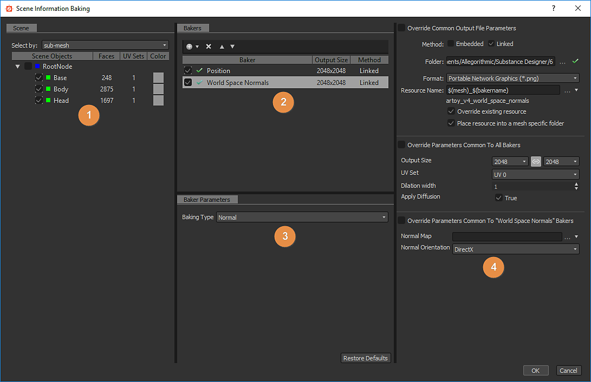
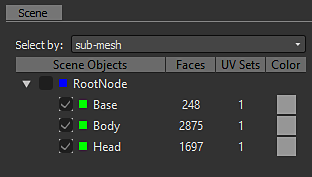
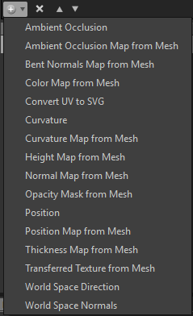

# Baker Legacy-Benutzeroberfläche

Hier finden Sie eine Beschreibung der Baker-Oberfläche, die in [Adobe Substance 3D Designer](https://www.adobe.com/de/products/substance3d-designer.html)-Versionen vor 6.0.4 verfügbar ist.

## Überblick

Das Bedienfeld &quot;Baker&quot; ist in vier Bereiche unterteilt:

### 1: Szene

Legen Sie fest, welcher Teil des Meshs am Baking beteiligt ist.

Neu in Version 6, können Sie auch nach Material auswählen:

### 2: Baker

Durch Drücken der Schaltfläche  können Sie die gewünschten Baker zur Verarbeitungsliste hinzufügen.

>[!NOTE]
>
> Backvorgänge werden nach der Listenreihenfolge verarbeitet (von oben nach unten): Dies kann wichtig sein, wenn Sie das Ergebnis eines Baking (wie die Normalen-Map) in einem anderen Baking führ-Prozess wiederverwenden möchten

Durch Klicken auf das Pluszeichen (+) im Baker-Layout können Sie die Baker zu einem Stapel hinzufügen (Sie können beliebig viele Baker zu einem Stapel hinzufügen).

.

Sie können einen Baking führend Prozess aus der Liste entfernen, indem Sie  drücken.

Sie können die Liste der Baking führend Prozesse neu anordnen, indem Sie einen Baking führend Prozess auswählen und  verwenden.

### 3: Parameter für Baker

In diesem Abschnitt werden die spezifischen Optionen für den aktuell ausgewählten Baker angezeigt.

### 4: Allgemeine Parameter

Zeigt die Parameter an, die von den Bakern gemeinsam verwendet werden.

>[!NOTE]
>
> Ändern Sie standardmäßig einen dieser Parameter. wirkt sich auf alle Baker aus, außer wenn Sie &quot;Parameter überschreiben&quot; aktivieren, die allen Bakern gemeinsam sind: in diesem Fall werden die Änderungen lokal auf dem aktuellen Baker vorgenommen.

* **Im Feld Ressourcenname** können Sie den Namen der generierten Bitmap bei Bedarf ändern.
* **In der Dropdownliste &quot;Dateiformat**&quot; können Sie das Dateiformat vom Standard (Windows- oder OS/2-Bitmapformat &quot;BMP&quot;) ändern.
* Mit dem Kontrollkästchen **Die** **Ressource in einem modellspezifischen Mesh platzieren** können Sie auswählen, ob die generierte Bitmap auf derselben Ebene wie das Modell oder in einem neuen Unterordner mit dem Namen &quot;Resources&quot; gespeichert wird.
* **Mit der Methode** können Sie festlegen, ob die neue Bitmapressource mit dem Substance-Paket verknüpft oder eingebettet werden soll.
* **Im Ordner &quot;**&quot; können Sie festlegen, wo die Zuordnungen gespeichert werden sollen.

Durch Drücken der Schaltfläche OK unten rechts im Fenster Baker wird der Baking gestartet.

Neu in Version 6: Sie können den Backvorgang jetzt mit der Schaltfläche &quot;Abbrechen&quot; abbrechen:

