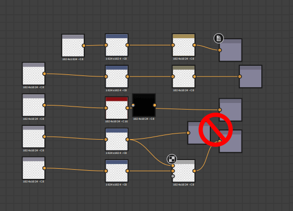

# Diagrammerstellung-Etikette

Die Erstellung großer, komplexer Diagramme kann schnell verwirrend werden und die Navigation erschweren. Es gibt eine Reihe von Instrumenten, mit denen diese Probleme gelöst werden können, und es gibt einige gute Gewohnheiten, sich einzuarbeiten, um Probleme später zu vermeiden. Auf dieser Seite finden Sie eine abschließende Liste der Techniken, die wir für saubere, effiziente und funktionale Grafiken empfehlen, die einfach freigegeben und verstanden werden können.

## Allgemein

### Graf

#### Graphenelemente

Knotenelemente sind Knotenobjekte, die neben und um die Graf in [der Graphansicht](../../interface/the-graph-view/the-graph-view.md) platziert werden können. Von diesen drei Vorteilen bietet der Rahmen die schnellsten und größten Vorteile, während die Nadeln &quot;Kommentar&quot; und &quot;Navigation&quot; für bestimmte Szenarien besser geeignet sind.

#### Rahmen

Die wichtigste Sache, die zu saubereren, leichter lesbaren Grafen führt, ist die Platzierung von Rahmen um Kerngruppen Ihres Grafen. Ohne Rahmen ist ein großer Graf fast unlesbar, und selbst kleine Grafen werden viel leichter verständlich, sobald man Rahmen zeichnet. Ein großer Vorteil von Rahmen besteht darin, dass ihre <b> Namen immer in der gleichen Skalierung gerendert werden</b>, auch wenn Sie sehr weit auszoomen.

Rahmen machen es viel leichter zu verstehen, was in einem Graf vor sich geht. Sie können Ihnen als Autor dabei helfen, Monate später auf Ihre Arbeit zurückzukommen, oder einem anderen Nutzer, z. B. einer Kollegin, bei der Suche nach einem Graf, an den sie nicht gewöhnt sind.

Verwenden Sie beim Platzieren von Rahmen die folgenden Kriterien:

* Identifizieren Sie **Funktionseinschränkungen** (z. B. 8 Dirt, die gemeinsam einen Knoteneffekt erzeugen), und gruppieren Sie diese mithilfe von Rahmen.
* Versuchen Sie immer, **verschiedene Farben** für Ihre Rahmen zu verwenden: Rahmen mit der gleichen blauen Standardfarbe heben sich nicht stark voneinander ab.
* **klare, beschreibende Namen** verwenden, die nicht zu lang sind (weitere Tipps finden Sie im Abschnitt unten)
* Legen Sie **nicht zu viel oder zu wenig** in einen Rahmen, da dies die Lesbarkeit nicht verbessert. Der genaue Betrag unterscheidet sich offensichtlich zwischen Grafen und Funktionalität.
* Fügen Sie, falls erforderlich, **Text in die Beschreibung hinzu**, um zu verstehen, was in einem Rahmen geschieht.

#### Anmerkungen und Nadeln

Kommentare und Nadeln sind für Rahmen nur nebensächlich und für gut verfasste Graf kein absolutes Muss. Sie können in den folgenden Szenarien verwendet werden:

* Kommentare eignen sich gut, um zusätzlichen Text hinzuzufügen, der über die Beschreibung eines Rahmens hinausgeht. Sie können kleine Textteile pro Knoten hinzufügen, meistens für kleine, detaillierte Informationen. Kommentare lassen sich nicht gut skalieren und werden nicht von einem entfernten Zoomfaktor gelesen.
* Mit Navigationspunkten können Sie mit dem Tastaturbefehl F2 durch bestimmte Bereiche des Diagramms blättern. Dies kann für sehr große Diagramme nützlich sein, bei denen man oft zwischen zwei Bereichen springen muss, die sehr weit voneinander entfernt sind.

### Eingabe- und Ausgabeplatzierung

Die Ein- und Ausgänge müssen an den äußersten Enden der Diagramme platziert werden: Alle Ausgänge auf der rechten Seite, alle Eingänge auf der linken Seite, jeder vertikal ausgerichtet. Dadurch lassen sie sich leichter finden und identifizieren.

Das obige Beispiel ist ein Extremfall: Frames werden nicht immer benötigt oder möglich, aber es sollte klar sein, dass die vertikale Ausrichtung von In- und Output viel klarer ist als die zufällige, gemischte Platzierung.

### Umleiten von Verknüpfungen

Bei großen, sehr langen Diagrammen werden manchmal Verknüpfungen über einen sehr großen Bereich hinweg erstellt. Dies führt zu Verwirrung, wenn Verknüpfungsdrähte den Graph ohne viel Kontrolle durchqueren. Mit der Tastenkombination &quot;Alt + Umschalt + Ziehen&quot; können Sie diese Links neu organisieren und auf einem anderen Pfad umleiten, indem Sie einen Link unterteilen und einen zusätzlichen Handle in der Mitte hinzufügen. Es wird empfohlen, dies in Szenarien zu verwenden, in denen es sinnvoll ist.

### Bezeichnung, Kennung und Verwendung

Alle Diagramme, die für die Freigabe oder Veröffentlichung bestimmt sind, sollten mit der nötigen Sorgfalt in die zusätzlichen Metadaten eingefügt werden, um die Benutzerfreundlichkeit zu verbessern. Folgende Punkte sind wichtig:

Die vorgeschlagenen Standardbezeichnungen reichen nie aus. Nehmen Sie sich die Zeit und Mühe, den angezeigten Parametern und Ihren In- und Ausgaben benutzerdefinierte Bezeichnungen hinzuzufügen.

Versuchen Sie, keine Kennzeichnung zu haben, und die Beschriftung unterscheidet sich zu stark: Wenn der Bezeichner an einer anderen Stelle (in mehreren Funktionen) verwendet wird, kann es sehr schwierig sein, herauszufinden, welche UI-Eigenschaft mit welcher Variablen verknüpft ist.

Versuchen Sie, die Beschriftungen den Begriffen in Frames (Frame-Beschriftungen) und Kommentaren anzupassen. Es erleichtert, herauszufinden, welcher Abschnitt des Diagramms mit welchem exponierten Parameter verknüpft ist

### Parametereinstellungen

Wenn Parameter angezeigt werden, ist mehr als nur die Bezeichnung und die Kennung wichtig. Beachten Sie folgende Punkte:

* Wählen Sie den richtigen Editortyp aus. Ein Regler ist möglicherweise nicht immer sinnvoll: Ein Winkel- oder Dropdown-Benutzeroberflächenelement sind ebenfalls möglich.
* Legen Sie die richtigen Min- und Max-Werte fest und entscheiden Sie, ob das Klemmen sinnvoll ist.
* Wählen Sie einen sinnvollen Standardwert: Standardwerte, die nutzlos zurückgeben, Ergebnisse von Großbuchstaben sollten vermieden werden.
* Ziehen Sie in Betracht, den Bereich bei Bedarf über eine [Funktion](../../function-graphs/function-graphs.md) neu zuzuordnen: Wenn ein Schieberegler von 0,125 bis 0,357 keinen Sinn ergibt, können Sie dies einfach mit einer linearen Interpolation neu zuordnen und das UI-Element einen Bereich von 0 bis 1 verwenden.

## Substance-Graphen

### Farb- und Graustufenmanagement

Bei der Verwendung von Farb- und Graustufendaten ist große Sorgfalt erforderlich, da das Mischen beider Typen nicht einfach und schnell erfolgen kann. Folgende Punkte sind zu berücksichtigen:

* Diagramme dürfen keine gepunkteten roten (Fehler-)Verknüpfungen enthalten.
* Es sollte keine unnötigen Konvertierungen zwischen Farb- und Graustufendarstellung und umgekehrt geben. In einigen Fällen kann der &quot;Knoten für die automatische Farb-/Graustufenkonvertierung&quot; in den Graph-Voreinstellungen zu langen, nutzlosen Ketten angedockter Konvertierungsknoten führen.
* Idealerweise werden Daten so lange wie möglich in Graustufen gespeichert und nur dann konvertiert, wenn sie unbedingt benötigt werden. Dies reduziert die Komplexität und spart Performance.
* Die Ein- und Ausgaben sollten mit dem richtigen Typ erstellt oder eingerichtet werden: Es ist z. B. nicht sinnvoll, den &quot;mask&quot;-Eingang auf color festzulegen, wenn er zur Verwendung als binäre Maske in Graustufen konvertiert wird.

### Auflösungssteuerung

Die Steuerung der Auflösung eines [Substance-Graphen](../../compositing-graphs/substance-compositing-graphs.md) kann verwirrend sein. Daher ist angemessene Sorgfalt erforderlich, um dies richtig zu tun. Fehler können zu schwerwiegenden Leistungseinbußen oder unbrauchbaren Ergebnissen von geringer Qualität führen.

[Um dieses Thema vollständig zu verstehen, stellen Sie sicher, dass Sie über absolute und relative Ausgabegrößen Bescheid wissen.](../../compositing-graphs/output-size/output-size.md)

* Ein Diagramm sollte in fast allen Fällen auf die Auflösung &quot;Relativ zu übergeordnetem Element&quot; eingestellt werden, es sei denn, es gibt eine sehr spezifische Ausnahme, in der es nicht erforderlich ist (sehr selten).
* Knoten sollten im Allgemeinen keine Überschreibungseinstellungen für die Ausgabegröße haben. Die Auflösung lässt sich in den meisten Fällen am besten über die Eigenschaften &quot;Übergeordnet&quot; oder &quot;Graf&quot; steuern.
* Bei Bitmaps sollte besonders darauf geachtet werden, dass die Standardeinstellung &quot;Absolute Ausgabegröße&quot; nicht über den gesamten Graf verteilt wird. Diese Einstellung sollte auf &quot;Relativ zum übergeordneten Element&quot; überschrieben werden. Dies ist eine der wenigen Ausnahmen von der oben genannten Regel.
