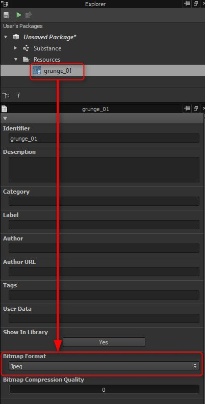

# Richtlinien zur Leistungsoptimierung

## Substance-Graphen

Je komplexer Ihre [Substance-Graf](../../compositing-graphs/substance-compositing-graphs.md) sind, desto mehr Verarbeitungsleistung benötigen Sie zum Rendern. Sie sollten versuchen, <b>ein Gleichgewicht zwischen Komplexität und Rendering-Geschwindigkeit herzustellen</b>.\
Dies ist *besonders* wichtig, wenn Sie sie in Echtzeit-Grafikanwendungen wie Spielen verwenden.

Im Allgemeinen sollten Knoten, die benutzerdefinierte Parameter gelegt haben, die zur Laufzeit geändert werden können - <b>, so nah wie möglich am Ende des Grafen platziert werden</b>.

Dies liegt daran, dass die Ausgabe jedes Knotens nach Möglichkeit zwischengespeichert wird. Je höher der Graf des anpassbaren Knotens ist, desto mehr Ausgaben müssen verarbeitet werden, wenn einer dieser freigelegte Parameter verändert wird. Wenn sich der gelegt Graf nahe am Ende des Knotens befindet, müssen nur die wenigen Knotenpunkte zwischen ihm und den Ausgabeknoten neu berechnet werden.

Wenn Sie beispielsweise eine einheitliche Farbe zu Beginn des Grafen anpassen, werden alle folgenden Knoten neu berechnet. Wenn Sie einen HSL vor der Ausgabe optimieren, wird nur dieser Knoten neu berechnet, wodurch die Leistung des Grafen erheblich verbessert wird.

Bitte beachten Sie die folgenden Richtlinien:

### ALLGEMEINE LEISTUNGSBEZOGENE EINSTELLUNGEN

+++GPU-Engine ist viel schneller als CPU-Engine
Verwenden Sie das GPU-Substance-Engine (mit Hotkey F9 wechseln), es sei denn, Sie haben eine nicht unterstützte (integrierte) Grafikkarte.

+++

+++Das Wechseln der übergeordneten Auflösung des Grafen ist langsam
Es berechnet Graf, Cache und alle Miniaturansichten neu. Es ist besser, [die Registerkarte <b>Batch </b> des Exportdialogs &#x200B;](../../compositing-graphs/exporting-bitmaps/exporting-bitmaps.md) zu verwenden, da dadurch eine umfangreiche, nicht benötigte Neuberechnung vermieden wird (z. B. beim Export in die Auflösung 8192).

+++

+++In Extremfällen kann ein erhöhter Speicher-Cache erforderlich sein
Die Anwendung &quot;[&quot; begrenzt den Arbeitsspeicher, der &#x200B;](../../interface/preferences-window/preferences-window.md) für den Bildcache verwendet werden kann. Sie können diesen jedoch überschreiben und erhöhen (mit Vorsicht).

+++

### OPTIMIERUNG DES GRAFEN

+++Achten Sie auf die Knotenauflösungen und die Vererbung im Allgemeinen!
Hohe Werte wirken sich erheblich auf die Performance aus. Überlegen Sie daher, wie das Material voraussichtlich verwendet wird und ob Sie die Datengröße reduzieren können.

Es wird empfohlen, mehr über die [Knotenauflösung (Ausgabegröße)](../../compositing-graphs/output-size/output-size.md) und die [Vererbung in Substance-Grafen](../../compositing-graphs/inheritance-compositing/inheritance-in-substance-compositing-graphs.md) zu erfahren.

+++

+++Verwenden von Graustufen, wenn keine Farbe erforderlich ist
Farbvorgänge dauern viermal länger als Graustufenvorgänge. Versuchen Sie außerdem, die Typkonvertierung zwischen Farb- und Graustufendarstellung zu minimieren.

+++

+++8 Bit verwenden, wenn 16 Bit nicht benötigt wird
Die CPU-Version des Substance Engine (SSE2) *unterstützt weder 16-Bit-Farbton noch 8-Bit-Graustufen.* Das GPU-Engine unterstützt alle 4 Kombinationen aus 8/16 Bit und Graustufen/Farbe. *Derzeit wird nur das CPU-Engine in Unity- und Unreal-Engine-Plug-ins verwendet*.

+++

+++Minimieren der Knotenausgabegröße, wann immer möglich
Manchmal wirkt sich die Verkleinerung einiger Knoten nicht auf das Endergebnis aus, sondern auf die Leistung. Die Verwendung eines Einheitliche Farbe-Knotens, der auf dieselbe Ausgabegröße wie das Dokument festgelegt ist, ist beispielsweise sinnlos: Die Einheitliche Farbe sollte auf &quot;Absolut [16px x 16px]&quot; und der nachfolgende Knoten auf &quot;Relativ zum übergeordneten Element&quot; festgelegt werden. Im Allgemeinen eignet sich dieser Trick gut für niederfrequente Bilder, wie z. B. Perlin Rauschen.

+++

+++Verwenden Sie keine Bilder, die kleiner als 16 x 16 Pixel sind.
Dies verlangsamt die Rendering-Leistung.

+++

+++Deaktivieren Sie bei Verwendung des Knotens &quot;Überblendung&quot; die Alpha-Überblendung, wenn sie nicht erforderlich ist.

+++

+++Weichzeichner und Verkrümmungen sind die prozessorintensivsten Knoten.

+++

+++Einige Rauschen-Generatoren sind von der Anzahl der gezeichneten Muster betroffen.
Der Knoten &quot;[Tile Generator](../../compositing-graphs/nodes-reference-for-com/node-library/texture-generators/patterns/tile-generator/tile-generator.md)&quot; wird beispielsweise langsamer, wenn Sie mehr Muster verarbeiten möchten, die Sie ihm hinzufügen.

+++

+++Einige Rauschen sind von einem Skalierungsfaktor betroffen.
Dieser Faktor wird in der Tat mehr Muster ziehen. Zu den betroffenen Nodes gehören Rauschen, Zellen, usw. Wenn Sie ein White-Rauschen-Muster benötigen, verwenden Sie keine Rauschen mit einem sehr hohen Skalierungswert und verwenden Sie stattdessen die Knoten [White Rauschen](../../compositing-graphs/nodes-reference-for-com/node-library/texture-generators/noises/white-noise/white-noise.md) oder [White Rauschen Fast](../../compositing-graphs/nodes-reference-for-com/node-library/texture-generators/noises/white-noise-fast/white-noise-fast.md).

+++

+++Umgekehrt gibt es einige sehr schnelle Rauschen-Generatoren
Dazu gehören [White Rauschen Fast](../../compositing-graphs/nodes-reference-for-com/node-library/texture-generators/noises/white-noise-fast/white-noise-fast.md), [Fraktalsumme Base](../../compositing-graphs/nodes-reference-for-com/node-library/texture-generators/noises/fractal-sum-base/fractal-sum-base.md) und [Anisotropic Rauschen](../../compositing-graphs/nodes-reference-for-com/node-library/texture-generators/noises/anisotropic-noise/anisotropic-noise.md).

+++

+++In manchen Fällen solltest du auf umfangreiche Bildaufnahmefunktionen achten
Funktionen werden auf dem CPU-Engine ausgeführt, außer in [Pixelprozessoren](../../compositing-graphs/nodes-reference-for-com/atomic-nodes/pixel-processor/pixel-processor.md). Wenn Sie in [Wertprozessoren](../../compositing-graphs/nodes-reference-for-com/atomic-nodes/value-processor/value-processor.md) oder [FXmaps](../../function-graphs/fxmaps/fxmaps.md) viele Bildberechnungen (Ändern der $pos-Koordinaten) durchführen, kommt es zu einem großen Austausch zwischen VRAM und CPU-RAM, was zu Leistungsverzögerungen führt.

+++

### OPTIMIERUNGEN FÜR DIE MOBILNUTZUNG

+++Es wird nicht empfohlen, Warps und FX-Maps zu verwenden.
Sie sind sehr leistungsintensiv.

+++

+++Weichzeichnungsknoten vermeiden
Verwenden Sie stattdessen Downscale-Transformationen.

+++

+++Arbeiten Sie so viel wie möglich in Graustufen
Wechseln Sie am Ende des Grafen in den Farbmodus.

+++

+++Knotenpunkte so weit wie möglich zwischen den Ausgaben freigeben

+++

### GRÖSSENOPTIMIERUNGEN FÜR EINGEBETTETE BITMAPS

Bei [Bitmaps](../../resources/bitmap-resource/bitmap-resource.md) ist die [Ausgabegröße](../../compositing-graphs/output-size/output-size.md) standardmäßig auf [&#39;Absolut&#39;](../../compositing-graphs/inheritance-compositing/inheritance-in-substance-compositing-graphs.md) festgelegt. Das bedeutet: Wenn die Bitmap über die Knotenkette mit einer Ausgabe verbunden ist, erzwingt sie, dass die endgültige Ausgabe die Größe der eingebetteten Bitmap hat.\
Für einen Knoten, der nach der Bitmap eingefügt wird, wird die Ausgabegröße auf &quot;[&#39;Relativ zur Eingabe&#39;](../../compositing-graphs/inheritance-compositing/inheritance-in-substance-compositing-graphs.md)&quot; festgelegt. Dies bedeutet, dass der Knoten auch die Größe der Bitmap besitzt und diese Größe in der Knotenkette bis zu den Ausgaben hinunter trägt. Um dies zu korrigieren, müssen Sie den Knoten nach der Bitmap so festlegen, dass seine Ausgabegröße auf [&#x200B; &#39;Relativ zum übergeordneten Element&#39;](../../compositing-graphs/inheritance-compositing/inheritance-in-substance-compositing-graphs.md) festgelegt wird.

Wenn für den Graf eine dynamische Auflösung festgelegt ist, können Sie die Ausgabegröße für die eingebettete Bitmap so ändern, dass sie Relativ zum übergeordneten Element ist.\
Auf diese Weise ändert sich die Bitmapgröße je nach übergeordnetem Graf. Es kann also nicht vorkommen, dass der Graf eine höhere Bitmapauflösung verarbeitet, als erforderlich ist.

>[!WARNING]
>
> Durch Festlegen eines [Bitmap](../../compositing-graphs/nodes-reference-for-com/atomic-nodes/bitmap/bitmap.md)-Knotens auf &quot;Relativ zum übergeordneten Element&quot; und [Veröffentlichen](../../compositing-graphs/publishing-asset-files/publishing-substance-3d-asset-files-sbsar.md) des Grafen in einem Substance 3D-Asset (SBSAR) wird die Bitmap mit einer Auflösung von **256x256** anstelle ihrer Originalgröße gespeichert. Es wird empfohlen, die [Vererbung-Methode](../../compositing-graphs/inheritance-compositing/inheritance-in-substance-compositing-graphs.md) der Bitmapknoten &quot;[Ausgabegröße](../../compositing-graphs/output-size/output-size.md)&quot; als &quot;Absolut&quot; zu behalten und einen [Transformations-2D](../../compositing-graphs/nodes-reference-for-com/atomic-nodes/transformation-2d/transformation-2d.md)-Knoten auf &quot;Relativ zum übergeordneten Element&quot; direkt nach dem Bitmapknoten festzulegen.

<table>
<tr style="border: 0;">
<td style="border: 0;" valign="top">

Es wird außerdem empfohlen, das Format von Bitmap-Ressourcen auf JPEG festzulegen, um die Größe veröffentlichter Substance 3D Assets (SBSAR) zu minimieren.

</td>
<td style="border: 0;" valign="top">

</td>
</tr>
</table>
