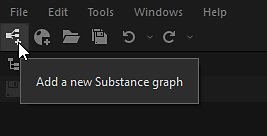
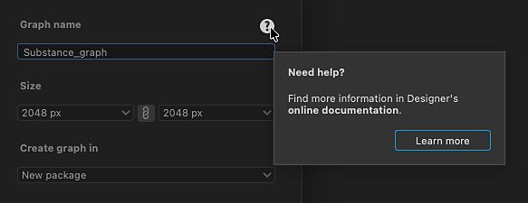

# Erstellen von Substance-Graphen

Das Erstellen von Texturen in Designer beginnt mit dem Erstellen eines Substance-Diagramms, entweder aus einer vordefinierten Vorlage oder aus einem leeren Diagramm.

## Erstellen eines Diagramms

Sie können eine der folgenden Methoden verwenden, um das Erstellen eines neuen [Substance-Diagramms](../../compositing-graphs/substance-compositing-graphs.md) zu starten:

* &#x200B;
  <table>
  <tr style="border: 0;">
  <td style="border: 0;" valign="top">

  Klicken Sie auf dem Startbildschirm auf die Schaltfläche <b>Neues Diagramm</b>.

  </td>
  <td style="border: 0;" valign="top">

  {zoomable="yes"}

  </td>
  </tr>
  </table>

* &#x200B;
  <table>
  <tr style="border: 0;">
  <td style="border: 0;" valign="top">

  Klicken Sie in einem beliebigen *vorhandenen*-Paketelement im [Explorer](../../interface/the-explorer-window/the-explorer-window.md) auf <b>RMB</b> und navigieren Sie im Kontextmenü zu <b>Neu > Substance-Diagramm</b>.

  </td>
  <td style="border: 0;" valign="top">

  {zoomable="yes"}

  </td>
  </tr>
  </table>

* &#x200B;
  <table>
  <tr style="border: 0;">
  <td style="border: 0;" valign="top">

  Klicken Sie in der Hauptsymbolleiste auf die Schaltfläche  <b>Neues Substance-Diagramm</b>.

  </td>
  <td style="border: 0;" valign="top">

  {zoomable="yes"}

  </td>
  </tr>
  </table>

* &#x200B;
  <table>
  <tr style="border: 0;">
  <td style="border: 0;" valign="top">

  Wechseln Sie im Hauptmenü zu <b>Datei > Neu > Substance-Diagramm...1</b>

  </td>
  <td style="border: 0;" valign="top">

  

  </td>
  </tr>
  </table>

* Drücken Sie den Tastaturbefehl <b>Strg+N</b> (Windows) bzw. <b>Befehl+N</b> (macOS).

Unabhängig von der gewählten Methode wird das Dialogfeld &quot;<b>Neues Substance-Diagramm</b>&quot; angezeigt.

## Diagrammvorlagen

Unabhängig von der Methode zum Erstellen eines neuen Substance-Diagramms wird Ihnen immer das Dialogfeld <b>Neues Substance-Diagramm</b> angezeigt, mit dem Sie das neue Diagramm konfigurieren können.

{zoomable="yes"}

### Vorlagen

Designer enthält Diagrammvorlagen mit vorkonfigurierten Knoten, damit Sie schneller durchstarten können. Sie können [Output](../../compositing-graphs/nodes-reference-for-com/atomic-nodes/output/output.md)-Knoten enthalten, einfache Knoten, um Werte an diese Ausgaben zu übergeben - z. B. [Einheitliche Farbe](../../compositing-graphs/nodes-reference-for-com/atomic-nodes/uniform-color/uniform-color.md) sowie [Eingabe](../../compositing-graphs/nodes-reference-for-com/atomic-nodes/input/input.md) Knoten.

Doppelklicken Sie auf eine Vorlage in der Liste, oder wählen Sie sie aus, und klicken Sie auf die Schaltfläche <b>Erstellen</b>, um mithilfe dieser Vorlage ein neues Substance-Diagramm zu erstellen. Standardmäßig wird das neue Diagramm in einem neuen, nicht gespeicherten Paket platziert.

>[!TIP]
>
> Beginne ganz von vorne
> 
> Wählen Sie die Vorlage <b>Leer</b> in der Kategorie &quot;Leer&quot; aus, um mit einem vollständig leeren Diagramm zu beginnen.

>[!NOTE]
>
> Vorlagen wechseln
> 
> Wenn Sie die falsche Vorlage auswählen, können Sie *nicht* zu einer anderen Vorlage wechseln, nachdem Sie das Diagramm erstellt haben.
> 
> Um Ihr vorhandenes Diagramm auf eine andere Vorlage zu portieren, können Sie ein neues Diagramm mit der entsprechenden Vorlage erstellen und das Diagramm kopieren und in die neue Vorlage einfügen. Erneutes Verbinden von Knoten, insbesondere Ausgabeknoten.

<table>
<tr style="border: 0;">
<td width="100.00%" style="border: 0;" valign="top">

Jede Vorlage wird nach ihrer Bezeichnung und ihrem Untertitel aufgelistet.

Der Untertitel bietet mehr Kontext zum *Anwendungsfall* für die Vorlage: das Materialmodell, auf dem es basiert, die Software, mit der es integriert werden soll, usw.

Im Modus <b>Miniaturansichten</b> wird der Untertitel in einem dunkleren, kleineren Text unter der Beschriftung platziert.

In den Ansichtsmodi <b>Liste</b>, <b>Pakete</b> und <b>Verzeichnisse</b> wird der Untertitel folgendermaßen an die Bezeichnung angehängt: *Bezeichnung - Untertitel*.

</td>
<td width="25.00%" style="border: 0;" valign="top">

</td>
</tr>
</table>

### Material-Samples

Die Kategorie <b>Materialproben</b> enthält eine [kuratierte Auswahl von Diagrammen](../../compositing-graphs/creating-compositing-gra/material-samples/material-samples.md), aus denen Sie lernen und mit denen Sie experimentieren können.

Sie können die Beispiele auch direkt vom Startbildschirm aus aufrufen, indem Sie die Schaltfläche <b>Zu den Beispielen wechseln</b> verwenden.

Alle Beispiele basieren auf dem [OpenPBR-Materialmodell](../../interface/3d-view/material-properties/material-properties.md#openpbr).

{zoomable="yes"}

<table>
<tr style="border: 0;">
<td style="border: 0;" valign="top">

### Info-QuickInfo

Wenn Sie mit dem Informationssymbol für jedes Vorlagenelement zeigen, wird eine QuickInfo mit zusätzlichen Informationen zur Vorlage angezeigt:

<b>Typ:</b> Der Typ des Assets, das mit der Vorlage erstellt werden soll. Dies kann in den [Diagrammeigenschaften](../../compositing-graphs/graph-parameters/graph-parameters.md) bearbeitet werden.

<b>Beschreibung:</b> Details zu der Vorlage, z. B. der Workflow, in den sie integriert ist, der beabsichtigte Anwendungsfall und Empfehlungen zu ihrer Verwendung.

<b>Ausgaben:</b> Die [Ausgabeknoten](../../compositing-graphs/nodes-reference-for-com/atomic-nodes/output/output.md) der Vorlage, falls vorhanden.

</td>
<td style="border: 0;" valign="top">

{zoomable="yes"}

</td>
</tr>
</table>

<table>
<tr style="border: 0;">
<td width="100.00%" style="border: 0;" valign="top">

### Ansichtsmodi

Die Vorlagenliste kann mithilfe der Schaltfläche &quot;<b>Ansichtsmodi</b>&quot; in verschiedenen Modi angezeigt werden.

Die von der ausgewählten Kategorie und Projektdatei durchgeführte Filterung wird in allen Ansichten angewendet.

</td>
<td width="33.33%" style="border: 0;" valign="top">

{zoomable="yes"}

</td>
</tr>
</table>

+++Ansichtsmodi
{zoomable="yes"}

<b>Miniaturen</b>

Karten mit Miniaturen, die eine Vorschau oder ein Symbol des Vorlagentyps bereitstellen.

{zoomable="yes"}

<b>Liste</b>

Vorlagen werden nur nach ihrer Beschriftung aufgelistet.

{zoomable="yes"}

<b>Pakete</b>

Vorlagen werden nach ihrer Bezeichnung als untergeordnete Elemente der Paketdatei aufgelistet, der sie angehören.

Bewegen Sie den Mauszeiger über ein Paketdateielement, um eine QuickInfo mit dem vollständigen Pfad anzuzeigen.

{zoomable="yes"}

<b>Verzeichnisse</b>

Vorlagen werden anhand ihrer Bezeichnung als untergeordnete Elemente des Verzeichnisses aufgelistet, in dem sich die Paketdatei befindet, zu der sie gehören.

Bewegen Sie den Mauszeiger über ein Verzeichniselement, um eine QuickInfo mit dem vollständigen Pfad anzuzeigen.

+++

### Eigenschaften

Nachdem Sie die Vorlage ausgewählt haben, können Sie grundlegende Informationen zum neuen Diagramm einrichten. Er kann jederzeit nach der Erstellung des Diagramms geändert werden.

<b>Diagrammname</b>: den Bezeichner des Graphen. Sie muss für ein bestimmtes Paket eindeutig sein und darf keine Leerzeichen und einige Sonderzeichen enthalten.

<b>Größe</b>: die übergeordnete Auflösung des Diagramms, die die Ausgabeauflösung der meisten Knoten steuert - weitere Informationen finden Sie auf der Seite [Ausgabegröße](../../compositing-graphs/output-size/output-size.md). Die Felder &quot;width&quot; und &quot;Height&quot; sind standardmäßig miteinander verknüpft. Sie können die Verknüpfung wieder aufheben, indem Sie auf die Verknüpfungsschaltfläche zwischen den Kombinationsfeldern &quot;width&quot; und &quot;Height&quot; klicken.

<b>Diagramm in </b> erstellen: Mit diesem Kombinationsfeld können Sie ein *neues*-Paket für das neue Diagramm erstellen oder das neue Diagramm einem beliebigen *vorhandenen*-Paket hinzufügen, das bereits im [Explorer](../../interface/the-explorer-window/the-explorer-window.md)-Bedienfeld geladen wurde.

### Hilfe-QuickInfo

Bewegen Sie den Mauszeiger über das Fragezeichensymbol, um eine QuickInfo mit einer Schaltfläche anzuzeigen, die direkt auf diese Seite verweist, damit Sie bei Bedarf auf diese Dokumentation zurückgreifen können.

{zoomable="yes"}

## Vorlagen verwalten

<table>
<tr style="border: 0;">
<td width="100.00%" style="border: 0;" valign="top">

### Filtern nach Kategorie

Kategorien werden verwendet, um Vorlagen zu gruppieren, die nach Anwendungsfall oder Elementtyp miteinander verknüpft sind.

Verwenden Sie das Kombinationsfeld <b>Kategorie</b>, um die Kategorie auszuwählen, nach der Sie die Vorlagen filtern möchten.

</td>
<td width="41.67%" style="border: 0;" valign="top">

{zoomable="yes"}

</td>
</tr>
</table>

<table>
<tr style="border: 0;">
<td width="100.00%" style="border: 0;" valign="top">

Für Vorlagen kann in den <b>Vorlagendaten</b> eine Kategorie eingerichtet sein. [Filterattribut &#x200B;](../../compositing-graphs/graph-parameters/graph-parameters.md), das als Graf verwendet wird, um die Vorlagenliste einzugrenzen:

&lt;category>;&lt;subtitle>

Benutzerdefinierte Kategorien können in den von Projektdateien bereitgestellten Vorlagen eingerichtet werden (siehe unten). Diese Kategorien werden dann der Liste im Kombinationsfeld hinzugefügt.

</td>
<td width="50.00%" style="border: 0;" valign="top">

{zoomable="yes"}

</td>
</tr>
</table>

<table>
<tr style="border: 0;">
<td width="100.00%" style="border: 0;" valign="top">

### Filterung nach Projektdatei

Wenn eine der aktiven [Projektdateien](../../interface/preferences-window/project-settings/project-settings.md) einen oder mehrere Vorlagenpfade enthält, werden die Graf in den Paketdateien, die unter diesen Pfaden gefunden wurden, der Vorlagenliste hinzugefügt.

Verwenden Sie dann die Schaltfläche <b>Nach Projektdatei filtern</b>, um die Liste der Vorlagen auf die Vorlagen einzugrenzen, die von einer bestimmten Projektdatei bereitgestellt werden.

</td>
<td width="33.33%" style="border: 0;" valign="top">

{zoomable="yes"}

</td>
</tr>
</table>
