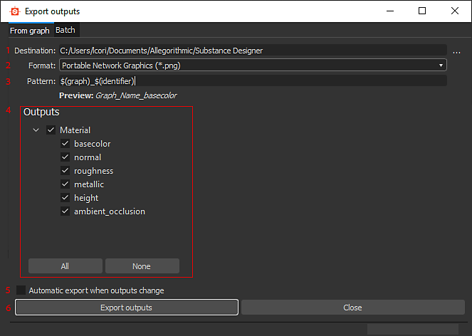
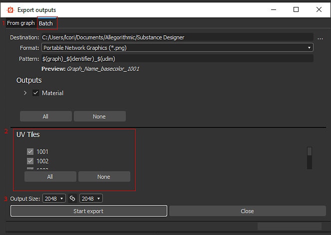

# Exportieren von Bitmaps

Auf dieser Seite wird erläutert, wie Substance 3D Designer in viele verschiedene Bitmap-Dateiformate exportieren kann und wie mehrere UV-Kacheln stapelweise exportiert werden.[Wenn Sie in PSD-Dateien exportieren möchten,](https://helpx.adobe.com/de/substance-3d/unlisted/documentation/sddoc/exporting-psd-186974407.html) [gibt es eine separate dedizierte Seite dafür.](https://helpx.adobe.com/de/substance-3d/unlisted/documentation/sddoc/exporting-psd-186974407.html)

## Exportieren von Konzepten

Beachten Sie beim Exportieren einer Bitmap Folgendes:

* Sie <b> exportieren aus einem Diagramm </b>, nicht aus einem Paket. Ein Paket generiert keinen Bildinhalt für sich.
* Die Anzahl (und Auflösung) der exportierten Bitmaps wird durch die <b>Ausgaben</b> eines Diagramms bestimmt.
* Filetype ist für alle Ausgaben/Bitmaps festgelegt.
* Das Exportieren unterscheidet sich von [Publishing](https://helpx.adobe.com/de/substance-3d/unlisted/documentation/sddoc/publishing-sbsar-file-200574380.html). Vergewissern Sie sich, dass Sie den Unterschied gut verstehen!

## Exportmethoden

Sobald Sie zum Exportieren bereit sind, gibt es zwei Möglichkeiten, auf das Dialogfeld &quot;Exportieren&quot; zuzugreifen:

<table>
<tr style="border: 0;">
<td style="border: 0;" valign="top">

Klicken Sie im [Explorer-Fenster](https://helpx.adobe.com/de/substance-3d/unlisted/documentation/sddoc/the-explorer-129368147.html) mit der rechten Maustaste auf den zu exportierenden Diagramm, und wählen Sie **&quot;Ausgaben als Bitmaps exportieren&quot;** aus.

</td>
<td style="border: 0;" valign="top">

Klicken Sie in der [Diagrammansicht](../../interface/the-graph-view/the-graph-view.md) auf die Schaltfläche &quot;Extras&quot;  und wählen Sie **&quot;Ausgaben exportieren...&quot;**.

</td>
</tr>
</table>

## Exportdialogfeld

Im Dialogfeld &quot;Exportieren&quot; finden Sie einige Optionen zum Anpassen des Exports.

Die auf der rechten Seite angezeigte Version ist das Standarddialogfeld. Die Änderung der Auflösung erfolgt entweder im Diagramm, in den Ausgaben oder durch Festlegen der übergeordneten Auflösung vor dem Öffnen des Dialogfelds.

1. <b>Ziel: </b>Speicherort für alle zu speichernden Dateien.
1. <b>Format:</b> Dateityp wird für alle exportierten Dateien verwendet.
1. <b>Muster</b>: generische Methode zum Generieren von Dateitypen basierend auf Metadaten-Schlüsselwörtern. Ein Beispieldateiname, der auf der ersten Ausgabe basiert, wird unten zur Überprüfung angezeigt.\
   Im Folgenden sind alle verfügbaren Optionen aufgeführt:
   1. *$(Diagramm)* - Name des aktuellen Diagramms
   1. *$(identifier)* - Bezeichner der aktuellen Ausgabe
   1. *$(description)* - Beschreibung der aktuellen Ausgabe
   1. *$(label)* - Bezeichnung der aktuellen Ausgabe
   1. *$(user\_data)* - benutzerdefinierte Benutzerdaten der aktuellen Ausgabe
   1. *$(group)* - Ausgabegruppe der aktuellen Ausgabe
   1. *$(colorspace)* - Farbraum der aktuellen Ausgabe (nur verfügbar für *OCIO* und *Adobe ACE* [Farbmanagement](../../color-management/color-management.md))
1. <b>Ausgaben:</b> Aktivieren oder deaktivieren Sie bestimmte Ausgaben und Ausgabegruppen in Ihrem Diagramm. Schaltflächen können alle aktiviert oder deaktiviert werden. Nützlich, wenn nur eine Bitmap geändert wurde.
1. <b>Automatischer Export:</b> Schaltfläche zum Umschalten, um den automatischen erneuten Export von Diagrammausgaben zu aktivieren, sobald eine Änderung vorgenommen wird. Nur für aktuelles Diagramm. Kann je nach Einstellung schwer und langsam sein.
1. <b>Schaltfläche &quot;Exportieren&quot;:</b> Exportiert mit den aktuellen Einstellungen oder schließt das Dialogfeld.

## Dialogfeld &quot;Exportieren&quot; (Stapel-/UV-Kacheln)

Bei der Arbeit mit UV-Kachel-Netzen in Designer kann das Exportdialogfeld auf eine etwas andere Weise verwendet werden, die den Batch-Export mehrerer UV-Kacheln gleichzeitig ermöglicht. Vergewissern Sie sich, dass Sie diesen Arbeitsablauf verstehen und ein [Substance-Diagramm](../../compositing-graphs/substance-compositing-graphs.md) ordnungsgemäß einer oder mehreren UV-Kacheln zugewiesen haben.\
Die Registerkarte &quot;Stapel&quot; ist auch eine schnellere Möglichkeit, Ihr Diagramm mit einer anderen Auflösung als der Arbeitsauflösung (übergeordnete Auflösung) zu exportieren.

Starten Sie das Dialogfeld mit denselben Methoden wie oben beschrieben. Klicken Sie dazu im Explorer *mit der rechten Maustaste auf* auf das Diagramm, das der UV-Kachel zugewiesen ist, oder *öffnen Sie das entsprechende Diagramm, das der UV-Kachel zugewiesen ist*, in der Diagrammansicht, wenn Sie die Schaltfläche &quot;Werkzeuge&quot; verwenden.

1. <b>Registerkarte &quot;Stapel&quot;</b>: Stellen Sie sicher, dass Sie diese Registerkarte anstelle der standardmäßigen <b>From Graph </b>-Methode auswählen. Andernfalls sind die Optionen 2-3 nicht verfügbar.
1. <b>UV-Kacheln:</b> Ebenso wie bei den Ausgaben können Sie den Export bestimmter UV-Kacheln aktivieren bzw. deaktivieren.
1. <b>[Ausgabegröße](../../compositing-graphs/output-size/output-size.md): </b>Überschreiben Sie die Exportauflösung, sodass Sie kleiner und effizienter arbeiten können, während Sie mit maximaler Größe exportieren.

