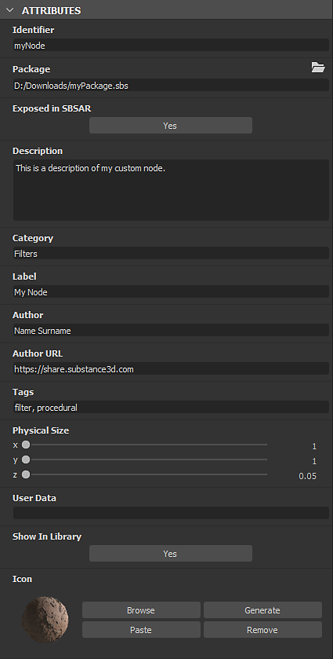

# Graphenparameter

Auf dieser Seite werden die Standardparameter für den <b>Substance-Graf </b> beschrieben.

Ein Graf verfügt über mehrere Parameter, die Sie ändern können. Sie können sie entweder durch Klicken auf *Leerraum* im Graf oder durch Auswählen des *Graf-Elements* im Bereich <b>Explorer</b> suchen. Die Parameter werden dann in der Parameteransicht angezeigt.

## Basisparameter

<table>
<tr style="border: 0;">
<td style="border: 0;" valign="top">

Dieser Abschnitt enthält Parameter, die Auswirkungen auf *alle darin enthaltenen Knoten haben*.

Jeder Graf in diesem Knoten, für den die Basisparameter auf die [&#128279;](../../compositing-graphs/inheritance-compositing/inheritance-in-substance-compositing-graphs.md)-Vererbung &quot;Relativ zum übergeordneten Element&quot;  festgelegt sind, erhält seine Werte aus den *Basisparametern des*-Grafen.

Die Basisparameterwerte des Grafen hängen wiederum vom Kontext ab, in dem der Graf verwendet wird.

</td>
<td style="border: 0;" valign="top">

{width="512px" zoomable="yes"}

</td>
</tr>
</table>

Wenn der Graf beispielsweise in einem anderen Graf als Instanzknoten verwendet wird, verwenden seine Basisparameter standardmäßig die Methode &quot;Relativ zur Eingabe&quot;-Vererbung. Dies bedeutet, dass sie ihre Werte vom Knoten erhalten, der mit seinem primären Eingang verbunden ist. (außer sie wurden [überschrieben](#input-parameters))

In den meisten Fällen spielt die Vererbung eine wichtige Rolle bei der Definition dieser Werte und bei der Art und Weise, wie sich diese Werte im gesamten Graf ändern. Es wird daher dringend empfohlen, vor der Verwendung dieser Graf ein gutes Verständnis von [Vererbung in Substance-Parametern](../../compositing-graphs/inheritance-compositing/inheritance-in-substance-compositing-graphs.md) zu erwerben.

|                      |                                                                                                                                                                                                                                                                                                                                                                                                                                     |
|:---------------------|:------------------------------------------------------------------------------------------------------------------------------------------------------------------------------------------------------------------------------------------------------------------------------------------------------------------------------------------------------------------------------------------------------------------------------------|
| <b>Ausgabegröße</b> | Mit diesem Parameter können Sie die *Basisauflösung* von Bildern im Graf auswählen.  Verwenden Sie die 

 Sperrschaltfläche, damit die Höhen- und Breitenwerte übereinstimmen und das Bild quadratisch bleibt, wenn Größenanpassungen vorgenommen werden.  *Standard: (0,0) - Relativ zum übergeordneten Element* [Weitere Informationen](../../compositing-graphs/output-size/output-size.md) |
| <b>Ausgabeformat</b> | Ermöglicht die Auswahl von *base Bittiefe* im Graf aus den folgenden Optionen:<ul data-preserve-html="true"><li data-preserve-html="true">8 Bit</li><li data-preserve-html="true">16 Bit</li><li data-preserve-html="true">HDR. Low Precision 16F (16-Bit-Gleitkomma)</li><li data-preserve-html="true">HDR. High Precision 32F (32-Bit-Gleitkomma)</li></ul>*Standard: 8 Bit pro Kanal - relativ zum übergeordneten Element* |
| <b>Pixelgröße</b> | Definiert die Pixelgröße. Es wird empfohlen, die **Width**- und **Height**-Werte auf **1** festzulegen.*Standard: (1,1) - Relativ zu übergeordnetem* |
| <b>Mustermodus</b> | Definiert den Basis-*Kachelmodus* im Diagramm anhand der folgenden Optionen:<ul data-preserve-html="true"> <li data-preserve-html="true">Kein Wiederholen</li> <li data-preserve-html="true">Horizontales Wiederholen</li> <li data-preserve-html="true">Vertikales Wiederholen</li> <li data-preserve-html="true">H+V Kacheln (d. h. horizontal und vertikal)</li> </ul>*Standard: H- und V-Kachelung - Relativ zu übergeordnetem Element* |
| <b>Zufallswert</b> | Definiert die Basis *Zufallswert* für das Diagramm.  Verwenden Sie die 

 Schaltfläche, um dem zufälligen Seed einen neuen zufälligen Wert zuzuweisen.  *Standard: 0 - Relativ zu übergeordnetem* |

<table>
<tr style="border: 0;">
<td width="100.00%" style="border: 0;" valign="top">

## Attribute

Der Abschnitt <b>Attribute</b> enthält *Metadaten* für das Diagramm, das Informationen für *Identifizierung*, *Kategorisierung* und *Anwenden* des Diagramms gemäß dem Entwurf des Autors bereitstellt.

</td>
<td width="33.33%" style="border: 0;" valign="top">

{zoomable="yes"}

</td>
</tr>
</table>

+++Liste der Attribute

|                      |                                                                                                                                                                                                                                                                                                                                                                                                                                                                                                                                                                                                                                                                                                                                                                                                                                                                                                                                                                                                                                                                                                                                                                                                                                                                                                                                                                                                                                                                                             |
|:---------------------|:--------------------------------------------------------------------------------------------------------------------------------------------------------------------------------------------------------------------------------------------------------------------------------------------------------------------------------------------------------------------------------------------------------------------------------------------------------------------------------------------------------------------------------------------------------------------------------------------------------------------------------------------------------------------------------------------------------------------------------------------------------------------------------------------------------------------------------------------------------------------------------------------------------------------------------------------------------------------------------------------------------------------------------------------------------------------------------------------------------------------------------------------------------------------------------------------------------------------------------------------------------------------------------------------------------------------------------------------------------------------------------------------------------------------------------------------------------------------------------------------|
| **Kennung** | Dies ist der Name des Diagramms und muss *eindeutig* sein. Sie können nicht zwei oder mehr Diagramme mit dem gleichen <b>Bezeichner</b> im selben Paket haben. Es wird als *Name* des Diagramms im Bereich [Explorer](../../interface/the-explorer-window/the-explorer-window.md) verwendet.  *Hinweis:* Der Bezeichner *darf keine leere Zeichenfolge sein*. Leere Zeichenfolgen werden automatisch durch `_` oder `Substance_graph` ersetzt. Für diesen Wert können Sie *nur* der folgenden Zeichen verwenden: 2.**`A-Z, 1-9, @$%[{]}_-` Nicht autorisierte Zeichen werden automatisch durch `_` ersetzt.  *Standard: Neuer\_Graph oder vom Benutzer bei der Diagrammerstellung festgelegt* |
| **Bezeichnung** | Das <b>Label</b> wird anstelle des <b>Bezeichners</b> verwendet, um den *Namen* des Diagramms für eine bessere Lesbarkeit in *Benutzerszenarien* anzuzeigen - z. B. [Library](../../interface/the-library/the-library.md)-Eintrag oder [Instanzknoten](../creating-compositing-gra/graph-instances-sub-gra/graph-instances-sub-graphs.md)-Bezeichnung.  Eine Beschriftung kann *nicht eindeutig* sein und Sonderzeichen enthalten.  *Tipp:* Wenn Sie ein Diagramm umbenennen - z. B. im [Explorer](../../interface/the-explorer-window/the-explorer-window.md) - möchten Sie möglicherweise auch die Beschriftung ändern!  *Standard: Leer* |
| **Typ** | Der <b>Typ</b> wird verwendet, um den beabsichtigten Zweck eines [Substance-Diagramms](../../compositing-graphs/substance-compositing-graphs.md) zu definieren. Es ist hauptsächlich für das [-Interoperabilitätsfeature &quot;Senden&quot; vorgesehen &#x200B;](../../interface/the-explorer-window/send-to-interoperability/send-to-interoperability.md). |
| **Materialmodell** | Durch das Festlegen des Diagrammmodells wird sichergestellt, dass der entsprechende Shader in der 3D-Materialmodell verwendet wird, wenn ein Shader *verfügbar ist, der dem Model* entspricht. Beispiel: Wenn ein Diagramm mit dem Materialmodus &quot;`OpenPBR v1.1`&quot; in der 3D-Ansicht angezeigt wird, wird der Shader &quot;`OpenPBR Surface`&quot; für das Zielmaterial ausgewählt.  Wenn kein passender Shader gefunden wird oder das Modell des Diagramms auf `Undefined` festgelegt ist, ist der für das Zielmaterial in der 3D-Ansicht verwendete Shader *unverändert*. |
| **Physische Größe** | Dieser Wert gibt die Dimension der Textur in der *physischen Welt* in X (Länge), Y (Breite) und Z (Height) an. Es steht daher in einem inhärenten Zusammenhang mit dem Material, das im Graphen erzeugt wird. Die Physische Größe kann zum Beispiel verwendet werden, um die Textur in der <b>2D-Ansicht</b> und in der <b>3D-Ansicht</b> in ihrem richtigen Verhältnis anzuzeigen.  *Tipp:* Die Physische Größe eines Substance-Diagramms kann als Float3-Wert in Substance-Funktionsdiagrammen abgerufen werden, die auf einen beliebigen Knoten in diesem Diagramm angewendet werden. Dabei wird die integrierte Variable $physicalsize [&#128279;](../../function-graphs/variables/system-variables/system-variables.md) verwendet.  *Hinweis:* Der **Z**-Wert wird derzeit *nicht übernommen. Konto* in der **3D-Ansicht**. Der Wert **Materialskalierung** für das Height sollte daher mithilfe eines Knotens **Ausgabe** festgelegt werden, der auf die **Höhenskalierung** oder direkt in den **Materialeigenschaften**.  *Standard: (0,0,0)* |
| **Symbol** | In diesem Bereich können Sie ein *Symbol* definieren, das von der <b>Bibliothek</b> verwendet wird, um den Eintrag dieses Diagramms sowohl als <b>SBS</b> als auch als <b>SBSAR</b> anzuzeigen. Das Symbol wird auch in anderen Situationen verwendet, z. B. [Substance 3D Painter](https://www.adobe.com/de/products/substance3d-painter.html) <b>Shelf</b>. Der Bereich bietet die folgenden Optionen:<ul data-preserve-html="true"> <li data-preserve-html="true"><b>Durchsuchen</b>: Ermöglicht es Ihnen, Ihre Systemdateien nach dem <i>vorhandenen Bild</i> zu durchsuchen, das als Symbol verwendet werden soll</li> <li data-preserve-html="true"><b>Generieren</b>: Dadurch wird ein Symbol mit einer <i>integrierten Vorgabe</i> des <b>PBR-Rendering</b>-Knotens generiert.</li> <li data-preserve-html="true"><b>Einfügen</b>: Ermöglicht das Einfügen der aktuell in der <i>Zwischenablage</i> enthaltenen Bilddaten als Symbol.</li> <li data-preserve-html="true"><b>Entfernen</b>: Mit dieser Option <i>wird das vorhandene Symbol entfernt</i>. Der Symbolsteckplatz <i>bleibt leer</i>.</li> </ul>*Hinweis:* Die Option **Generieren** verwendet die **Physische Größe**, um die **Height-Skalierung** des **PBR-Rendering** für seinen Versatz-Effekt zu ermitteln. Wenn im Diagramm ein **Output**-Knoten vorhanden ist, der auf **physicalsize** festgelegt ist, wird diese Ausgabe verwendet. Wenn keine solche Ausgabe vorhanden ist, wird der Wert aus den **Attributen** des Diagramms *anstelle von* verwendet. Wenn der Wert des Attributs (0,0,0) ist, wird der *voreingestellte Wert* von 0,1 verwendet.  *Hinweis:* Wenn *kein Symbol* definiert ist, wird stattdessen die *erste Bildausgabe* für das Diagramm verwendet.  *Standard: Leer* |
| **Paket** | Der *absolute* Dateiname für das **Paket**, zu dem dieses Diagramm gehört.Mit der Schaltfläche **Ordner** können Sie ein neues System *Dateibrowser-Fenster* an diesem Speicherort öffnen.*Standard: Paketdateiname/Leer, wenn das Paket nie gespeichert wurde* |
| **In SBSAR verfügbar gemacht** | Dadurch wird gesteuert, ob das Diagramm und seine Ausgaben in der **SBSAR**-Datei, die aus dem **Package**-Diagramm des Diagramms veröffentlicht wurde, *angezeigt* werden können. Dies ist hilfreich, wenn einige Diagramme im Paket nur als *Untergraph* für das Hauptdiagramm des Pakets verwendet werden und *nicht* in **SBSAR** angezeigt werden sollte.*Standard: Ja* |
| **In Bibliothek anzeigen** | Steuert, ob der Graph in der **Bibliothek** *sichtbar* sein soll, wenn das Paket in einem Speicherort gespeichert ist, der von der **Bibliothek** *überwacht* wird.*Standard: Auf der Registerkarte &quot;Bibliothek&quot; in den Projekteinstellungen festgelegt* |
| **Beschreibung** | Dies ist der *Beschreibungstext* des Diagramms.Er ist in der *QuickInfo* für den Diagrammeintrag in der **Library**, einem beliebigen **Instance**-Knoten für diesen Graph und Software mit einer bestehenden **Substance-Integration**.*Standard: Leer* |
| **Kategorie** | Sie können dieses Feld verwenden, um eine *Kategorie* für dieses Diagrammelement in der **Bibliothek** festzulegen.*Standard: Leer* |
| **Autor** | Sie können dieses Feld verwenden, um den *Namen* des Autors zu platzieren.*Standard: Leer* |
| **Autoren-URL** | In dieses Feld können Sie eine *URL* eingeben - z. B. die Website des Autors.*Standard: Leer* |
| **Tags** | Sie können dieses Feld verwenden, um Ihre eigenen *Tags* hinzuzufügen, um die *Durchsuchbarkeit* und die *Auffindbarkeit* des Diagramms zu verbessern.*Standard: Leer* |
| **Gruppe** | Aktiviert die Gruppierung von Elementen im Menü Knoten. Ressourcen wie Diagramme oder Bitmaps, die einen gemeinsamen Gruppenwert verwenden, werden in einem nach der Gruppe benannten Abschnitt gruppiert. *Standard: Leer* |
| **Benutzerdaten** | Sie können dieses Feld verwenden, um Ihre eigenen zusätzlichen Daten hinzuzufügen. Dies ist nützlich für benutzerdefinierte Integrationen in Software von Drittanbietern. Substance 3D Painter und Sampler verwenden diese Benutzerdaten, um bestimmte Verhaltensweisen festzulegen.*Standard: Leer* |
| **Vorlagendaten** | Wenn ein Substance-Diagramm als Vorlage verwendet wird, legt dieses Attribut die Kategorie und den Untertitel [&#128279;](../../compositing-graphs/creating-compositing-gra/creating-a-substance-compositing-graph.md) der Vorlage fest. Sie sind folgendermaßen voneinander getrennt: &lt;category>;&lt;subtitle>   *Standard: Leer* |

+++

## Eingabeparameter

<table>
<tr style="border: 0;">
<td style="border: 0;" valign="top">

Alle für das Diagramm spezifischen Parameter, einschließlich [verfügbar gemachte Parameter](../../compositing-graphs/manage-parameters/exposing-a-parameter/exposing-a-parameter.md), werden [verwaltet](../../compositing-graphs/manage-parameters/manage-parameters.md), bearbeitet und hier in der Vorschau angezeigt.

[Parametervorgaben](../../compositing-graphs/manage-parameters/parameter-presets/parameter-presets.md) können auch für einige oder alle Parameter erstellt werden.

</td>
<td style="border: 0;" valign="top">

{zoomable="yes"}

</td>
</tr>
</table>

+++Grundparameter überschreiben
Wenn Sie ein Diagramm in einem anderen Diagramm als [Instanzknoten](../creating-compositing-gra/graph-instances-sub-gra/graph-instances-sub-graphs.md) verwenden, können Sie den Standardwert für jeden Basisparameter auf diesem neuen Instanzknoten steuern.

Öffnen Sie das Hamburger-Menü oben im Abschnitt &quot;Eingabeparameter&quot; und gehen Sie zum Untermenü &quot;Basisparameter überschreiben&quot;, um einen Basisparameter auszuwählen, für den Sie einen beliebigen Standardwert festlegen möchten.

Der Editor des ausgewählten Parameters wird über der Liste der Diagrammeingabeparameter angezeigt. Sie können dann ihren Wert und die [Vererbungsmethode](../../compositing-graphs/inheritance-compositing/inheritance-in-substance-compositing-graphs.md) wie gewünscht anpassen.

+++

>[!IMPORTANT]
>
> Die Registerkarten &quot;<b>Vorschau</b>&quot; und &quot;<b>Vorgaben</b>&quot; sind deaktiviert, wenn Sie die [-kontextbezogene Bearbeitung &#x200B;](../../interface/preferences-window/preferences-window.md) verwenden.

## Eingaben

<table>
<tr style="border: 0;">
<td style="border: 0;" valign="top">

In diesem Teil werden alle [Eingabe](../../compositing-graphs/nodes-reference-for-com/atomic-nodes/input/input.md)-Knoten des Diagramms aufgelistet.

Sie können die Reihenfolge der Elemente ändern, indem Sie ganz links auf den Auswahlpunkt klicken.

</td>
<td style="border: 0;" valign="top">

{zoomable="yes"}

</td>
</tr>
</table>

## Ausgaben

<table>
<tr style="border: 0;">
<td style="border: 0;" valign="top">

In diesem Teil werden alle [Ausgabe](../../compositing-graphs/nodes-reference-for-com/atomic-nodes/output/output.md)-Knoten des Diagramms angezeigt.

Sie können die Reihenfolge der Elemente ändern, indem Sie ganz links auf den Auswahlpunkt klicken.

</td>
<td style="border: 0;" valign="top">

{zoomable="yes"}

</td>
</tr>
</table>
