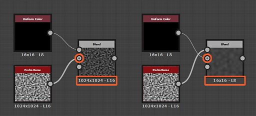

# Vererbung bei Substance-Graphen

Auf dieser Seite wird beschrieben, wie die Vererbung in [Substance-Graphen](../../compositing-graphs/substance-compositing-graphs.md) in [Substance 3D Designer](https://www.adobe.com/products/substance3d-designer.html) angewendet wird und welche Auswirkungen sie auf die Ausgabe des Diagramms hat.

{width="1400px"}

## Überblick

Alle Knoten in einem Substance-Diagramm können *den Wert einiger Parameter von einer Quelle erben*. Vererbung bedeutet, dass die Änderung des Werts in der Quelle *diese Änderung* auf allen Knoten ausführt, die von ihr erben. Dies ist eines der Grundkonzepte, die Substance 3D Designer bei der Generierung parametrischer Elemente unterstützen.

>[!NOTE]
>
> Eine kommentierte Projektdatei, die die Vererbung zeigt, ist im Abschnitt [Substance-Beispieldiagramme](../../compositing-graphs/sample-compositing-graphs/sample-substance-compositing-graphs.md) dieser Dokumentation verfügbar.

### Vererbungsmethoden

<table>
<tr style="border: 0;">
<td style="border: 0;" valign="top">

{width="128px"}

<b>Absolut</b>

Keine Vererbung, der Wert ist *willkürlich und lokal* für den Parameter definiert.

</td>
<td style="border: 0;" valign="top">

{width="128px"}

<b>Relativ zur Eingabe </b>

Der Wert wird von den Daten geerbt, die mit dem *primären Eingang* des Knotens verbunden sind.

</td>
<td style="border: 0;" valign="top">

{width="128px"}

<b>Relativ zu übergeordnetem Element </b>

Der Wert wird von *parent* des Knotens oder Diagramms geerbt.

</td>
</tr>
</table>

Vererbungsmethoden werden auf die [Basisparameter](../../compositing-graphs/graph-parameters/graph-parameters.md) eines Knotens angewendet. Dies ist der Satz allgemeiner Parameter, über die alle Knoten verfügen, die *grundlegende Aspekte* ihres Verhaltens steuern. Zu diesen Parametern gehören:

* **Ausgabegröße**
* **Ausgabeformat** (d. h. Bittiefe)
* **Pixelgröße**
* **Pixelverhältnis**
* **Kachelmodus**
* **Zufallsparameter**

Dadurch sollten Sie wissen, wie Änderungen am *One*-Knoten sich auf die Auflösung, Genauigkeit und das Kachelverhalten von *allen Knoten, die von ihm aus nachgelagert sind*, auswirken können.

>[!WARNING]
>
> Eine wichtige Erinnerung zum Verständnis der auf dieser Seite diskutierten Konzepte: Ein *Instanzknoten* ist ein [Knoten, der ein Diagramm in einem anderen Diagramm darstellt](../../compositing-graphs/creating-compositing-gra/graph-instances-sub-gra/graph-instances-sub-graphs.md), mit seinen *eigenen diskreten Parameterwerten*, daher der Begriff *Instanz*.\
> Beispiel: Zwei [Perlin-Nodes](../../compositing-graphs/nodes-reference-for-com/node-library/texture-generators/noises/perlin-noise/perlin-noise.md) in einem Diagramm sind beide Darstellungen eines *gleichen* Quelldiagramms (`perlin_noise` in `noise_perlin_noise.sbs`) mit ihren *eigenen Parameterwertsätzen*.

>[!NOTE]
>
> **Ausgabegröße:** Verwenden Sie die Sperrschaltfläche , damit der Wert des Heights *mit dem Wert der Breite* übereinstimmt.\
> **Zufallswert:** Verwenden Sie die Schaltfläche , um dem Zufallswert einen neuen Zufallswert zuzuweisen.

## Änderungen vornehmen

### Ändern von Vererbungsmethoden

Im Eigenschaftenfenster verfügen alle Parameter, die im Abschnitt [Basisparameter](../../compositing-graphs/graph-parameters/graph-parameters.md) der Eigenschaften eines Knotens aufgeführt sind, über eine Dropdownschaltfläche (Symbol) <b>Erbschaftsmethode festlegen</b> gegenüber der entsprechenden Bezeichnung.\
Mit dieser Schaltfläche können Sie die Vererbungsmethode auswählen, die für einen Parameter verwendet werden soll.

{width="512px"}

In den meisten Fällen sind die Basisparameter eines *Knotens* auf *Relativ zu Eingabe* festgelegt, um das prozedurale Verhalten der Verkettung von Knoten zu nutzen, während die Basisparameter eines *Graphen* auf *Relativ zu übergeordneten* festgelegt sind, sodass die globalen Parameter an den Kontext angepasst werden können, in dem das Diagramm verwendet wird.

### VERERBTE WERTE ANPASSEN

Einige Basisparameter, wie z. B. [Ausgabegröße](../../compositing-graphs/output-size/output-size.md), Pixelgröße oder Zufallsverteilung, können *relativ zum geerbten Wert geändert werden*.

Wenn der Parameter &quot;Ausgabegröße&quot; beispielsweise ein *Relativ zu...*-Vererbungsmethode, ein Wert oder `(1, -1)` bedeutet eine Potenz von zwei Auflösung *über*, den geerbten Wert für X, und eine Potenz von zwei Auflösung *unter*, den geerbten Wert für Y, z. B.:

* Vererbter Wert : `(9, 9)`, das `2^9, 2^9 = 512, 512` ist
* Relativer Wert: `(1, -1)`, das `2^(9+1), 2^(9-1) = 256, 1024` ist

>[!NOTE]
>
> Die Seite &quot;[Ausgabegröße](../../compositing-graphs/output-size/output-size.md)&quot; wird tiefer in diesen kritischen Basisparameter eingraviert. Es wird empfohlen, zu lesen, wie die endgültige Auflösung eines Knotens berechnet wird.

Wenn eine Funktion auf einen Base-Parameter angewendet wird, wird das Ergebnis der Funktion auch mithilfe der Vererbungsmethode des Parameters interpretiert.\
Berücksichtigen Sie das Beispiel für die Ausgabegröße. Eine Funktion, die darauf abzielt, die geerbte Auflösung in X und Y um das Zweifache zu erhöhen, sollte den Wert `(2, 2)` Integer2 ausgeben.

## Elternschaft für Knoten und Graphen

Wenn Sie die Methode Relative zu übergeordneter Vererbung verwenden, sollten Sie wissen, was genau dieses übergeordnete Element in einem bestimmten Kontext ist.

Das übergeordnete Element eines Knotens ist das *Diagramm*, in dem er vorhanden ist.

Das übergeordnete Element eines Diagramms ist der *Kontext*, in dem es vorhanden ist:

* Wenn dieses Diagramm ein Unterdiagramm ist, das in einem anderen Hostdiagramm als *Instanzknoten* instanziiert wird, ist der übergeordnete Knoten des Unterdiagramms der *Instanzknoten*. Das übergeordnete Element dieses Instanzknotens ist das *Hostdiagramm*.
* Wenn dieses Diagramm ein Stammdiagramm ist, ist die übergeordnete Anwendung die *Anwendung selbst* und der Wert, den die Anwendung für einen bestimmten Parameter festgelegt hat. Diagramme erben beispielsweise den Parametersatz <b>Übergeordnete Größe</b> in der Symbolleiste der [Diagrammansicht](../../interface/the-graph-view/the-graph-view.md).

>[!WARNING]
>
> Die Elternschaft wird *wie vorhanden angewendet*, wenn ein Paket in Substance 3D-Elementdateien (SBSAR) veröffentlicht wird. Dies bedeutet, dass beim Festlegen eines beliebigen Parameters auf die *Absolute*-Vererbungsmethode dieser Parameter *gesperrt* wird, um den aktuellen Wert im veröffentlichten Asset zu erhalten.\
> Dies ist zwar für [Bitmap](../../compositing-graphs/nodes-reference-for-com/atomic-nodes/bitmap/bitmap.md)-Knoten oder [Optimierungszwecke](../../best-practices/performance-optimization/performance-optimization-guidelines.md) wünschenswert, aber wir empfehlen *dringend*, bei der Arbeit in Substance-Graphen *Vererbungsmethoden im Verhältnis zu...* zu verwenden, es sei denn, es gibt einen *eindeutigen, absichtlichen Zweck*, um etwas Anderes zu tun.

### KONTEXTBEARBEITUNG.

Wenn Sie [In-context editing](../../compositing-graphs/creating-compositing-gra/graph-instances-sub-gra/graph-instances-sub-graphs.md) auf einem Grapheninstanzknoten verwenden, ist der übergeordnete Knoten des Diagramms der *Instanzknoten*. In diesem Fall ist die Einstellung <b>Übergeordnete Größe</b> in der Symbolleiste der [Diagrammansicht](../../interface/the-graph-view/the-graph-view.md) *deaktiviert*, da das Diagramm die Basisparameter vom Instanzknoten erbt.

Diese Eigenschaft ist der *Punkt* der kontextbezogenen Bearbeitung und sollte *in* berücksichtigt werden, wenn die Vererbungsmethode festgelegt und die aktuellen Werte der Base-Parameter eines beliebigen Knotens bewertet werden.

## Vererbung mit mehreren Eingaben

Wenn ein Diagramm über mehrere Eingaben verfügt, kann jede Eingabe je nach Vererbungsmethode von den einzelnen Eingabedaten oder vom Diagramm erben:

<table>
<tr style="border: 0;">
<td style="border: 0;" valign="top">

{width="128px"}

<b>Relativ zur Eingabe </b>

Der Eingang erbt von seinen diskreten Eingangsdaten, unabhängig von den Base-Parametern des Diagramms. Dies ist sehr hilfreich bei der Steuerung von Daten pro Eingabe.

</td>
<td style="border: 0;" valign="top">

{width="128px"}

<b>Relativ zu übergeordnetem Element </b>

Die Eingabe erbt vom Graphen, und die empfangenen Daten werden entsprechend angepasst.

</td>
<td style="border: 0;" valign="top">

</td>
</tr>
</table>

### Primärer Input

<table>
<tr style="border: 0;">
<td style="border: 0;" valign="top">

<table>
<tr style="border: 0;">
<td style="border: 0;" valign="top">

{width="48px"}

</td>
<td style="border: 0;" valign="top">

{width="48px"}

</td>
<td style="border: 0;" valign="top">

{width="48px"}

</td>
</tr>
</table>

Eine der Eingaben kann als **Primäre Eingabe** des Diagramms festgelegt werden, indem Sie auf **RMB** auf diesem [Eingabe](../../compositing-graphs/nodes-reference-for-com/atomic-nodes/input/input.md)-Knoten klicken und die Option **Als primäre Eingabe festlegen** im Kontextmenü auswählen.

</td>
<td style="border: 0;" valign="top">

</td>
</tr>
</table>

Wenn das Diagramm als Instanzknoten in ein anderes Diagramm instanziert wird, erben alle Basisparameter des Instanzknotens, die auf *Relativ zu Eingang* festgelegt sind, die mit *dieser Eingabe* verbundenen Daten. Der primäre Eingang eines Instanzknotens kann durch den kleinen dunklen Punkt in seinem Connector identifiziert werden.

Die anderen Eingaben, die auf *Relativ zu übergeordnetem* festgelegt sind, erben die Werte der gleichen Basisparameter, da sie vom *Diagramm* erben, das vom *Instanzknoten\** erbt, der von der primären Eingabe erbt.

\*: Dies ist wahr, wenn das Diagramm die Vererbungsmethode* Relativ zu übergeordnetem * verwendet.

## Beispiele

Im Folgenden finden Sie einige Beispiele zu verschiedenen Fällen von Vererbung sowie zum Wechselspiel der Vererbungsmethoden, die in den folgenden Akteuren von oben nach unten festgelegt wurden:

1. Anwendung
1. Host-Diagramm
1. Instanzknoten im Hostdiagramm
1. Unterdiagramm - das Diagramm, auf das der Instanzknoten verweist
1. Knoten im Unterdiagramm

Die *Vererbungsmethode*, die für einen Akteur festgelegt wurde, wird direkt darüber in Orange angezeigt. Der *Fluss der Vererbung* zu seiner Quelle wird mit orangefarbenen Linien angezeigt.

Buchstaben stellen *separate Sätze* von Base-Parametern dar und sollten helfen, zu verfolgen, welche Daten von welchem Akteur geerbt werden.

<table>
<tr style="border: 0;">
<td style="border: 0;" valign="top">

**Beispiel A**

{zoomable="yes"}

</td>
<td style="border: 0;" valign="top">

**Beispiel B**

{zoomable="yes"}

</td>
</tr>
</table>

<table>
<tr style="border: 0;">
<td style="border: 0;" valign="top">

**Beispiel C**

{zoomable="yes"}

</td>
<td style="border: 0;" valign="top">

**Beispiel D**

{zoomable="yes"}

</td>
</tr>
</table>

## Fehlerbehebung bei Vererbungsproblemen

Wenn Sie ein Diagramm erstellen und seine Komplexität erhöhen, kann es zu unerwarteten Ergebnissen kommen, die durch Vererbung verursacht werden. Wenn die Ausgabe eines Knotens eine falsche Auflösung oder Genauigkeit (d. h. Bittiefe) aufweist, sollten Sie *die Vererbungskette aufwärts* gehen, um zu ermitteln, woher diese Werte stammen.

Ein guter Ausgangspunkt ist das Überprüfen der Daten, die direkt unter einem Knoten angezeigt werden: Dies sind die Auflösung, das Farbformat und die Genauigkeit der Bildausgabe durch die *erste Ausgabe* des Knotens. Obwohl das Verständnis der Lösung unkompliziert ist, lohnt es sich, den zweiten Teil der Daten detailliert zu beschreiben:

* Das Präfix &quot;*&quot; für den Buchstaben &quot;*&quot; bezieht sich auf das Farbformat des Bildes:
  * <b>L</b>: Luminanz (z. B. Graustufen)
  * <b>C</b>: Farbe
* Die *Zahl* bezieht sich auf die Bittiefe des Bildes von der niedrigsten bis zur höchsten Genauigkeit:
  * <b>8</b>: 8-Bit-Ganzzahl (256 Schritte in 0-1)
  * <b>16</b>: 16-Bit-Ganzzahl (65 536 Schritte in 0-1)
  * <b>16F</b>: 16-Bit-Gleitkommawert (niedrige Genauigkeitswerte über 0-1, einschließlich Negative)
  * <b>32F</b>: 32-Bit-Gleitkommawert (hohe Präzisionswerte über 0-1, einschließlich Negative)

Wenn der Knoten mehr als eine Ausgabe hat, können Sie deren Auflösung und Genauigkeit auf zwei einfache Arten überprüfen:

* Doppelklicken Sie auf <b>LMB</b> auf dem *Ausgabestecker*, um das Bild in der [2D-Ansicht](../../interface/2d-view/2d-view.md) anzuzeigen, und überprüfen Sie die Bildinformationen, die in der *unteren linken Ecke* des Viewports der 2D-Ansicht angezeigt werden.
* Erstellen Sie einen Knoten vom Typ [Levels](../../compositing-graphs/nodes-reference-for-com/atomic-nodes/levels/levels.md) oder [Transformation 2D](../../compositing-graphs/nodes-reference-for-com/atomic-nodes/transformation-2d/transformation-2d.md) und verbinden Sie seinen Eingang mit der Ausgabe, die Sie überprüfen möchten. Der Knoten &quot;*&quot; erbt standardmäßig von der Ausgabe &quot;*&quot;, und Sie können dann die Werte unter dem Knoten überprüfen.

Nun können Sie die Knotenkette im Diagramm nach oben gehen und versuchen, den *ersten Knoten* zu finden, in dem die unerwarteten Werte angezeigt werden. Überprüfen Sie die Vererbungsmethode ihrer Base-Parameter.

Wenn nichts falsch ist und der Knoten ein Instanzknoten ist, müssen Sie tiefer gehen und das Diagramm öffnen, auf das dieser Instanzknoten verweist. Wiederhole diesen Vorgang ausgehend von den Ausgabeknoten des Diagramms und ausgehend vom Stromaufwärtsfluss.

### EIN GEMEINSAMES BEISPIEL

Insbesondere das *Primäre Eingabe*-Konzept wird leicht *übersehen* und kann zu Vererbungsproblemen führen.

Der Knoten [Blend](../../compositing-graphs/nodes-reference-for-com/atomic-nodes/blend/blend.md) ist dafür sehr anfällig, da er sehr häufig verwendet wird. Die <b>Background</b>-Eingabe ist die primäre Eingabe.

{width="512px"}

Sie müssen auf die Reihenfolge achten, in der Sie die beiden Eingaben mischen: Der Eingang, dessen Auflösung und Präzision Sie im Diagramm beibehalten möchten, sollte mit dem Eingang Hintergrund verbunden sein, wenn der benötigte Mischmodus dies ermöglicht. Andernfalls müssen Sie möglicherweise die Base-Parameter des Überblendungsknotens und die zugehörige Vererbungsmethode anpassen, um dies zu kompensieren.
