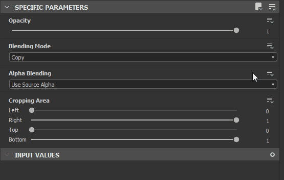
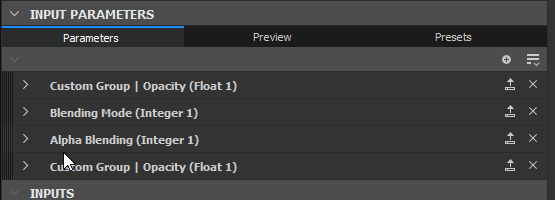

# Exponieren von Parametern

Das Freigeben von Parametern ist eines der leistungsfähigsten Tools und der Schlüssel zum Öffnen Ihrer Diagramme für andere Anwendungen wie Substance 3D Painter, Substance 3D Sampler und Substance Integrationen für Maya und 3DS Max.

Auf dieser Seite werden alle erforderlichen Konzepte für den Einstieg in die Bereitstellung erläutert. Es wird [ empfohlen, zuerst zu erfahren, was eine Diagramminstanz ist](../../../compositing-graphs/creating-compositing-gra/graph-instances-sub-gra/graph-instances-sub-graphs.md), bevor Sie mit dieser Seite fortfahren. Es ist auch gut, den Unterschied zwischen Publish und &quot;Exportieren&quot; sowie die betroffenen Dateitypen zu erfassen[.](../../../getting-started/overview/overview.md)

*\*Gestrichelte, transparente Linien oben sind eine abstrakte Darstellung der Verbindung\
von angezeigten Parametern zu Diagrammparametern.*

## Parameter verstehen und belichten

+++Was ist ein Parameter?
*Ein Parameter ist ein einfacher Wert mit einem UI-Element, der das Verhalten eines Diagramms steuert.* Sie verwenden sie ständig in allen Substance-Software: um eine Farbe zu ändern, den Mischmodus festzulegen, einen Deckkraftwert auszuwählen usw. Ohne Parameter würde die Substance-Software überhaupt keine Anpassung zulassen.

Parameter können in vielen verschiedenen Formen vorliegen: Regler, Zifferblätter, Eingabefelder, Dropdown-Menüs usw. Die Werte, die sie darstellen, können verschiedene Typen haben: Dezimalwerte, ganze (Ganzzahl) Werte, boolesche (Wahr-/Falsch) Werte, sogar Textausschnitte.

+++

+++Was ist &quot;Entlarven&quot;?
***Durch das Freigeben wird ein Parameter zur Verfügung gestellt, der außerhalb der aktuellen Diagrammansicht verwendet werden kann.***  Beim Erstellen eines Diagramms wählen Sie in der Regel einen Knoten aus, um die Parameter in seinen Eigenschaften zu ändern. Wenn sie verfügbar gemacht werden, *aktivieren Sie den Zugriff auf diesen Parameter von einem externen Steuerungsfenster aus*. Diese &quot;externe Systemsteuerung&quot; kann je nach Kontext verschiedene Dinge bedeuten: Wenn sie in Designer als Diagramminstanz verwendet wird, agiert sie nur als ein anderer Knoten. Bei Verwendung in Substance 3D Painter, Substance 3D Sampler oder einer Integration sind diese verfügbar gemachten Parameter *das einzige Steuerelement, das Sie über das Diagramm verfügen.*

+++

+++Warum ist die Aufdeckung nützlich?
***Das Verfügbarmachen von Parametern ist etwas, was Substance 3D Designer über einen einfachen Textur-Editor hinausführt und es Ihnen ermöglicht, anpassbare, dynamische Tools zur Texturgenerierung zu erstellen*** **.** Ohne Belichtung würden sich Substance-Materialien nicht sehr von statischen Texturen unterscheiden: können Sie ihre Ausgaben nicht ändern.

+++

+++Warum werden nicht alle Parameter automatisch und ständig verfügbar gemacht?
<b> [Substance-Graphen](../../../compositing-graphs/substance-compositing-graphs.md) kann kompliziert werden und Hunderte von Parametern gleichzeitig enthalten. Es ist nicht sinnvoll, einem Benutzer immer alle Parameter anzuzeigen, insbesondere wenn Sie Diagramme mit einem einfachen Ziel erstellen, für die nicht viele Parameter erforderlich sind.</b> Wenn Sie Parameter verfügbar machen, arbeiten Sie als UI- oder UX-Designer: Du denkst, welche Kontrollen sinnvoll sind, welche Werte erforderlich sind und wie du sie einfach für dich selbst, für andere Nutzer online oder für deine Mitarbeiter nutzen kannst.

+++

+++Muss ich Mathe für die Belichtung kennen? Soll ich Substance-Funktionsdiagramme verstehen?
***Mathematisches Wissen ist nicht erforderlich, um die Verfügbarkeitsparameter richtig zu nutzen, und auch die Verwendung von Funktionen ist nicht erforderlich.***  Als Anfänger können Sie mathematische Operationen in [Funktionsdiagrammen](../../../function-graphs/function-graphs.md) fast vollständig vermeiden. Es wird nur dringend empfohlen, [die verschiedenen Datentypen wie Integer, Float und Boolean zu kennen.](../../../function-graphs/nodes-reference-for-fun/function-nodes-overview/function-nodes-overview.md)

+++

## Belichtung.

Derzeit gibt es zwei Hauptmethoden zum Anzeigen von Parametern. Die eine Methode eignet sich besser für die schnelle Belichtung eines einzelnen Parameters, die zweite Methode eignet sich besser für die Belichtung mehrerer Parameter in einem Sweep.

{width="512px"}

### EINZELBELICHTUNGSMETHODE

1. Suchen Sie den Parameter, der im Bereich [Eigenschaften](../../../interface/properties/properties.md) auf der Registerkarte Spezifische Parameter angezeigt werden soll.
1. Klicken Sie auf die Schaltfläche mit den Dropdownoptionen .
1. Wählen Sie  <b>Als neue Diagrammeingabe verfügbar machen</b> aus der Dropdown-Liste, die erste Option.
1. Das Dialogfeld &quot;<b>Parameter verfügbar machen</b>&quot; wird angezeigt. Legen Sie alle Parametereigenschaften wie gewünscht fest.

   Es wird empfohlen, mindestens die <b>ID</b> und <b>Bezeichnung</b> zu ändern.
1. Drücken Sie <b>OK</b>, um den Vorgang zu bestätigen.
1. Der Name des Parameters wird *blau*, und der Name \
   Neben den Dropdownoptionen wird die Schaltfläche <b> Parameterfunktion bearbeiten</b> angezeigt, um zu bestätigen, dass der Parameter angezeigt wird.

>[!NOTE]
>
> Die meisten Zahlenfelder unterstützen *einfache mathematische Formeln* als Eingabe, z. B. `17+3.5`, `7/3`, `(4+2)*3`. Drücken Sie *Eingabe*, um die Formel zu validieren, und das Ergebnis wird in das Feld eingegeben. Wenn die Formel ungültig ist, wird das Feld auf den vorherigen Wert zurückgesetzt.\
> Einige numerische Felder in anderen Teilen der Anwendung, z. B. im Dock [Eigenschaften](../../../interface/properties/properties.md), unterstützen diese Funktion ebenfalls.

{width="512px"}

### Stapelbelichtungsmethode

Wenn ein Parameter angezeigt wird, ist diese Methode etwas langsamer als die vorherige. Wenn mehrere Parameter verfügbar gemacht werden, ist dies viel schneller.

1. Suchen Sie statt eines einzelnen Parameters die Schaltfläche  <b>Mehrfachbelichtung</b> oben rechts auf der Registerkarte <b>Spezifische Parameter</b>.
1. Wählen Sie <b>Stapelbereitstellungsparameter aus...</b> aus dem Dropdownmenü
1. Das Dialogfeld &quot;<b>Batch-Bereitstellung</b>&quot; wird angezeigt, in dem Sie die Bereitstellung aller <b>spezifischen Parameter eines Knotens anpassen können.</b>
1. Verwenden Sie <b>Alle</b>, <b>Keine</b> oder bestimmte Kontrollkästchen, um zu entscheiden, welche Parameter verfügbar gemacht werden sollen.
1. Klicken Sie in der Liste auf einen Parameternamen unter der Spalte <b>Graph input identifier</b>, um den Namen zu ändern.
1. Klicken Sie auf einen <b>Gruppennamen</b> in der Spalte <b>Graph-Eingabegruppe</b> in der Liste, um eine (Unter-)Gruppe für einen bestimmten Parameter hinzuzufügen.
1. Verwenden Sie die <b>Graph-Eingabekennung</b> und die <b>Graph-Eingabegruppe</b>-Eingabefelder am unteren Rand, um allen angezeigten Parametern Präfix, Suffix und Eingabegruppen gleichzeitig hinzuzufügen. Alle diese Werte werden zusätzlich zu den Einstellungen pro Parameter angewendet.
1. Klicken Sie auf <b>OK</b>, um alle ausgewählten Parameter zu bestätigen und anzuzeigen. Die Parameternamen zeigen jetzt *blau* an, um zu bestätigen, dass die Parameter angezeigt werden, sowie eine  <b>Schaltfläche zum Bearbeiten der Funktion</b>.

## Einschränkungen

Es gibt einige Einschränkungen in Bezug auf das Verfügbarmachen von Parametern, wie in der folgenden Tabelle aufgeführt.

| Parametertyp | Ursache |
| --- | --- |
| [Verlaufsbalken](../../../compositing-graphs/nodes-reference-for-com/atomic-nodes/gradient-map/gradient-map.md), [Kurveneditor](../../../compositing-graphs/nodes-reference-for-com/atomic-nodes/curve/curve.md), [Schrift](../../../compositing-graphs/nodes-reference-for-com/atomic-nodes/text/text.md), [Tonwertkorrektur-Histogramm](../../../compositing-graphs/nodes-reference-for-com/atomic-nodes/levels/levels.md) | Widgets erforderlich, die für vom Benutzer erstellte Parameter nicht verfügbar sind. |

Eine weitere wichtige Einschränkung betrifft [statische Parameter](../../../glossary/glossary.md). Diese können in einem [veröffentlichten Substance 3D-Asset (SBSAR)](../../publishing-asset-files/publishing-substance-3d-asset-files-sbsar.md) nicht geändert werden.

Statische Parameter - im Gegensatz zu dynamischen Parametern - *können nicht sofort bearbeitet werden*, nachdem das Diagramm *gekocht* wurde - d. h. verarbeitet, um den Algorithmus schnell und effizient auszuführen. Das Kochen erfolgt in Designer jedes Mal, wenn das Diagramm *bearbeitet* oder *veröffentlicht* ist.

Daher sind statische Parameter in Designer sichtbar und bearbeitbar, in einem veröffentlichten Substance 3D-Asset jedoch *ausgeblendet*. Sie können den Vorschaumodus verwenden, um diese Einschränkungen zu sehen, bevor Sie auf einem Substance 3D-Element veröffentlichen: Siehe &quot;Vorschau der Parameter&quot; weiter unten.

Als Problemumgehung können Sie einen [Switch](../../../compositing-graphs/nodes-reference-for-com/node-library/filters/blending/switch/switch.md)- oder [Multi Switch](../../../compositing-graphs/nodes-reference-for-com/node-library/filters/blending/multi-switch/multi-switch.md)-Knoten und mehrere Logiksätze verwenden, um zwischen verschiedenen Werten/Zuständen für diese Parameter zu wechseln.

| Knoten | Parameter |
| --- | --- |
| Alle Knoten | Pixelverhältnis im Kachelmodus |
| [Einheitliche Farbe](../../../compositing-graphs/nodes-reference-for-com/atomic-nodes/uniform-color/uniform-color.md) | Farbmodus |
| [Pixelprozessor](../../../compositing-graphs/nodes-reference-for-com/atomic-nodes/pixel-processor/pixel-processor.md) | Farbmodus |
| [Überblendung](../../../compositing-graphs/nodes-reference-for-com/atomic-nodes/blend/blend.md) | Füllmethode Alpha-Füllmethode Zuschneidebereich |
| [FX-Map](../../../compositing-graphs/nodes-reference-for-com/atomic-nodes/fx-map/fx-map.md) | Mischmodus |
| [Quadrant](../../../function-graphs/fxmaps/the-quadrant-node/the-quadrant-node.md) | Alpha-Eingabebildfilter für Muster |

## Ändern der angezeigten Parameter

Nach dem Belichten ist es nicht mehr möglich, auf einen Parameter wie zuvor zuzugreifen. Sie können den Wert ändern, die Elemente umbenennen, in der Benutzeroberfläche anordnen und sogar den Parameter entfernen. Das alles geschieht auf der Ebene &quot;Diagrammeigenschaften&quot;. In diesem Abschnitt wird die entsprechende Vorgehensweise beschrieben.

So ändern Sie die Optionen eines angezeigten Parameters:

1. Klicken Sie auf die Schaltfläche &quot;Dropdown-Optionen&quot;  neben dem bereits angezeigten Parameter.
1. Wählen Sie &quot;<b>&quot; aus, um den angezeigten Diagrammeingang zu bearbeiten.</b>. Dadurch gelangen Sie direkt zum entsprechenden Eintrag in den Diagrammeigenschaften.
1. Doppelklicken Sie in einen leeren Bereich des Diagramms, um zu den Diagrammeigenschaften zu gelangen. Suchen Sie dann den Parameter in der Liste mit <b>Eingabeparametern</b>.
1. Klicken Sie im <b>Explorer</b> einmal auf das Diagramm, und suchen Sie dann den Parameter in der Liste der <b>Eingabeparameter</b>.

{width="512px"}

### EINGABEPARAMETER

Alle angezeigten Parameter werden auf der Registerkarte Eingabeparameter aufgelistet. Die folgenden Eigenschaften sind für die meisten gängigen Fälle verfügbar, z. B. &quot;Gleitkomma&quot; und &quot;Ganzzahlen&quot; mit dem Standard-Editortyp.

1. <b>Kennung</b>: Eindeutiger Bezeichner für diesen Parameter Darf keine Leerzeichen oder Sonderzeichen enthalten.
1. <b>Bezeichnung</b>: Bezeichnung nur für Benutzeroberfläche. Wenn kein Label definiert ist, wird der Bezeichner in der Benutzeroberfläche angezeigt. Kann Leerzeichen und Sonderzeichen enthalten
1. <b>Gruppe</b>: Gruppieren Sie Parameter in einem reduzierbaren Abschnitt, damit lange Parameterlisten übersichtlich und verwaltbar bleiben. Die Parameter werden gruppiert, wenn sie den Gruppennamen &quot;*&quot;, der exakt mit dem Gruppennamen &quot;*&quot; übereinstimmt, gemeinsam verwenden. Verwenden Sie das Zeichen `/`, um *Untergruppen* zu erstellen - z. B. 3`My Group/My Sub-group`
1. <b>Beschreibung</b>: Textfeld für die Beschreibung, als QuickInfo verwendet.
1. <b>Typ / Editor</b>: Legen Sie den Datentyp sowie den Typ des UI-Editors fest. Bestimmte Editoren sind nur für bestimmte Datentypen verfügbar (z. B. eine Dropdown-Liste nur für Ganzzahl). *Das Ändern des Editors löscht in vielen Fällen die Standardwerte, Vorsicht!*
1. <b>Standard</b>: Standardwert, bei dem der Parameter beginnt. Dies ist auch der Wert, der in Ihrem Graphen bei der Knotenvorschau verwendet wird. Versuchen Sie, einen einfachen, nutzbaren Wert hier zu verwenden, vermeiden Sie Extremfälle.
1. <b>Min</b>: Mindestwert für die Benutzeroberfläche
1. <b>Max</b>: Maximalwert für die Benutzeroberfläche
1. <b>Klemme</b>: Legen Sie fest, ob Min und Max weiche oder harte Grenzen sind (erlauben Sie dem Benutzer, die Grenzen zu überschreiten).
1. <b>Schritt</b>:Set die Präzision oder Granularität des Werts.
1. <b>Benutzerdaten</b>: benutzerdefinierte Benutzerdaten, die für jeden Zweck verfügbar sind.
1. <b>Sichtbar, wenn</b>: spezielles Ausdruckssystem zum Ein- oder Ausblenden von Parametern basierend auf externen Bedingungen. Siehe [Sichtbar, wenn: Kontrollieren der Sichtbarkeit von Eingängen, Ausgängen und Parametern](../../../compositing-graphs/visible-control-vis/visible-if-control-visibility-of-inputs-outputs-and-parameters.md)

{width="512px"}

#### Dropdown-Liste

Ein Sonderfall ist die <b>Dropdownliste </b> für Integer-Typen. Es gibt keine Standard-, Min- oder Max-Werte, sondern nur eine einzelne Werteinstellung, mit der Sie eine Liste von Elementen definieren können.

* Jedes Element entspricht einem Element in der Dropdownliste.
* Der erste Wert für ein Item ist die tatsächliche, interne ganze Zahl, die vom Graphen verwendet wird. Stellen Sie sicher, dass diese für Ihren [Multiswitch](../../../compositing-graphs/nodes-reference-for-com/node-library/filters/blending/multi-switch/multi-switch.md) richtig eingerichtet sind (sie beginnen bei 1, nicht bei 0).
* Der zweite Wert ist die dem Benutzer angezeigte UI-Bezeichnung.
* Mit dem dritten Kontrollkästchen können Sie ein Element als das standardmäßig ausgewählte Element markieren.
* Das X löscht ein Element, das + fügt ein Element hinzu.

{width="512px"}

#### Neuanordnung

Sie können die Parameter neu anordnen, indem Sie die dunklen, gestreiften Handles auf die linke Seite des Namens der Eingabeparameter in der Liste ziehen und ablegen. Beachten Sie, dass sich Gruppierungsparameter auf die Reihenfolge auswirken können.

{width="512px"}

### VORSCHAU VON PARAMETERN

Da das Einrichten von Parametern schwierig sein kann, ohne das Endergebnis zu sehen, kann ein <b>Vorschaumodus</b> aktiviert werden, um zu überprüfen, wie die Parameterbenutzeroberfläche extern aussehen und sich verhalten wird. Klicken Sie oben in der Mitte des Rollouts für Eingabeparameter auf die Registerkarte <b>Vorschau</b>.

Normalerweise werden alle im <b>Vorschaumodus</b> vorgenommenen Änderungen *verworfen*. Sie können jedoch die <b>Schaltfläche zum Anwenden </b> neben dem Augensymbol verwenden, um die aktuellen Werte des <b>-Vorschaumodus</b> als *neue Standardwerte* festzulegen.

[Im Vorschaumodus können Sie auch eingebettete Vorgaben erstellen.](../../../compositing-graphs/manage-parameters/parameter-presets/parameter-presets.md)

>[!IMPORTANT]
>
> Der Vorschaumodus ist deaktiviert, wenn die [-kontextbezogene Bearbeitung ](../../../interface/preferences-window/preferences-window.md) verwendet wird.

>[!WARNING]
>
> Im Vorschaumodus soll das Erlebnis eines [veröffentlichten Substance 3D-Assets (SBSAR)](../../publishing-asset-files/publishing-substance-3d-asset-files-sbsar.md) so genau wie möglich dargestellt werden. Daher gelten die auf dieser Seite aufgeführten Einschränkungen in diesem Modus, z. B. *statische Parameter, die in der Liste nicht vorhanden sind*.

{width="512px"}

### KOPIEREN UND EINFÜGEN VON PARAMETERN

Parameter können zwischen Graphen kopiert und eingefügt werden.

Ein einzelner Parameter kann mit der Schaltfläche &quot;Kopieren&quot;  kopiert werden. Mehrere Parameter können über das Parametermenü &quot;&quot; kopiert werden. Wählen Sie &quot;Eingaben kopieren&quot;, um alle Eingaben zu kopieren.

Wählen Sie &quot;Eingaben einfügen&quot;  im Menü &quot;Parameter&quot; , um einen oder mehrere Parameter einzufügen.

Wenn Sie Werte und nicht den tatsächlich angezeigten Parameter selbst übertragen möchten, [lesen Sie die Informationen zu Parametervorgaben.](../../../compositing-graphs/manage-parameters/parameter-presets/parameter-presets.md)

## Entfernen und Reinigen exponierter Parameter

Aufgrund der Art von Parametern können Probleme mit fehlenden oder nicht verwendeten Parametern auftreten, wenn Sie über einen Eingabeparameter verfügen, der mehrere Knoten steuert, oder wenn Eingabeparameter vorhanden sein können, ohne einen Knoten zu steuern. Nachfolgend werden häufige Probleme und deren Lösungen beschrieben.

{width="512px"}

### VERFOLGEN VON FEHLERHAFTEN PARAMETERN AUF KNOTEN

Mit dem Knotensuche-Tool &quot;&quot;, das sich in der oberen Leiste der Diagrammansicht befindet, können Sie nachverfolgen, welcher Parameter von welchem Knoten verwendet wird. Klicken Sie darauf, um Knoten mithilfe bestimmter Parameter zu suchen.

Wenn ein Knoten ein tatsächliches Problem aufweist, zeigt er oben links ein Warnungskennzeichen  an. Wenn Sie den Mauszeiger über das Abzeichen bewegen, wird eine QuickInfo mit weiteren Informationen angezeigt.

Um ein Problem zurückzusetzen und zu entfernen, klicken Sie für den Parameter, den Sie reparieren oder zurücksetzen möchten, auf die Dropdown-Schaltfläche &quot;&quot; neben der Schaltfläche &quot;Funktion bearbeiten&quot; und wählen Sie &quot; <b>Zurücksetzen&quot;. </b>Hiermit wird ein Parameter auf seinen vorherigen, nicht exponierten Zustand zurückgesetzt. Der blaue Name wird wieder grau, um dies widerzuspiegeln.

{width="512px"}

### BEREINIGEN NICHT VERWENDETER EINGABEPARAMETER

Wenn Sie den Überblick über Ihre Eingabeparameter verloren haben und nicht mehr wissen, welche Parameter verwendet werden, können Sie sie mit einem kleinen Werkzeug bereinigen. Klicken Sie auf die Menüschaltfläche &quot;Eingabeparameter&quot; , und wählen Sie <b>Eingaben bereinigen.</b>

Ein neues Dialogfeld mit allen nicht verwendeten Parametern wird angezeigt. Aktivieren bzw. deaktivieren Sie die Parameter, die Sie entfernen bzw. beibehalten möchten, und klicken Sie auf &quot;OK&quot;. Wenn kein Dialogfeld angezeigt wird, sind derzeit keine nicht verwendeten Parameter zum Bereinigen vorhanden.

{width="512px"}

### PARAMETER ENTFERNEN

Um einen verwendeten Parameter tatsächlich zu entfernen, sind zwei unterschiedliche Schritte erforderlich.

1. Klicken Sie auf dem Knoten mit dem offengelegten Parameter auf den Dropdown-Pfeil rechts neben der blau eingefärbten Schaltfläche „Funktion“: . Wählen Sie dann &quot;Auf Standardwert zurücksetzen&quot;. Dadurch wird die Verwendung des Parameters auf diesem einen Knoten entfernt. für jeden anderen Knoten, der denselben Parameter verwendet, zu wiederholen. &quot;Auf Standardwert zurücksetzen&quot; setzt auch den Bereich des Parameter-Widgets auf den *weichen Bereich* zurück.
1. Klicken Sie in der Liste &quot;Eingabeparameter&quot; des Diagramms auf das X rechts neben dem Parametereintrag. Dadurch wird der Parameter vollständig gelöscht. Wenn Knoten versuchen, diesen Parameter zu verwenden, wird ein Warnschild angezeigt (siehe oben).
