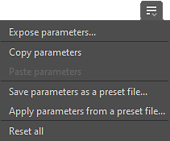

# Parameter verwalten

Wenn Sie Parameter nicht nur direkt anpassen, sondern auch steuern müssen, bietet Designer verschiedene hilfreiche Funktionen für die folgenden Aufgaben:

* [Kopieren Sie die Werte aller Parameter eines Knotens und fügen Sie sie ein.](#copy-paste-parameters)
* Speichern Sie die Werte oder alle Parameter eines Knotens in einer [Vorgabedatei](../../compositing-graphs/manage-parameters/parameter-presets/parameter-presets.md), um sie später wiederzuverwenden.
* [Stellen Sie die Parameter &#x200B;](../../compositing-graphs/manage-parameters/exposing-a-parameter/exposing-a-parameter.md) von Knoten bereit, damit sie zugänglich sind, und verknüpfen Sie sie miteinander.
* [Parameter &#x200B;](../../compositing-graphs/visible-control-vis/visible-if-control-visibility-of-inputs-outputs-and-parameters.md) gemäß den Werten anderer Parameter ein- oder ausblenden
* Verwenden Sie ein [Substance-Funktionsdiagramm &#x200B;](../../function-graphs/function-graphs.md), um den Wert eines Parameters zu berechnen.

## Parameteraktionen

Die Tools, die zur Verwaltung von Parametern verfügbar sind, sind an folgenden Positionen verfügbar:

### Globale Aktionen

<table>
<tr style="border: 0;">
<td width="100.00%" style="border: 0;" valign="top">

Wenn die Eigenschaften eines Knotens im Eigenschaften-Dock angezeigt werden, können die Knotenparameter global mithilfe des Menüs &quot;<b>Parameter verwalten</b>&quot; im folgenden Abschnittsheader verwaltet werden:

* Für [atomare Knoten](../../compositing-graphs/nodes-reference-for-com/atomic-nodes/atomic-nodes.md): Spezifische Parameter
* Für [Instanzknoten](../../compositing-graphs/creating-compositing-gra/graph-instances-sub-gra/graph-instances-sub-graphs.md): Instanzparameter

</td>
<td width="33.33%" style="border: 0;" valign="top">

{zoomable="yes"}

</td>
</tr>
</table>

Die Aktionen in diesem Menü wirken sich auf *alle* der in diesem Abschnitt aufgeführten Parameter aus:

* <b>Verfügbarkeitsparameter:</b> Öffnet das Dialogfeld &quot;Stapelverfügbarkeitsparameter&quot;. Für jeden angezeigten Parameter erstellt die Aktion eine neue Diagrammeingabe und legt automatisch eine Funktion fest, die diese Diagrammeingabe verwendet. Weitere Informationen zum Verfügbarmachen von Parametern in [dieser dedizierten Seite &#x200B;](../../compositing-graphs/manage-parameters/exposing-a-parameter/exposing-a-parameter.md).
* <b>Parameter kopieren:</b> Siehe [Parameter kopieren und einfügen](#copy-paste-parameters) Abschnitt unten.
* <b>Parameter einfügen:</b> Siehe [Parameter kopieren und einfügen](../../compositing-graphs/manage-parameters/manage-parameters.md) Abschnitt unten.
* <b>Parameter als Vorgabedatei speichern:</b> Weitere Informationen zu Parametervorgaben in [dieser dedizierten Seite](../../compositing-graphs/manage-parameters/parameter-presets/parameter-presets.md).
* <b>Parameter aus einer Vorgabedatei anwenden:</b> Weitere Informationen zu Parametervorgaben in [dieser dedizierten Seite](../../compositing-graphs/manage-parameters/parameter-presets/parameter-presets.md).
* <b>Alle zurücksetzen:</b> Setzt alle Parameter auf ihre Standardwerte und -bereiche zurück. Wenn Funktionen auf Parameter angewendet wurden, werden sie verworfen.

>[!NOTE]
>
> Einige Aktionen sind für einige Atomknoten nicht verfügbar. Siehe [Einschränkungen für atomare Knoten](#atomic-nodes-limitations) weiter unten.

### Einzelne Parameteraktionen

<table>
<tr style="border: 0;">
<td width="100.00%" style="border: 0;" valign="top">

Wenn Sie einen *single*-Parameter verwalten möchten, verwenden Sie das Menü &quot;<b>Funktion verwalten</b>&quot; gegenüber der Parameterbeschriftung.

</td>
<td width="33.33%" style="border: 0;" valign="top">

{zoomable="yes"}

</td>
</tr>
</table>

Sie können einen [Substance-Funktionsdiagramm &#x200B;](../../function-graphs/the-function-graph/the-function-graph.md) auf diesen Parameter auf drei Arten anwenden:

* <b>Als neue Diagrammeingabe verfügbar machen:</b> Erstellt eine neue Diagrammeingabe und legt automatisch eine Funktion fest, die diese Diagrammeingabe verwendet. Weitere Informationen zum Verfügbarmachen von Parametern in [dieser dedizierten Seite &#x200B;](../../compositing-graphs/manage-parameters/exposing-a-parameter/exposing-a-parameter.md).
* <b>Leere Funktion:</b> Erstellen Sie eine neue Funktion.
* <b>Konstantenwert:</b> Bearbeiten Sie eine Funktion, die von einem [Knoten mit konstanten Werten](../../function-graphs/nodes-reference-for-fun/atomic-function-nodes/constant-nodes/constant-nodes.md) ausgeht, der auf den aktuellen Wert des Parameters festgelegt ist.
* <b>Zurücksetzen:</b> Setzt den Parameter auf den Standardwert und den Bereich zurück. Wenn eine Funktion auf den Parameter angewendet wurde, wird sie verworfen.

>[!NOTE]
>
> Die Aktionen zum Kopieren/Einfügen und die Vorgabedatei sind global für alle Parameter und daher nicht für einzelne Parameter verfügbar.

### Kontextmenü des Knotens

<table>
<tr style="border: 0;">
<td width="100.00%" style="border: 0;" valign="top">

Einige Parameteraktionen aus dem oben aufgeführten *globalen*-Menü sind im Knotenkontextmenü verfügbar. Klicken Sie auf RMB auf einem Knoten und gehen Sie zu &quot;Parameter verwalten&quot;, um auf sie zuzugreifen.

Beachten Sie, dass die Aktionen zum Kopieren/Einfügen in diesem Menü nicht verfügbar sind. Sie finden sie in den Knoteneigenschaften, wie oben erläutert.

Für dieses Menü gelten die unten aufgeführten Einschränkungen für atomare Knoten.

</td>
<td width="50.00%" style="border: 0;" valign="top">

Menü &quot;Parameter verwalten&quot; von {zoomable="yes"} im Menü &quot;Parameter verwalten&quot;

</td>
</tr>
</table>

<table>
<tr style="border: 0;">
<td style="border: 0;" valign="top">

## Parameter kopieren und einfügen

Es ist möglich, alle Parameterwerte für einen Quellknoten zu kopieren und in einen Zielknoten einzufügen. Die Parameter des Quell- und Zielknotens sind <b> zugeordnet, basierend auf ihren Bezeichnern und Typen </b>.

Beispielsweise kann ein Parameter &quot;Scale&quot;, der als Bezeichner &quot;scale&quot; und als Typ &quot;Float&quot; dient, kopiert und in einen anderen Parameter &quot;Shape Scale&quot; eingefügt werden, wenn sein Bezeichner ebenfalls &quot;scale&quot; lautet und sein Typ ebenfalls &quot;Float&quot; lautet.

Diese Funktion funktioniert genauso wie die Verwendung einer [Parametervoreinstellungsdatei](../../compositing-graphs/manage-parameters/parameter-presets/parameter-presets.md). Die in die Zwischenablage kopierten Daten sind mit den in SBSPRS-Vorgabedateien gespeicherten Daten identisch und können in jeden Texteditor eingefügt werden, der überprüft und bearbeitet werden soll.

</td>
<td style="border: 0;" valign="top">

{zoomable="yes"}

</td>
</tr>
</table>

## Atomare Knotenbeschränkungen

Einige Features sind für einige [atomare Knoten](../../compositing-graphs/nodes-reference-for-com/atomic-nodes/atomic-nodes.md) aufgrund ihrer spezifischen Implementierung und Steuerelemente nicht verfügbar.

Diese Aktionen...

* [Kopieren/Einfügen von Parametern](#copy-paste-parameters)
* [Vorgabedatei speichern/anwenden](../../compositing-graphs/manage-parameters/parameter-presets/parameter-presets.md)

...sind für diese atomaren Knoten nicht verfügbar:

<table>
<tr style="border: 0;">
<td style="border: 0;" valign="top">

[Bitmap](../../compositing-graphs/nodes-reference-for-com/atomic-nodes/bitmap/bitmap.md)

[Kurve](../../compositing-graphs/nodes-reference-for-com/atomic-nodes/curve/curve.md)

[Abstand](../../compositing-graphs/nodes-reference-for-com/atomic-nodes/distance/distance.md)

[FX-Map](../../compositing-graphs/nodes-reference-for-com/atomic-nodes/fx-map/fx-map.md)

[Verlauf (dynamisch)](../../compositing-graphs/nodes-reference-for-com/atomic-nodes/gradient-dynamic/gradient-dynamic.md)

</td>
<td style="border: 0;" valign="top">

[Verlaufsumsetzung](../../compositing-graphs/nodes-reference-for-com/atomic-nodes/gradient-map/gradient-map.md)

[Eingabefarbe](../../compositing-graphs/nodes-reference-for-com/atomic-nodes/input/input.md)

[Eingabegraustufen](../../compositing-graphs/nodes-reference-for-com/atomic-nodes/input/input.md)

[Eingabewert](../../compositing-graphs/nodes-reference-for-com/atomic-nodes/input/input.md)

[Ausgabe](../../compositing-graphs/nodes-reference-for-com/atomic-nodes/output/output.md)

</td>
<td style="border: 0;" valign="top">

[Pixelprozessor](../../compositing-graphs/nodes-reference-for-com/atomic-nodes/pixel-processor/pixel-processor.md)

[SVG](../../compositing-graphs/nodes-reference-for-com/atomic-nodes/svg/svg.md)

[Text](../../compositing-graphs/nodes-reference-for-com/atomic-nodes/text/text.md)

[Gleichmäßige Farbe](../../compositing-graphs/nodes-reference-for-com/atomic-nodes/uniform-color/uniform-color.md)

[Wertprozessor](../../compositing-graphs/nodes-reference-for-com/atomic-nodes/value-processor/value-processor.md)

</td>
<td style="border: 0;" valign="top">

</td>
</tr>
</table>
