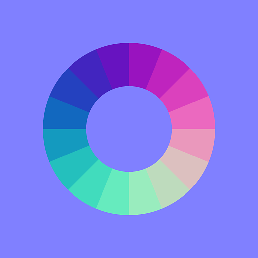

# Elementare Knoten

Atomare Knoten sind die Grundbausteine von Substance-Graphen.

Alle anderen Substance-Diagrammknoten in der [Library](../../../interface/the-library/the-library.md) sind aus Atomknoten aufgebaut, falls Sie sie auf ihre unterste Ebene aufteilen.

<table>
<tr style="border: 0;">
<td style="border: 0;" valign="top">

[Bitmap](../../../compositing-graphs/nodes-reference-for-com/atomic-nodes/bitmap/bitmap.md)

</td>
<td style="border: 0;" valign="top">

[Überblenden](../../../compositing-graphs/nodes-reference-for-com/atomic-nodes/blend/blend.md)

</td>
<td style="border: 0;" valign="top">

[Weichzeichnen](../../../compositing-graphs/nodes-reference-for-com/atomic-nodes/blur/blur.md)

</td>
<td style="border: 0;" valign="top">

[Kurve](../../../compositing-graphs/nodes-reference-for-com/atomic-nodes/curve/curve.md)

</td>
<td style="border: 0;" valign="top">

[Richtungsunschärfe](../../../compositing-graphs/nodes-reference-for-com/atomic-nodes/directional-blur/directional-blur.md)

</td>
</tr>
</table>

<table>
<tr style="border: 0;">
<td style="border: 0;" valign="top">

[Richtungsverzerrung](../../../compositing-graphs/nodes-reference-for-com/atomic-nodes/directional-warp/directional-warp.md)

</td>
<td style="border: 0;" valign="top">

[Relief](../../../compositing-graphs/nodes-reference-for-com/atomic-nodes/emboss/emboss.md)

</td>
<td style="border: 0;" valign="top">

[Abstand](../../../compositing-graphs/nodes-reference-for-com/atomic-nodes/distance/distance.md)

</td>
<td style="border: 0;" valign="top">

[Verlauf (dynamisch)](../../../compositing-graphs/nodes-reference-for-com/atomic-nodes/gradient-dynamic/gradient-dynamic.md)

</td>
<td style="border: 0;" valign="top">

[Verlaufsumsetzung](../../../compositing-graphs/nodes-reference-for-com/atomic-nodes/gradient-map/gradient-map.md)

</td>
</tr>
</table>

<table>
<tr style="border: 0;">
<td style="border: 0;" valign="top">

[FX-Map](../../../compositing-graphs/nodes-reference-for-com/atomic-nodes/fx-map/fx-map.md)

</td>
<td style="border: 0;" valign="top">

[Graustufenkonvertierung](../../../compositing-graphs/nodes-reference-for-com/atomic-nodes/grayscale-conversion/grayscale-conversion.md)

</td>
<td style="border: 0;" valign="top">

[HSL](../../../compositing-graphs/nodes-reference-for-com/atomic-nodes/hsl/hsl.md)

</td>
<td style="border: 0;" valign="top">

[Eingabefarbe](../../../compositing-graphs/nodes-reference-for-com/atomic-nodes/input/input.md)

</td>
<td style="border: 0;" valign="top">

[ eingeben](../../../compositing-graphs/nodes-reference-for-com/atomic-nodes/input/input.md)

[Graustufen eingeben](../../../compositing-graphs/nodes-reference-for-com/atomic-nodes/input/input.md)

</td>
</tr>
</table>

<table>
<tr style="border: 0;">
<td style="border: 0;" valign="top">

[Eingabewert](../../../compositing-graphs/nodes-reference-for-com/atomic-nodes/input/input.md)

</td>
<td style="border: 0;" valign="top">

[Tonwertkorrektur](../../../compositing-graphs/nodes-reference-for-com/atomic-nodes/levels/levels.md)

</td>
<td style="border: 0;" valign="top">

[Normale](../../../compositing-graphs/nodes-reference-for-com/atomic-nodes/normal/normal.md)

</td>
<td style="border: 0;" valign="top">

[Ausgabe](../../../compositing-graphs/nodes-reference-for-com/atomic-nodes/output/output.md)

</td>
<td style="border: 0;" valign="top">

[Pixelprozessor](../../../compositing-graphs/nodes-reference-for-com/atomic-nodes/pixel-processor/pixel-processor.md)

</td>
</tr>
</table>

<table>
<tr style="border: 0;">
<td style="border: 0;" valign="top">

[Scharfzeichnen](../../../compositing-graphs/nodes-reference-for-com/atomic-nodes/sharpen/sharpen.md)

</td>
<td style="border: 0;" valign="top">

[Kanäle mischen](../../../compositing-graphs/nodes-reference-for-com/atomic-nodes/channel-shuffle/channel-shuffle.md)

</td>
<td style="border: 0;" valign="top">

[SVG](../../../compositing-graphs/nodes-reference-for-com/atomic-nodes/svg/svg.md)

</td>
<td style="border: 0;" valign="top">

[Text](../../../compositing-graphs/nodes-reference-for-com/atomic-nodes/text/text.md)

</td>
<td style="border: 0;" valign="top">

[2D-Transformation](../../../compositing-graphs/nodes-reference-for-com/atomic-nodes/transformation-2d/transformation-2d.md)

</td>
</tr>
</table>

<table>
<tr style="border: 0;">
<td style="border: 0;" valign="top">

[Gleichmäßige Farbe](../../../compositing-graphs/nodes-reference-for-com/atomic-nodes/uniform-color/uniform-color.md)

</td>
<td style="border: 0;" valign="top">

[Wertprozessor](../../../compositing-graphs/nodes-reference-for-com/atomic-nodes/value-processor/value-processor.md)

</td>
<td style="border: 0;" valign="top">

[Verzerrung](../../../compositing-graphs/nodes-reference-for-com/atomic-nodes/warp/warp.md)

</td>
<td style="border: 0;" valign="top">

</td>
<td style="border: 0;" valign="top">

</td>
</tr>
</table>

## Platzieren von Atomknoten

Es gibt mehrere Möglichkeiten, Atomknoten in Substance-Graphen zu erstellen:

### <b>Die Node-Palette</b>

Die Node-Palette befindet sich in der Symbolleiste &quot;[Graph View&quot;](../../../interface/the-graph-view/the-graph-view.md) und bietet einfachen Zugriff auf atomare Knoten: Klicken Sie einfach auf einen Knoten oder ziehen Sie ihn in den Graphen.

Die Palette wird mit dieser Schaltfläche umgeschaltet: 

### <b>Das Knotenmenü </b>

Drücken Sie *Leertaste* oder *Tabulator* in der Diagrammansicht, um eine durchsuchbare Liste von Knoten anzuzeigen und standardmäßig alle atomaren Knoten aufzulisten.

Mit dem Suchfeld können Sie [alle anderen Knoten in der Bibliothek durchsuchen](../../../compositing-graphs/nodes-reference-for-com/node-library/node-library.md), einschließlich [Ihres eigenen Inhalts](../../../interface/the-library/managing-custom-content/managing-custom-content-and-filters.md) (falls hinzugefügt).

### <b>Das Kontextmenü des Diagramms</b>

Klicken Sie mit der rechten Maustaste in das Diagramm und gehen Sie zum Untermenü &#39;Knoten hinzufügen&#39;, um auf eine Liste von Atomknoten zuzugreifen.

### <b>Die Bibliothek</b>

In der Kategorie &#39;Atomknoten&#39; der [Bibliothek](../../../interface/the-library/the-library.md) werden alle Atomknoten gehostet. Sie können per Drag &amp; Drop in ein Substance-Diagramm gezogen werden.

### <b>Tastaturbefehle</b>

Sie können [Ihre eigenen Tastaturbefehle](../../../interface/preferences-window/preferences-window.md) definieren, um sofort einen beliebigen Knoten in einem Diagramm zu erstellen, einschließlich atomarer Knoten.
