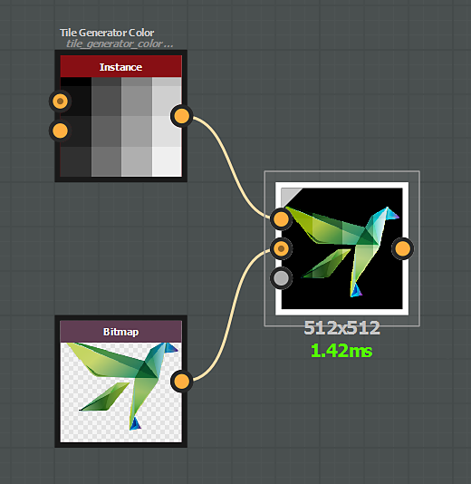

# Füllmethoden

Der Knoten &quot;[Blend](../../../../../compositing-graphs/nodes-reference-for-com/atomic-nodes/blend/blend.md)&quot; bietet die folgenden Füllmethoden:

## Kopieren

Der Mischmodus &quot;*Kopieren*&quot; platziert den Vordergrund einfach über den Hintergrund.

{zoomable="yes"}

Bei Farbbildern wird der Alphakanal standardmäßig bei der Deckkraft berücksichtigt.

Dies kann mit dem Parameter &quot;Alpha-Überblendung&quot; geändert werden.

"){zoomable="yes"}

## Hinzufügen (Linear abwedeln)

Der Mischmodus &quot;*Hinzufügen*&quot; fügt den Vordergrundeingabewert zu jedem entsprechenden Pixel im Hintergrund hinzu.

"){zoomable="yes"}

## Subtrahieren

Der Mischmodus &quot;*Substance*&quot; zieht den Vordergrundeingabewert von jedem entsprechenden Pixel im Hintergrund ab.

Wenn das Ergebnis der Subtraktion kleiner als 0 ist, wird der Wert auf 0 begrenzt, wodurch reines Schwarz entsteht.

{zoomable="yes"}

## Multiplizieren

Der Mischmodus *Multiplizieren* multipliziert den Hintergrundeingabewert mit jedem entsprechenden Pixel im Vordergrund.

Da der Wert jedes Pixels zwischen 0 und 1 liegt, ist das Ergebnis im Vergleich zum Original immer gleich oder kleiner (dunkler).

{zoomable="yes"}

## Addieren/Subtrahieren

Der Mischmodus &quot;*Sub* hinzufügen&quot; funktioniert wie folgt:

* Vordergrundpixel, deren Wert größer als 0,5 ist, werden zu ihren jeweiligen Hintergrundpixeln hinzugefügt.
* Vordergrundpixel, deren Wert kleiner als 0,5 ist, werden von ihren jeweiligen Hintergrundpixeln subtrahiert.

{zoomable="yes"} hinzufügen

## Maximal (Aufhellen)

Der Mischmodus *Max* wählt den höheren Wert zwischen Hintergrund und Vordergrund aus.

"){zoomable="yes"}

## Min. (Abdunkeln)

Im Mischmodus &quot;*Min*&quot; wird der niedrigere Wert zwischen Hintergrund und Vordergrund ausgewählt.

"){zoomable="yes"}

## Wechseln

Der Mischmodus &quot;*Switch*&quot; ähnelt dem Kopiermodus, mit einem *entscheidenden* Unterschied:

* &#39;Deckkraft&#39; auf 0 eingestellt: Der Datenstrom der Knoten, die mit dem Vordergrundeingang *verbunden sind, wird nicht berechnet*.
* &#39;Deckkraft&#39; auf 1 eingestellt: Der Datenstrom der Knoten, die mit dem &#39;Background&#39;-Eingang *verbunden sind, wird nicht berechnet*.

Daher kann dieser Modus verwendet werden, um die Leistung Ihres Diagramms zu verbessern.

Die Knoten [Switch](../../../../../compositing-graphs/nodes-reference-for-com/node-library/filters/blending/switch/switch.md) und [Switch grayscale](../../../../../compositing-graphs/nodes-reference-for-com/node-library/filters/blending/switch/switch.md) sind so eingerichtet, dass sie die Mischknoten in diesen spezifischen Konfigurationen verwenden.

{zoomable="yes"}

## Dividieren

Der Mischmodus &quot;*Divide*&quot; teilt den Wert der Hintergrundeingabepixel durch jedes entsprechende Pixel im Vordergrund.

{zoomable="yes"}

## Überlagerung

Der Mischmodus &quot;*Overlay*&quot; kombiniert die Füllmethoden &quot;Multiplizieren&quot; und &quot;Negativ multiplizieren&quot;:

* &#x200B;
  * Wenn der Wert des Pixels der unteren Ebene unter 0,5 liegt, wird eine Füllmethode vom Typ *Multiplizieren* angewendet.
  * Wenn der Wert der unteren Pixelebene über 0,5 liegt, wird eine Überblendung vom Typ *Bildschirm* angewendet.

{zoomable="yes"}

## Negativ multiplizieren

Mit dem Mischmodus &quot;Negativ multiplizieren&quot; werden die Werte der Pixel in den beiden Eingängen invertiert und dann wieder invertiert.

Das Ergebnis ist der entgegengesetzte Effekt zu multiplizieren und ist immer gleich oder höher (heller) im Vergleich zum Original.

{zoomable="yes"}

## Weiches Licht

Der Mischmodus &quot;Weiches Licht&quot; erzeugt je nach Helligkeit der Vordergrundfarbe ein subtiles helleres oder dunkleres Ergebnis.

Beim Mischen von Farben mit einer Helligkeit von mehr als 50 % werden die Hintergrundpixel aufgehellt, während Farben mit einer Helligkeit von weniger als 50 % die Hintergrundpixel abdunkeln.

{zoomable="yes"}
