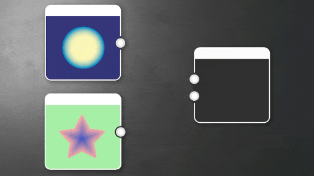

# Kanäle mischen

<table>
<tr style="border: 0;">
<td style="border: 0; width:33.33%; vertical-align:top" width="33.33%" valign="top">

{width="100%"}

<b>In:</b> Elementare Knoten

</td>
<td style="border: 0; width:66.66%; vertical-align:top" width="66.66%" valign="top">

Ordnet die Farbkanäle von einem oder zwei Eingabebildern im Ausgabebild neu an.

Das heißt, es werden zwei Eingänge verwendet und Sie können eine Ausgabe zurückgeben, bei der die Alphakanäle Rot, Grün, Blau und Blau vertauscht oder auf einen der Kanäle vom Eingang festgelegt werden.

Im Wesentlichen ermöglicht es Ihnen, RGB-Kanäle auf jede erdenkliche Weise zu verpacken und auszutauschen. Graustufen-Eingaben werden wie Farben behandelt: Rot, Grün, Blau und Alpha geben alle die gleichen Werte zurück.

</td>
</tr>
</table>

<table>
<tr style="border: 0">
<td style="border: 0; width: 15%" width="15%"></td>
<td style="border: 0; text-align: center" align="center"></td>
<td style="border: 0; width: 15%" width="15%"></td>
</tr>
</table>

Channel-Shuffle verfügt über Grundoptionen, aber in den meisten Fällen von Channel-Packing oder Stripping und dem Festlegen von Alphakanälen ist es schneller, [RGBA Merge](../../../../compositing-graphs/nodes-reference-for-com/node-library/filters/channels/rgba-merge/rgba-merge.md), [RGBA Split](../../../../compositing-graphs/nodes-reference-for-com/node-library/filters/channels/rgba-split/rgba-split.md), [Alpha Merge](../../../../compositing-graphs/nodes-reference-for-com/node-library/filters/channels/alpha-merge/alpha-merge.md) und [Alpha Split](../../../../compositing-graphs/nodes-reference-for-com/node-library/filters/channels/alpha-split/alpha-split.md) zu verwenden. Sie sind für Standardaktionen eingerichtet, bei denen nicht mehrere Parameter geändert und danach in Graustufen konvertiert werden müssen. Wenn Sie nach einer erweiterten Version mit mehr Fülloptionen suchen, sehen Sie sich den [Kanalmixer](../../../../compositing-graphs/nodes-reference-for-com/node-library/filters/adjustments/channel-mixer/channel-mixer.md) an.

## Parameter

|  |  |
| --- | --- |
| <b>Roter Kanal</b> *Ganzzahl* | Wählen Sie den Quellkanal aus, der in den Rot-Kanal des Ausgabebilds eingefügt werden soll. |
| <b>Grüner Kanal</b> *Ganzzahl* | Wählen Sie den Quellkanal aus, der in den grünen Kanal des Ausgabebilds eingefügt werden soll. |
| <b>Blauer Kanal</b> *Ganzzahl* | Wählen Sie den Quellkanal aus, der in den Blaukanal des Ausgabebilds eingefügt werden soll. |
| <b>Alphakanal</b> *Ganzzahl* | Wählen Sie den Quellkanal, der in den Alphakanal des Ausgabebilds eingefügt werden soll. |

## Eingabe-Verbindungen

|  |  |
| --- | --- |
| <b>Eingabe 1</b> *Farbe/Graustufen* PRIMÄR | Primäres Eingabebild. |
| <b>Eingabe 2</b> *Farbe/Graustufen* | Sekundäres Eingabebild. |

## Beispiele

*Demnächst verfügbar.*
