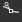

# Kurve

<table>
<tr style="border: 0;">
<td width="33.33%" style="border: 0;" valign="top">

{width="200px"}

</td>
<td width="100.00%" style="border: 0;" valign="top">

Ordnet die Werte in einem Bild mithilfe einer benutzerdefinierten Kurve neu zu.

Der Knoten bietet eine Schnittstelle zur Neuzuordnung der Bildtonalität, ähnlich wie andere 2D-Bildbearbeitungsanwendungen. Der Benutzer kann Punkte platzieren und Bézier-Kurven anpassen, um die Eingabe neu zuzuordnen, wobei es sich entweder um Graustufen oder Farbe handeln kann.Sie ist besonders nützlich, wenn sie mit Gradientenübergängen verwendet wird, um sie einem bestimmten Profilprofil zuzuordnen, sie ermöglicht eine sehr präzise Modellierung von Kegelprofilen und dergleichen. Height-Profile werden in der Regel in der Regel in der Regel in der Regel in der Regel in der Regel in der Regel in der Regel in der Regel in der Regel in der Regel in der Regel in der Regel nicht verwendet.

</td>
</tr>
</table>

Im Gegensatz zu den meisten anderen Knoten verfügt der Knoten Kurve nicht über eine typische Standardschnittstelle mit Schiebereglern und Parametern, sondern bietet stattdessen einen vollwertigen Kurveneditor. Im folgenden Abschnitt finden Sie weitere Informationen zur Verwendung der Applikation.

[Dies bedeutet jedoch, dass keiner der Parameter eines Kurvenknotens einem Untergraph verfügbar gemacht werden kann](../../../../compositing-graphs/manage-parameters/exposing-a-parameter/exposing-a-parameter.md). Die einzige Option ist hier, einen [Multiswitch](../../../../compositing-graphs/nodes-reference-for-com/node-library/filters/blending/multi-switch/multi-switch.md) zu verwenden, um zwischen verschiedenen Kurvenprofilen zu wechseln.

<table>
<tr style="border: 0;">
<td width="100.00%" style="border: 0;" valign="top">

</td>
<td width="83.33%" style="border: 0;" valign="top">

</td>
<td width="100.00%" style="border: 0;" valign="top">

</td>
</tr>
</table>

<table>
<tr style="border: 0;">
<td style="border: 0;" valign="top">

## Parameter

### Kurveneditor

</td>
<td style="border: 0;" valign="top">

### Eingangsanschlüsse

### Ausgangsanschlüsse

</td>
<td style="border: 0;" valign="top">

### Beispiele

</td>
</tr>
</table>

## Parameter

|  |  |
| --- | --- |
| <b>Kurve anwenden/freilegen</b> *Boolescher Wert* | Ermöglicht das Kopieren der Benutzerkurve in die Ausgabe, anstatt sie auf das Eingabebild anzuwenden. |
| <b>Kurvenadressierung</b> *Boolescher Wert* | Dieser Parameter bestimmt, wie HDR. Pixel außerhalb des Bereichs [0, 1] in der Eingabe behandelt werden: eingeklemmt oder gefaltet bis [0, 1]. |
| <b>Kurve</b> *Array von Kurvenschlüsseln* | Die benutzerdefinierte Kurve, die zum Zuordnen der eingegebenen Graustufenwerte verwendet wird.   Kann mit dem [Kurveneditor](#curve-editor) bearbeitet werden. |

## Kurveneditor

### Erstellen und Verschieben eines Punkts

Um einen Punkt zu erstellen, doppelklicken Sie einfach auf eine beliebige Stelle in der Kurvenansicht:

### Steuern des Punkteinflusses

<table>
<tr style="border: 0;">
<td width="100.00%" style="border: 0;" valign="top">

Um präzise Ergebnisse zu erzielen, bieten die Kurvenknoten für jeden Punkt unterschiedliche Modi an:

</td>
<td width="33.33%" style="border: 0;" valign="top">

</td>
</tr>
</table>

 Setzen Sie den Punktmodus auf den Standardwert zurück.

 Sperren/Entsperren der 2 Bézier-Handler, damit der Benutzer sie gemeinsam oder unabhängig verschieben kann.

 Beide Seiten des Punkts werden von einem Bézier-Handler gesteuert.

 Die rechte Seite des Punkts wird von einem Bézier-Handler gesteuert, während die linke Seite flach bleibt.

 Die linke Seite des Punkts wird von einem Bézier-Handler gesteuert, während die rechte Seite flach bleibt.

 Die Punktseiten bleiben flach

### Eingabehistogramm anzeigen

Sie können das Histogramm Ihrer Eingabe ein- oder ausblenden, indem Sie einfach auf  klicken.

### Jeden Kanal einzeln steuern (Farbeingabe)

<table>
<tr style="border: 0;">
<td width="100.00%" style="border: 0;" valign="top">

Wenn Sie einen Farbknoten eingeben, können Sie die Kurve für jeden Kanal anpassen:

Wählen Sie einfach in der Dropdown-Liste oben rechts die Kurve aus, die Sie anpassen möchten:

</td>
<td width="33.33%" style="border: 0;" valign="top">

</td>
</tr>
</table>

Im RGB-Kurvenmodus können Sie die einzelnen Kanalkurven durch Drücken/Deaktivieren von  ein- bzw. ausblenden:

### Ausrichten, Spiegeln und Spiegeln

<table>
<tr style="border: 0;">
<td width="100.00%" style="border: 0;" valign="top">

Wenn Sie mit der rechten Maustaste auf die Kurvenansicht klicken, werden einige weitere Optionen angezeigt.

<b>Oben ausrichten:</b> Richten Sie die ausgewählten Punkte horizontal am höchsten aus.

<b>Zentrieren:</b> Richten Sie die markierten Punkte horizontal am durchschnittlichen Height der Auswahl aus.

<b>Unten ausrichten:</b> Richten Sie die ausgewählten Punkte horizontal an dem niedrigsten aus.

</td>
<td width="50.00%" style="border: 0;" valign="top">

</td>
</tr>
</table>

<b>Horizontal/vertikal verteilen:</b> Verteilen der Punkte auf der ausgewählten Achse

<b>Horizontal/vertikal spiegeln:</b> Spiegeln Sie die markierten Punkte entsprechend der markierten Achse.

<b>Horizontal/vertikal spiegeln:</b> Spiegeln Sie die gesamte Kurve gemäß der ausgewählten Achse

### Tastenkombinationen

<table>
<tr style="border: 0;">
<td style="border: 0;" valign="top">

<b>LMB + Ziehen</b>

Zeichnen Sie ein Auswahlfeld.

</td>
<td style="border: 0;" valign="top">

</td>
</tr>
</table>

<table>
<tr style="border: 0;">
<td style="border: 0;" valign="top">

<b>Umschalt + Ziehen</b>

Beschränken Sie die Bewegung auf die X- oder Y-Achse.

</td>
<td style="border: 0;" valign="top">

</td>
</tr>
</table>

<table>
<tr style="border: 0;">
<td style="border: 0;" valign="top">

<b>Alt + LMB + Ziehen</b>

Unterbrechen Sie vorübergehend die Griffe, um sie unabhängig voneinander zu verschieben.

</td>
<td style="border: 0;" valign="top">

</td>
</tr>
</table>

### Anpassen des Rahmens der Kurve

Beim Anpassen der Handler kann es vorkommen, dass ein Handler die Kurvenansicht durchläuft.

In diesem Fall können Sie die Größe mithilfe der Schaltfläche &quot;&quot; an den Inhalt anpassen.

Die Schaltfläche &quot;&quot; setzt den Zoomfaktor auf 1 zurück

## Eingangsanschlüsse

|  |  |
| --- | --- |
| <b>Eingabe</b> *Graustufen/Farbe* PRIMÄR | Das zu verarbeitende Bild. |

## Ausgangsanschlüsse

|  |  |
| --- | --- |
| <b>Ausgabe</b> *Graustufen/Farbe* |  |

## Beispiele

*Demnächst verfügbar.*
