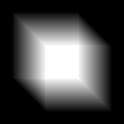

# Richtungsunschärfe

<table>
<tr style="border: 0;">
<td width="33.33%" style="border: 0;" valign="top">

{width="200px"}

</td>
<td width="100.00%" style="border: 0;" valign="top">

Wendet Unschärfe in einer bestimmten Richtung gemäß einer Intensitäts-Map an.

Dieser Knoten führt eine Operation ähnlich einer Bewegungsunschärfe an einer Eingabe aus. Im Gegensatz zum regulären Knoten &quot;[Blur](../../../../compositing-graphs/nodes-reference-for-com/atomic-nodes/blur/blur.md)&quot;, der in allen Richtungen gleichmäßig verschwimmt, funktioniert die &quot;Richtungsunschärfe&quot; entlang eines benutzerdefinierten Winkels.

</td>
</tr>
</table>

Ähnlich wie &quot;Weichzeichnen&quot; ist es auch ein schnellerer und qualitativ schlechter Vorgang. Eine erweiterte, qualitativ hochwertigere Alternative wird in [Anisotropischer Weichzeichner](../../../../compositing-graphs/nodes-reference-for-com/node-library/filters/blurs/anisotropic-blur/anisotropic-blur.md) bereitgestellt, mit einem leistungsfähigen Kompromiss

<table>
<tr style="border: 0;">
<td width="100.00%" style="border: 0;" valign="top">

</td>
<td width="83.33%" style="border: 0;" valign="top">

</td>
<td width="100.00%" style="border: 0;" valign="top">

</td>
</tr>
</table>

## Richtungsunschärfe und Anisotropie

Diese Bilder unten zeigen die Richtungsunschärfe und die [Anisotrope Unschärfe](../../../../compositing-graphs/nodes-reference-for-com/node-library/filters/blurs/anisotropic-blur/anisotropic-blur.md), die für dieselbe Eingabeform mit ähnlichen Parametern wirksam sind. Der anisotrope Weichzeichner wurde auf volle Anisotropie und hohe Qualität eingestellt.

<table>
<tr style="border: 0;">
<td style="border: 0;" valign="top">

<b>Richtungsunschärfe</b>

{zoomable="yes"}

</td>
<td style="border: 0;" valign="top">

<b>Anisotropischer Weichzeichner</b>

{zoomable="yes"}

</td>
</tr>
</table>

<table>
<tr style="border: 0;">
<td style="border: 0;" valign="top">

### Parameter

</td>
<td style="border: 0;" valign="top">

### Eingangsanschlüsse

</td>
<td style="border: 0;" valign="top">

### Ausgangsanschlüsse

</td>
<td style="border: 0;" valign="top">

### Beispiele

</td>
</tr>
</table>

## Parameter

|  |  |
| --- | --- |
| <b>Intensität</b> *Gleitend* | Legt den Weichzeichnungsradius in Pixel fest. |
| <b>Winkel</b> *Gleitend* | Die Richtung des Weichzeichnereffekts in der Anzahl der Windungen im Uhrzeigersinn, beginnend bei der Horizontalen - d. h. dem Richtungsvektor (1, 0). |

## Eingangsanschlüsse

|  |  |
| --- | --- |
| <b>Eingabe</b> *Graustufen/Farbe* [PRIMÄR](../../../../glossary/glossary.md) | Das zu verarbeitende Bild. |

## Ausgangsanschlüsse

|  |  |
| --- | --- |
| <b>Ausgabe</b> *Graustufen/Farbe* |  |

## Beispiele

*Demnächst verfügbar.*
