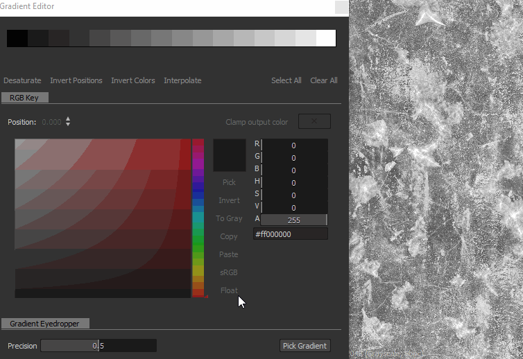

# Verlaufsumsetzung

<table>
<tr style="border: 0;">
<td width="33.33%" style="border: 0;" valign="top">

{width="200px"}

</td>
<td width="100.00%" style="border: 0;" valign="top">

Ordnet die Graustufenwerte in einem Bild mithilfe eines benutzerdefinierten Verlaufs neu zu.

Dieser Knoten erfüllt einen doppelten Zweck: Es kann einfach als <b> verwendet werden. </b>-Knoten für die Konvertierung von Graustufen in Farben oder zum Kolorieren von Graustufen-Eingaben in einer Zuordnung zu einem benutzerdefinierten Farbbalken.

</td>
</tr>
</table>

Der Knoten bietet einen erweiterten und funktionsreichen Verlaufseditor, mit dem Sie mehrere Farben präzise zuordnen können: Weitere Informationen finden Sie im Abschnitt [Verlaufseditor](#gradient-editor) auf dieser Seite.

<table>
<tr style="border: 0;">
<td width="100.00%" style="border: 0;" valign="top">

</td>
<td width="83.33%" style="border: 0;" valign="top">

</td>
<td width="100.00%" style="border: 0;" valign="top">

</td>
</tr>
</table>

## Beispiele

## Parameter

|  |  |
| --- | --- |
| <b>Farbmodus</b> *Boolescher Wert* | Legt den Ausgabemodus auf &quot;Farbe&quot; oder &quot;Graustufen&quot; fest. |
| <b>Verlaufsadressierung</b> *Boolescher Wert* | Setzt den Verlauf entweder auf die Wiederholung (Kachel) oder auf Klemmwerte, die außerhalb des Bereichs [0, 1] liegen. |
| <b>Verlauf</b> *Array von Verlaufsschlüsseln* | Die benutzerdefinierte Verlaufsrampe, die zum Zuordnen der eingegebenen Graustufenwerte verwendet wird.   Kann an Ort und Stelle oder mit dem [Verlaufseditor](#gradient-editor) bearbeitet werden. |

## Verlaufseditor

Dieses Fenster enthält Steuerelemente zum Bearbeiten des Referenzverlaufs, der vom Knoten &quot;Verlaufsumsetzung&quot; zum Zuordnen von Graustufenwerten zu Farben verwendet wird.

Sie kann auf folgende Weise aus den <b>Eigenschaften</b> des Verlaufsumsetzungs-Knotens geöffnet werden:

* Klicken Sie auf der Schaltfläche <b>Verlaufseditor</b> auf LMB.
* Doppelklicken Sie auf LMB auf einem Pin in der Verlaufsleiste. Der angeklickte Pin wird dann automatisch im Verlaufseditor ausgewählt, sodass Sie seine Werte direkt bearbeiten können.

### Bearbeiten der Verlaufspunkte

Die Farben und ihre Position entlang des Verlaufs werden durch Pins gesteuert, die entlang des Verlaufsbalkens platziert werden.

Jeder Pin legt eine Farbe an seiner Position entlang des Verlaufs fest.

Die Abschnitte des Verlaufs vor und nach dem ersten bzw. letzten Pin werden auf die Farben dieses Pins festgelegt.

Die folgenden Steuerelemente sind zum Bearbeiten von Pins verfügbar:

<table>
<tr style="border: 0;">
<td style="border: 0;" valign="top">

<b>Stecknadel hinzufügen</b>

Klicken Sie auf LMB auf dem Farbverlauf oder direkt darunter, um einen Pin an der Position hinzuzufügen, auf die Sie im Farbverlaufsbalken geklickt haben.

Der neue Pin wird an dieser Position auf die Farbe des Verlaufs gesetzt.

</td>
<td style="border: 0;" valign="top">

</td>
</tr>
</table>

<table>
<tr style="border: 0;">
<td style="border: 0;" valign="top">

<b>Stecknadel verschieben</b>

Halten Sie LMB gedrückt und ziehen Sie die ausgewählten Pins entlang der Verlaufsleiste, um sie zu verschieben.

Sie können auch die Position eines Pins mit einem numerischen Wert festlegen, indem Sie ihn auswählen und den Parameter <b>Position</b> verwenden. Die Position ist ein Wert im Bereich [0;1], wobei 0 der Anfang des Farbverlaufs und 1 sein Ende ist.

</td>
<td style="border: 0;" valign="top">

</td>
</tr>
</table>

Wenn mehrere Pins ausgewählt sind, können alle gleichzeitig ** verschoben werden. Wenn ein oder mehrere Pins beim Verschieben den Verlauf erreichen und beenden, stehen je nach der für das Verschieben verwendeten Maustaste zwei Verhalten zur Verfügung:

* <b>LMB:</b> Pins verbleiben am Ende, d. h. sie werden an dieser Position gestapelt, wenn sie das Pin erreichen, und ihre relative Position wird geändert.
* <b>MMB:</b> Pins werden am anderen Ende des Verlaufs wiederholt, d. h. ihre relativen Positionen bleiben unverändert.

<table>
<tr style="border: 0;">
<td style="border: 0;" valign="top">

<b>Pin löschen</b>

Wählen Sie die Pins aus und drücken Sie die Entf-Taste oder ziehen Sie die Pins aus dem Verlaufsbalken, um sie zu löschen.

</td>
<td style="border: 0;" valign="top">

</td>
</tr>
</table>

<table>
<tr style="border: 0;">
<td style="border: 0;" valign="top">

<b>Positionen umkehren</b>

Spiegelt die Positionen der ausgewählten Pins im Verlauf.

</td>
<td style="border: 0;" valign="top">

</td>
</tr>
</table>

<table>
<tr style="border: 0;">
<td style="border: 0;" valign="top">

<b>Alle löschen</b>

Entfernt alle Pins aus dem Verlaufsbalken.

</td>
<td style="border: 0;" valign="top">

</td>
</tr>
</table>

<b>Farben umkehren</b>

Mit dieser Schaltfläche werden die Farben der ausgewählten Nadeln auf ein Negativ gesetzt.

<b>Sättigung verringern</b>

Durch Klicken auf diese Schaltfläche wird die Sättigung der Farben reduziert, die für die ausgewählten Nadeln festgelegt wurden.

### Interpolationsmodi

Sobald die Nadeln eingerichtet sind, können Sie mit den verfügbaren Interpolationsmodi steuern, wie Farben von einer Nadel zur nächsten übergehen:

+++Linear
Standardinterpolationsmodus: wendet eine einfache lineare Interpolation zwischen den einzelnen Nadeln an, sodass der Verlauf gleichmäßig verläuft.

+++

+++Flache Tangenten
Wenn Sie sich den Übergang zwischen Verläufen als Bézier-Kurven vorstellen, bei denen Nadeln Kurvenpunkte sind, legt dieser Modus für diese Punkte horizontale Tangenten fest.

Dies führt zu einem Übergang, der an eine stufenlose Interpolation erinnert.

Wenn dieser Modus ausgewählt ist, ist der Parameter <b>Mittelpunkt</b> aktiviert, mit dem Sie die horizontale Position des vertikalen Mittelpunkts der Kurve zwischen den Punkten versetzen können. Dadurch wird die Skala zwischen der Out- und In-Tangente effektiv geändert.

+++

+++Weich
Wendet auf die Interpolationskurve zwischen den einzelnen Punkten eine Glättung an.

Wenn dieser Modus aktiviert ist, ist der Parameter <b>Smoothness</b> aktiviert. Mit diesem Parameter können Sie die Intensität der Glättung anpassen, wobei ein Wert von 0 dem Interpolationsmodus <b>Linear</b> entspricht.

+++

+++Keine Interpolation
Die Farbe ändert sich nur an der Position einer Nadel und bleibt bis zur nächsten Nadel entlang des Verlaufsbalkens konstant.

Dies führt zu sehr intensiven Farbübergängen, sodass nur die von den Nadeln festgelegten Farben auf dem Verlauf vorhanden sind.

+++

### Farbwähler

Mit dem Farbwähler können Sie eine Farbe auf verschiedene Weise festlegen:

* <b>Farbverlauf und Farbtonleiste</b>

  <table>
  <tr style="border: 0;">
  <td style="border: 0;" valign="top">

  Passe die Positionen des Gizmos im Verlauf und der Kerbe in der Farbtonleiste an, um eine Farbe festzulegen.

  </td>
  <td style="border: 0;" valign="top">

  

  </td>
  </tr>
  </table>

* <b>Schieberegler für RGB, HSV und Alpha</b>

  <table>
  <tr style="border: 0;">
  <td width="100.00%" style="border: 0;" valign="top">

  Mit den Reglern &quot;RGB&quot;, &quot;HSV&quot; und &quot;Alpha&quot; können Sie eine Farbe präzise einstellen, indem Sie die Regler anpassen oder ihre numerischen Werte direkt festlegen.

  Alternativ können Sie auch einen Hexadezimalcode in das Eingabefeld unter den Reglern eingeben.

  </td>
  <td width="33.33%" style="border: 0;" valign="top">

  

  </td>
  </tr>
  </table>

* <b>Auf Bildschirm auswählen</b>

  <table>
  <tr style="border: 0;">
  <td style="border: 0;" valign="top">

  Verwenden Sie die Schaltfläche <b>Auswählen</b> und klicken Sie auf LMB an einer beliebigen Stelle auf dem Bildschirm, um die Farbe an dieser Stelle aufzunehmen.

  </td>
  <td style="border: 0;" valign="top">

  

  </td>
  </tr>
  </table>

<table>
<tr style="border: 0;">
<td width="100.00%" style="border: 0;" valign="top">

Die ausgewählte Farbe wird in der oberen Hälfte der Farbminiatur in der Vorschau angezeigt.\
In der unteren Hälfte wird die zuvor verwendete Farbe angezeigt. Doppelklicken Sie auf LMB, um die bearbeitete Farbe wiederherzustellen.

</td>
<td width="16.67%" style="border: 0;" valign="top">

</td>
</tr>
</table>

Wenn mehrere Pins ausgewählt sind, werden die Schieberegler für RGB, HSV und Alpha in Delta-()-Schieberegler umgewandelt, d. h., sie werden verwendet, um den Wert jedes Pins um denselben Wert zu verschieben.

<table>
<tr style="border: 0;">
<td width="100.00%" style="border: 0;" valign="top">

Darüber hinaus stehen die folgenden Funktionen unter der Farbminiatur als Schaltflächen zur Verfügung:

<b>Umkehren:</b> Ändert die Farbe in ihr Negativ.

<b>Grau:</b> Sättigung der Farbe verringern;

<b>Kopieren </b>*:* Kopieren der aktuell ausgewählten Farbe in die Zwischenablage;

<b>Einfügen:</b> Wechseln zu der Farbe, die sich derzeit in der Zwischenablage befindet;

<b>sRGB</b>: Verwenden Sie den sRGB-Farbraum, um Farben anzuzeigen. Ist die Option deaktiviert, wird der lineare Farbraum verwendet.

<b>Gleitkommawert:</b> Zeigt die Werte der RGB-, HSV- und Alpha-Schieberegler in Gleitkommawerten an.

</td>
<td width="25.00%" style="border: 0;" valign="top">

</td>
</tr>
</table>

### Verlaufspipette

Die Verlaufs-Pipette ist eine der nützlichsten Funktionen dieses Knotens, da Sie komplexe Verläufe erstellen können, indem Sie einfach eine Linie auf einem Referenzbild zeichnen.

Der Regler <b>Genauigkeit</b> hilft Ihnen beim Anpassen des neu erstellten Verlaufs, indem Sie die Anzahl der Tasten erhöhen oder verringern: Je niedriger die Werte sind, desto präziser stimmt der Verlauf mit den ausgewählten Werten überein.

## Eingangsanschlüsse

|  |  |
| --- | --- |
| <b>Eingabe</b> *Graustufen* PRIMÄR | Das zu verarbeitende Graustufenbild. |

## Ausgangsanschlüsse

|  |  |
| --- | --- |
| <b>Ausgabe</b> *Graustufen* |  |

## Beispiele

*Demnächst verfügbar.*
