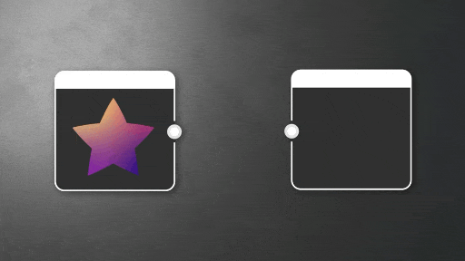

# Graustufenkonvertierung

<table>
<tr style="border: 0;">
<td style="border: 0; width:33.33%; vertical-align:top" width="33.33%" valign="top">

{width="100%"}

<b>In:</b> Atomknoten

</td>
<td style="border: 0; width:66.66%; vertical-align:top" width="66.66%" valign="top">

Konvertiert ein Farbbild mithilfe der Luminanz der einzelnen Farbkanäle in ein Graustufenbild.

Dieser Knoten kann als optimierte Methode verwendet werden, um einen Graustufenkanal aus einem Farbbild zu extrahieren, indem alle &quot;Kanalgewichte&quot; auf 0 gesetzt werden, mit Ausnahme des gewünschten Kanals, der auf 1 gesetzt werden sollte.

</td>
</tr>
</table>

<table>
<tr style="border: 0">
<td style="border: 0; width: 15%" width="15%"></td>
<td style="border: 0; text-align: center" align="center"></td>
<td style="border: 0; width: 15%" width="15%"></td>
</tr>
</table>

Die meisten Knoten können so eingestellt werden, dass sie in Graustufen oder Farben ausgegeben werden, wobei erstere aus Gründen der Einfachheit und Leistung bevorzugt werden.

Es wird empfohlen, von Anfang an in Graustufen zu arbeiten und Bilder später in Ihrem Arbeitsablauf einzufärben, z. B. mit einem Knoten [Verlaufsumsetzung](../../../../compositing-graphs/nodes-reference-for-com/atomic-nodes/gradient-map/gradient-map.md).

Dies bedeutet, dass ein Graustufen-Konvertierungsknoten im Allgemeinen nur für Fälle reserviert ist, in denen Sie ein Farbbild gezielt in Graustufen konvertieren möchten. Schauen Sie sich in diesen Fällen auch die [erweiterten Graustufen-Konvertierungen](../../../../compositing-graphs/nodes-reference-for-com/node-library/filters/adjustments/grayscale-conversion-adv/grayscale-conversion-advanced.md) und [Farben zu Masken](../../../../compositing-graphs/nodes-reference-for-com/node-library/filters/adjustments/color-to-mask/color-to-mask.md) an.

## Parameter

|  |  |
| --- | --- |
| <b>Kanalgewichte</b> *Float4* | Legt die Gewichtung der einzelnen RGBA-Kanäle bei der Graustufenkonvertierung fest.   Standardmäßig erfolgt eine gleichmäßige Aufteilung auf die RGB-Kanäle. |
| <b>Alpha reduzieren</b> *Boolescher Wert* | Legt das Verhalten des Alphas für das endgültige Graustufenergebnis fest, da Graustufenwerte keine Alpha-Informationen enthalten können.   Wenn *True*, wird die Graustufenkonvertierung mit dem Alphakanal des Eingabebilds multipliziert. |
| <b>Hintergrundwert</b> *Gleitend* | Legt den grundlegenden Hintergrundwert fest, wenn die Eingabe über eine Alphamaske verfügt. Das heißt, es wird festgelegt, welche Pixel als transparent zu behandeln sind.   *Verfügbar, wenn &quot;Alpha reduzieren&quot; auf &quot;Wahr&quot; festgelegt ist.* |

## Eingangsanschlüsse

|  |  |
| --- | --- |
| <b>Eingabe</b> *Farbe* PRIMÄR | Das zu verarbeitende Farbbild. |

## Beispiele

*Demnächst verfügbar.*
