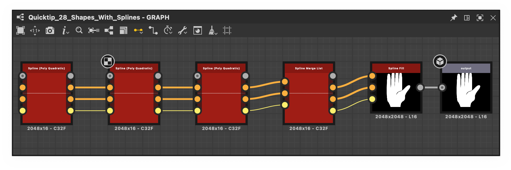

# Ausgabe

<table>
<tr style="border: 0;">
<td width="33.33%" style="border: 0;" valign="top">

{width="200px"}

</td>
<td width="100.00%" style="border: 0;" valign="top">

Der Ausgabeknoten gibt das <b>Ergebnis</b> eines Substance-Diagramms oder eines seiner Ergebnisse an, wenn mehr als ein Ausgabeknoten darin vorhanden ist.

Das Bild oder der Wert, das/der mit dem Ausgabeknoten eines Diagramms verbunden ist, wird von einem beliebigen [Instanzknoten](../../../../compositing-graphs/inheritance-compositing/inheritance-in-substance-compositing-graphs.md) ausgegeben, der dieses Diagramm darstellt, und [kann als Diagrammausgabe exportiert werden](../../../../compositing-graphs/exporting-bitmaps/exporting-bitmaps.md).

</td>
</tr>
</table>

Wenn eine [veröffentlichte SBSAR-Datei](../../../../compositing-graphs/publishing-asset-files/publishing-substance-3d-asset-files-sbsar.md) dieses Diagramm enthält, kann diese Datei dieses Bild in jeder Integration oder in jedem Plug-In ausgeben, die die Datei verwendet.

Er verfügt über einen einzigen Eingangssteckplatz, der typunabhängig ist, d. h., er tippt sich selbst nach dem mit ihm verbundenen Datentyp ein.

Es hat keine Parameter, sondern Attribute, die von großer Bedeutung sind, um die Ausgabe ordnungsgemäß zu beschriften und ihrer beabsichtigten Verwendung zuzuführen.

Jeder Substance-Graph muss *mindestens einen* Ausgabeknoten aufweisen. Wenn keine Ausgabe vorhanden ist, kann das Diagramm nie ein tatsächliches Ergebnis zurückgeben, und es wird eine [Warnung](../../../../technical-issues/warnings-and-errors/warnings-and-errors.md) ausgelöst.

## Attribute

|  |  |
| --- | --- |
| <b>Kennung</b> *Zeichenfolge* | Der eindeutige Bezeichner der Ausgabe. Diese Eigenschaft darf nicht leer gelassen werden und darf keine Sonderzeichen oder Leerzeichen enthalten.   Der Bezeichner wird verwendet, da die Bezeichnung des Knotens die Eigenschaft &#39;Label&#39; leer lässt. Es kann auch verwendet werden, um [exportierte Texturen](../../../../compositing-graphs/exporting-bitmaps/exporting-bitmaps.md) zu benennen. |
| <b>Beschreibung</b> *Zeichenfolge* | Die optionale Beschreibung, die als QuickInfo für die Ausgabe verwendet wird, lautet Substance graphs. |
| <b>Bezeichnung</b> *Zeichenfolge* | Dies wird als Bezeichnung für den Ausgabeknoten verwendet, und der entsprechende Connector in [Instanzknoten](../../../../compositing-graphs/inheritance-compositing/inheritance-in-substance-compositing-graphs.md), der dieses Diagramm darstellt. Die Beschriftung kann Leerzeichen und Sonderzeichen enthalten. |
| <b>Benutzerdaten</b> *Zeichenfolge* | Optionale Metadaten, die für bestimmte Filtervorgänge verwendet werden können. [Substance 3D Painter](https://www.adobe.com/de/products/substance3d/apps/painter.html) nutzt diese Daten, um [einige Funktionen zu steuern](https://experienceleague.adobe.com/de/docs/substance-3d-painter/using/content/creating-custom-effects/user-data). |
| <b>Gruppe</b> *Zeichenfolge* | Attribut, das zum Gruppieren von Ausgaben für die [Linkerstellungsmodi von Designer verwendet wird](../../../../interface/the-graph-view/link-creation-modes/link-creation-modes.md).   Ausgaben mit einem identischen &#39;Group&#39;-Attribut werden als einzelne Verbindung im &#39;Compact Material&#39;-Verknüpfungserstellungsmodus angezeigt. |

## Integrationsattribute

Dies sind Attribute, die von Integrationen/Plug-ins verwendet werden sollen, die das Diagramm in einer [veröffentlichten SBSAR-Datei verwenden](../../../../compositing-graphs/publishing-asset-files/publishing-substance-3d-asset-files-sbsar.md).

Daher haben sie keine Auswirkungen auf das Format von [Bitmapexporten](../../../../compositing-graphs/exporting-bitmaps/exporting-bitmaps.md). Darüber hinaus wird in Designer nur das Attribut <b>Nutzung</b> verwendet. Weitere Informationen finden Sie unten.

<b>Nutzung</b>

|  |  |
| --- | --- |
| <b>Komponente</b> *Zeichenfolge* | Wird verwendet, um den entsprechenden SVBRDF-Shader-Eingaben in AxF-Workflows einige Texturkanäle zuzuordnen. |
| <b>Nutzung</b> *Zeichenfolge* | Definiert den Typ und die Verwendung des Ausgabeknotens. Diese Eigenschaft ist wichtig, da sie Folgendes bewirkt:<ul data-preserve-html="true"> <li data-preserve-html="true">Knotenverbindung in Substance-Graphen bei Verwendung einiger [Link-Erstellungsmodi](../../../../interface/the-graph-view/link-creation-modes/link-creation-modes.md) </li> <li data-preserve-html="true">Verbindung von Texturen mit Shadern in der 3D-Ansicht (siehe unten: &#39;[Informationen zur Rolle von Benutzern in der 3D-Ansicht](#usages-role-3dview)&#39;)</li> <li data-preserve-html="true">Verbindung von Texturen mit Materialien in Integrationen/Plug-ins</li> </ul> |
| <b>Farbraum</b> *Zeichenfolge* | Legt den Farbraum fest, in dem diese Ausgabe interpretiert werden soll. Wird von einigen Integrationen in anderen Anwendungen verwendet und hat keine Auswirkungen in Designer. |

### Rolle von Benutzern in der 3D-Ansicht

Da Diagrammausgaben häufig als Endergebnis für einen bestimmten Texturkanal dienen sollen, können sie automatisch an den entsprechenden Sampler des Shaders gesendet werden, der in der 3D-Ansicht verwendet wird.

Eine Ausgabe, deren <b>Verwendung</b>-Eigenschaft *mit einer Samplerverwendung* in der 3D-Ansicht übereinstimmt, wird mit diesem Sampler verbunden. Beispiel: Eine Ausgabe mit einer `basecolor`-Verwendung wird mit dem `basecolor`-Sampler des 3D-Ansichtshaders verbunden. Weitere Informationen finden Sie im Abschnitt [Daten anzeigen im Abschnitt 3D-Ansicht](../../../../interface/3d-view/3d-view.md) der Seite [3D-Ansicht](https://substance3d.adobe.com/documentation/display/draftdesigner/.3d%20view%20vdraftversion).

Klicken Sie auf RMB in einem leeren Bereich in der [Diagrammansicht](../../../../interface/the-graph-view/the-graph-view.md) und wählen Sie im Kontextmenü die Option <b>Ausgaben in 3D-Ansicht anzeigen</b> aus, um alle Ausgaben mit 3D-Ansicht-Samplern zu verbinden, die *passende Verwendungen* haben.

>[!IMPORTANT]
>
> Wenn mehrere Verwendungen eingerichtet werden, um z. B. Kanälen in einer verpackten Textur Verwendungen zuzuweisen, wird nur die *erste Verwendung* in der Liste mit der 3D-Ansicht verbunden. Dies ist eine bekannte Einschränkung.

## Standardausgabe

Wenn ein Diagramm mehr als eine Ausgabe hat, kann eine dieser Ausgaben als Standardausgabe für dieses Diagramm festgelegt werden. Hiermit wird festgelegt, welche der Ausgaben für Folgendes verwendet werden sollen:

* Die Miniaturansicht eines Instanzknotens, der dieses Diagramm darstellt
* Anzeigen dieser Instanzknoten in der 2D-Ansicht
* Die Miniaturansicht dieses Diagramms in der Bibliothek (erfahren Sie hier, wie Sie Ihre eigenen Ressourcen [hinzufügen](../../../../interface/preferences-window/project-settings/project-settings.md)).

Mit dieser Funktion können Sie Diagrammausgaben in beliebiger Reihenfolge anordnen, unabhängig davon, wie das Diagramm als Knoten dargestellt wird.

So legen Sie einen Ausgabeknoten als Standardausgabe eines Diagramms fest:

* Klicken Sie mit der rechten Maustaste auf einen Ausgabeknoten und wählen Sie im Kontextmenü die Aktion Als Standardausgabe festlegen aus.
* Verwenden Sie in den Eigenschaften des Ausgabeknotens die Schaltfläche &quot;Als Standard festlegen&quot; in der Kopfzeile des Abschnitts &quot;Attribute&quot;.

Hier ist ein Beispiel für Instanzknoten vor und nach dem Festlegen einer Standardausgabe:

<table>
  <tr style="border: 0">
    <td style="border: 0">
      
       <i>Vorher</i>
    </td>
    <td style="border: 0">
      
       <i>Nach</i>
    </td>
  </tr>
</table>
