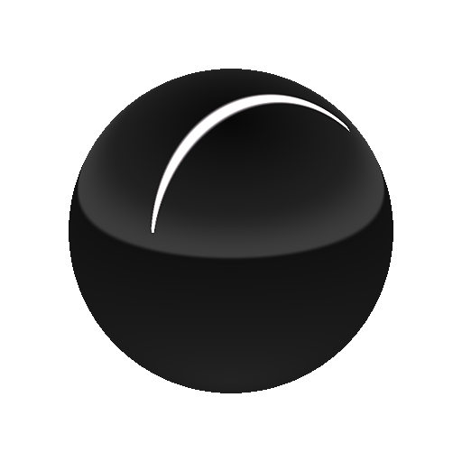

# Linienbeleuchtung

<table>
<tr style="border: 0;">
<td style="border: 0;" valign="top">

{width="200px"}

## Linienbeleuchtung

**In:** *3D-Ansicht/HDRI-Werkzeuge*

**Komplex**

</td>
<td style="border: 0;" valign="top">

## Beschreibung

Erzeugt eine sphärisch projizierte Linienform basierend auf den Koordinaten zweier Punkte im Raum. Im Vergleich zu [Formenlicht](../../../../../../compositing-graphs/nodes-reference-for-com/node-library/3d-view-library/hdri-tools/shape-light/shape-light.md) verfügt es über mehr Optionen zum Ausrichten von Formen und zum Anwenden wiederholter Muster auf die Lichtform.

Die Positionierungsmodi für diesen Knoten sind etwas komplexer als andere HDRI-Lichtknoten. Es wird empfohlen, verschiedene Größenmodi auszuprobieren, um herauszufinden, welcher für Ihr Szenario funktioniert.

## Eingaben

* **Hintergrundbildeingabe**: *Farbeingabe*\
  Optionaler Hintergrund, auf dem das erzeugte Licht komponiert werden soll.
* **Shape Image Input**: *Farbeingabe*\
  Optionales Bild für die Zuordnung zum Linienlicht. Wird nur verwendet, wenn der Formfarbmodus auf &quot;Bildeingabe&quot; eingestellt ist.
* **Musterbildeingabe**: *Graustufen-Eingabe*\
  Benutzerdefiniertes Musterbild, das verwendet wird, wenn der Parameter &quot;Muster&quot; auf &quot;Bildeingabe&quot; eingestellt ist.

## Parameter

* **Positionsmodus**: *Boden/Decke, Abstand zum Ursprung, Weltpositionen*\
  Sie können aus drei verschiedenen Platzierungsmodi auswählen. Boden/Decke und Abstand zum Ursprung unterstützen die Bearbeitung in der 2D-Ansicht, Weltpositionen können nur über Eigenschaften geändert werden, aber es wird eine exaktere Platzierung unterstützt.
* **Grundraster anzeigen**: *False/True*\
  Hilfsfunktion, um das Zeichnen eines Debug-Bodenrasters zu ermöglichen. Hilft bei der Schätzung der Position von Linien im Raum.
* **Positionskoordinaten**
  * **Vektor nach oben**: *Z nach oben, J nach oben*\
    Nur mit dem Modus &quot;Weltposition&quot; bestimmen Sie die Ausrichtung des Koordinatensystems.
  * **Punkt 1 UV-Position**:\
    Nur mit Boden / Decke und Abstand zum Ursprung. Legt die erste Punktposition im UV-Raum fest.
  * **Punkt 2 UV-Position**:\
    Nur mit Boden / Decke und Abstand zum Ursprung. Legt die zweite Punktposition im UV-Raum fest.
  * **Weltrangliste für Punkt 1**: *-2.0 - 2.0*\
    Nur im Modus &quot;Weltpositionen&quot;. Legt den ersten Punkt im Weltraum fest. Keine 2D-Ansichtsinteraktion unterstützt.
  * **Weltrangliste für Punkt 2**: *-2.0 - 2.0*\
    Nur im Modus &quot;Weltpositionen&quot;. Legt den zweiten Punkt im Weltraum fest. Keine 2D-Ansichtsinteraktion unterstützt.
  * **Absolutes Height der Zeile**: *0.0 - 1.0*\
    Nur bei der Positionsart &quot;Boden/Decke&quot; wird das absolute Height von der Decke eingestellt. Verwenden Sie &quot;Bodenraster anzeigen&quot;, um die Position besser zu schätzen.
  * **Abstand zum Ursprung**: *0.0 - 1.0*\
    Nur mit Abstand zum Ursprung-Positionsmodus. Legt für beide Punkte den Abstand vom Mittelpunkt des Panoramas fest.
* **Formfarbmodus**: *RGB, Temperatur (Kelvin), Bildeingabe*\
  Wählen Sie die Methode aus, die zum Festlegen der Formfarbe verwendet werden soll. Image Input ermöglicht die Verwendung des zweiten Eingangssteckplatzes.
* **Farbe**: *(Farbwert)*\
  Nur bei RGB als Formfarbmodus. Wählt Farbe für die Form.
* **Temperatur**: *800.0 - 20000.0*\
  Nur, wenn der Formfarbmodus auf &quot;Temperatur&quot; eingestellt ist. Legt den Kelvin-Wert für die Formfarbe fest.
* **UV-Modus für Formenbild**: *Dehnen, Nur Mitte dehnen, Wiederholen + Abstand*\
  Nur bei aktiviertem Formfarbmodus &quot;Bildeingabe&quot;. Legt fest, wie das Bild auf die Linienform angewendet wird, und bestimmt das Verhalten der UV-Wiederholung.
* **Abstand für wiederholte Formbilder**: *0.0 - 1.0*\
  Nur bei &quot;Formfarbmodus&quot; auf &quot;Bildeingabe&quot; und &quot;UV-Modus&quot; auf &quot;Wiederholen + Abstand&quot; eingestellt. Legt den Abstand fest, der zwischen den Bildern auf einer Linie liegt.
* **Gamma für Formenbild**: *sRGB, linear*\
  Nur bei aktiviertem Formfarbmodus &quot;Bildeingabe&quot;. Legen Sie fest, wie die Formbildeingabe interpretiert wird.
* **Exposition (EV)**: *0.0 - 10.0*\
  Belichtungswert für generierte Form festlegen, optimal abgestimmt auf den Belichtungswert des Hintergrundbilds.
* **Zeilendrehung**: *0.0 - 1.0*\
  Dreht die Linie entlang der Achse ihrer Länge. Die Linie wird beim Drehen als flache Karte behandelt.
* **Thickness der Zeile**: *0.0 - 1.0*\
  Legt die Thickness der Zeilenkarte fest.
* **Muster**: *Quadrat glätten, Quadrat scharf, Kegel, Hemisphäre, Bildeingabe*\
  Wählen Sie die zu verwendende Musterform aus.
* **Musterhärte**: *0.0 - 1.0*\
  Härte/Kontrast des Musters einstellen.
* **Muster-UV-Modus**: *Dehnen, Nur Mitte dehnen, Wiederholen + Abstand*\
  Legen Sie fest, wie eine sekundäre Mustermaske verwendet wird, die über dem Formenbild angewendet wird.
* **Abstand der Musterwiederholung**: *0.0 - 1.0*\
  Nur, wenn der UV-Mustermodus auf &quot;Wiederholen + Abstand&quot; eingestellt ist. Festlegen des Abstands zwischen wiederholten Mustern.
* **Bodenbeschneidung aktivieren**: *False/True*\
  Aktiviere das Beschneiden von Linien. Der Effekt ist bei Verwendung des Platzierungsmodus &quot;Boden/Decke&quot; nicht sichtbar.
* **Ground-Height**: *-2.0 - 0.0*\
  Legt das relative Height der für die Beschneidung verwendeten Vordergrundebene fest. Wirkt sich auf das gezeichnete Bodenraster aus.
* **Hintergrundeingabe aktivieren**: *False/True*\
  Schaltet die Verwendung des optionalen Hintergrundbilds um. Kompositionen generierten Licht auf dem Hintergrund.
* **Hintergrundfarbe**: *(Farbwert)*\
  Wenn die Option &quot;Hintergrundeingabe&quot; nicht verwendet wird, legen Sie hier einen Wert für einen einfarbigen Hintergrund fest.
* **Gamma im Hintergrund**: *sRGB, linear* Wenn die Hintergrundeingabe verwendet wird, legen Sie fest, wie die Hintergrundeingabe interpretiert werden soll.

## Beispielbilder

</td>
</tr>
</table>
