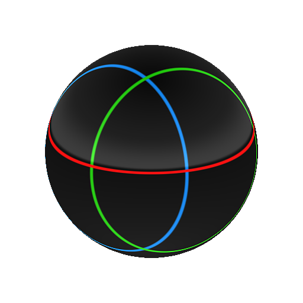

# Panorama-Drehung

<table>
<tr style="border: 0;">
<td width="33.33%" style="border: 0;" valign="top">

{width="200px"}

<b>In:</b> 3D-Ansicht > HDRI-Werkzeugs

</td>
<td width="100.00%" style="border: 0;" valign="top">

## Beschreibung

Dreht ein Panoramabild mit kugelförmiger Zuordnung um seinen Mittelpunkt, wobei die Projektion/Zuordnung korrekt bleibt. Nützlich zum Neigen oder Anpassen von HDR-Bildern.

</td>
</tr>
</table>

## Parameter

|  |  |
|:---|:---|
| <b>Drehung</b> <i>0.0 - 1.0</i> |  |
| <b>Richtungswinkel</b> <i>0.0 - 1.0</i> |  |
| <b>Vordrehung um Pol</b> <i>-1.0 - 1.0</i> |  |
| <b>Drehung um Pol buchen</b> <i>0.0 - 1.0</i> |  |
