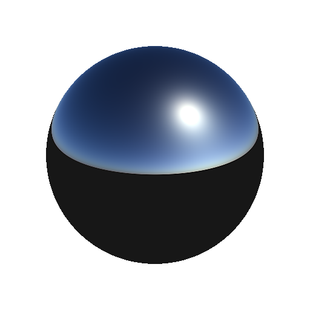

# Physische Sonne/Himmel

<table>
<tr style="border: 0;">
<td style="border: 0;" valign="top">

{width="200px"}

## Physische Sonne/Himmel

**In:** *3D-Ansicht/HDRI-Werkzeuge*

**Fortgeschrittene**

</td>
<td style="border: 0;" valign="top">

## Beschreibung

Implementierung von physischer Sonne und Himmel auf Basis des Hosek-Wikie-Skylight-Modells. Bietet eine hervorragende Basis für eine künstliche HDRI.

## Parameter

* **Sun-Position**:\
  Bereich = [0,1]x[0,1] (Längengrad-Breitenwinkel)
* **Trübung**: *1.0 - 10.0*\
  Die Trübung reicht von 1 bis 10
* **Albedo**: *0.0 - 1.0*\
  Die Albedo reicht von 0 bis 1.
* **Grundfarbe**: *(Farbwert)*\
  Farbe der Grundebene.
* **Exposition (EV)**: *-1.0 - 4.0*\
  Belichtungswert der resultierenden Ausgabe.
* **Sun-Größe**: *0.0 - 4.0*\
  Skalierung der Sonne, jeder Wert, der sich von 1 unterscheidet, ist physikalisch nicht korrekt. Wert hat subtile Effekte!
* **Sonnenintensität**: *0.0 - 1.0*\
  Intensität der Sonnenscheibe. Die Sun-Festplatte ist relativ klein, sodass der Effekt nicht sofort sichtbar ist.
* **Sky-Intensität**: *0.0 - 1.0* Intensität des Himmels. Wirkt sich auch auf die Sonneneruption am Himmel aus, nicht auf die Scheibe selbst.

## Beispielbilder

</td>
</tr>
</table>
