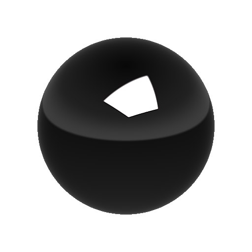

# Flächenlicht

<table>
<tr style="border: 0;">
<td width="33.33%" style="border: 0;" valign="top">

{width="200px"}

<b>In:</b> 3D-Ansicht > HDRI-Werkzeugs

</td>
<td width="100.00%" style="border: 0;" valign="top">

## Beschreibung

Erzeugt eine sphärisch projizierte Ebenenform. Die Ebene kann mithilfe der Eingabeparameter in 3D platziert und ausgerichtet werden.

Es unterscheidet sich von dem einfacheren [Formenlicht](../../../../../../compositing-graphs/nodes-reference-for-com/node-library/3d-view-library/hdri-tools/shape-light/shape-light.md) dadurch, dass es über erweiterte Platzierungsoptionen außerhalb der Projektion für einfachere Abstand zum Ursprung verfügt und mehr Muster und Masken angewendet werden können, ähnlich wie [Linienlicht](../../../../../../compositing-graphs/nodes-reference-for-com/node-library/3d-view-library/hdri-tools/line-light/line-light.md).

</td>
</tr>
</table>

## Eingaben

|  |  |
|:---|:---|
| <b>Hintergrundbildeingabe</b> <i>Farbeingabe</i> | Optionaler Hintergrund, auf dem das erzeugte Licht komponiert werden soll. |
| <b>Shape-Image-Eingabe</b> <i>Farbeingabe</i> | Optionales Bild für die Zuordnung zum Linienlicht. Wird nur verwendet, wenn der Formfarbmodus auf &quot;Bildeingabe&quot; eingestellt ist. |
| <b>Musterbildeingabe</b> <i>Graustufen-Eingabe</i> | Benutzerdefiniertes Musterbild, das verwendet wird, wenn der Parameter &quot;Muster&quot; auf &quot;Bildeingabe&quot; eingestellt ist. |

## Parameter

|  |  |
|:---|:---|
| <b>Positionsmodus</b> <i>Boden/Decke, Abstand zum Ursprung, Weltpositionen</i> | Sie können aus drei verschiedenen Platzierungsmodi auswählen. Boden/Decke und Abstand zum Ursprung unterstützen die Bearbeitung in der 2D-Ansicht, Weltpositionen können nur über Eigenschaften geändert werden, aber es wird eine exaktere Platzierung unterstützt. |
| <b>Boden-Raster anzeigen</b> <i>False/True</i> | Helfer-Funktion, um das Zeichnen eines Debug-Boden-Rasters zu ermöglichen. Hilft bei der Schätzung der Position von Linien im Raum. |
| <b>Positionskoordinaten</b> |  |
| <b>Vektor nach oben</b> <i>Z nach oben, J nach oben</i> | Nur mit dem Modus &quot;Weltposition&quot; bestimmen Sie die Ausrichtung des Koordinatensystems. |
| <b>Ebene UV Position</b> | Nur mit Boden / Decke und Abstand zum Ursprung. Legt die Ebenenposition im UV-Raum fest. |
| <b>Weltposition der Ebene</b> <i>-2.0 - 2.0</i> | Nur im Modus &quot;Weltpositionen&quot;. Legt den Weltraum für die Ebenenposition fest. Keine 2D-Ansicht-Interaktion unterstützt. |
| <b>Absolutes Height der Ebene</b> <i>0.0 - 1.0</i> | Nur bei der Positionsart &quot;Boden/Decke&quot; wird das absolute Height von der Decke eingestellt. Verwenden Sie &quot;Bodenraster anzeigen&quot;, um die Position besser zu schätzen. |
| <b>Abstand zum Ursprung</b> <i>0.0 - 1.0</i> | Nur mit Abstand zum Ursprung-Positionsmodus. Legt für beide Punkte den Abstand vom Mittelpunkt des Panoramas fest. |
| <b>Formfarbmodus</b> <i>RGB, Temperatur (Kelvin), Bildeingabe</i> | Wählen Sie die Methode aus, die zum Festlegen der Formfarbe verwendet werden soll. Image Input ermöglicht die Verwendung des zweiten Eingangssteckplatzes. |
| <b>Farbe</b> <i>(Farbwert)</i> | Nur bei RGB als Formfarbmodus. Wählt Farbe für die Form. |
| <b>Temperatur</b> <i>800.0 - 20000.0</i> | Nur, wenn der Formfarbmodus auf &quot;Temperatur&quot; eingestellt ist. Legt den Kelvin-Wert für die Formfarbe fest. |
| <b>Modus für die UV des Formenbilds</b> <i>Gedehnt, nur Mitte Gedehnt, Wiederholen + Abstand</i> | Nur bei aktiviertem Formfarbmodus &quot;Bildeingabe&quot;. Legt fest, wie das Bild auf die Linienform angewendet wird, und bestimmt das Verhalten der UV-Wiederholung. |
| <b>Abstand für die Wiederholung des Formenbilds</b> <i>0.0 - 1.0</i> | Nur bei &quot;Formfarbmodus&quot; auf &quot;Bildeingabe&quot; und &quot;UV-Modus&quot; auf &quot;Wiederholen + Abstand&quot; eingestellt. Legt den Abstand fest, der zwischen den Bildern auf einer Linie liegt. |
| <b>Shape Image Gamma</b> <i>sRGB, linear</i> | Nur bei aktiviertem Formfarbmodus &quot;Bildeingabe&quot;. Legen Sie fest, wie die Formbildeingabe interpretiert wird. |
| <b>Belichtung (EV)</b> <i>0.0 - 10.0</i> | Belichtungswert für generierte Form festlegen, optimal abgestimmt auf den Belichtungswert des Hintergrundbilds. |
| <b>Ebenenskala</b> <i>0.0 - 1.0</i> | Legen Sie die einheitliche Skalierung der Form &quot;Ebene&quot; fest. |
| <b>Ebenengröße</b> <i>0.0 - 1.0</i> | Festlegen einer ungleichmäßigen Größe der Form &quot;Ebene&quot;. |
| <b>Ebenendrehung</b> <i>0.0 - 1.0</i> | Ebene entlang ihrer Mittelachse drehen. |
| <b>Muster</b> <i>Quadrat glätten, Quadrat scharf, Kegel, Halbkugel, Bildeingabe</i> | Wählen Sie die zu verwendende Musterform aus. |
| <b>Pattern-Härte</b> <i>0.0 - 1.0</i> | Härte/Kontrast für das Muster festlegen. |
| <b>Pattern-UV-Modus</b> <i>Gedehnt, nur Mitte Gedehnt</i> | Legen Sie fest, wie eine sekundäre Mustermaske verwendet wird, die über dem Formenbild angewendet wird. |
| <b>Boden-Clipping aktivieren</b> <i>False/True</i> | Aktivieren Sie diese Option, wenn die Ebene durch eine Grundebene beschnitten werden kann oder immer noch angezeigt wird, wenn sie darunter liegt. Verwenden Sie &quot;Bodenraster anzeigen&quot;, um dies besser einzuschätzen. |
| <b>Boden-Height</b> <i>-2.0 - 0.0</i> | Passe das Height der Grundebene für die Beschneidung an. |
| <b>Hintergrundeingabe aktivieren</b> <i>False/True</i> | Schaltet die Verwendung des optionalen Hintergrundbilds um. Kompositionen generierten Licht auf dem Hintergrund. |
| <b>Hintergrundfarbe</b> <i>(Farbwert)</i> | Wenn die Option &quot;Hintergrundeingabe&quot; nicht verwendet wird, legen Sie hier einen Wert für einen einfarbigen Hintergrund fest. |
| <b>Hintergrund-Gamma</b> <i>sRGB, linear</i> | Wenn die Hintergrundeingabe verwendet wird, legen Sie fest, wie die Hintergrundeingabe interpretiert werden soll. |

## Beispiele

<table style="margin-top: 32px; margin-bottom: 32px">
    <tr style="border: 0">
        <td style="border: 0; background: transparent">
            
        </td>
    </tr>
</table>
