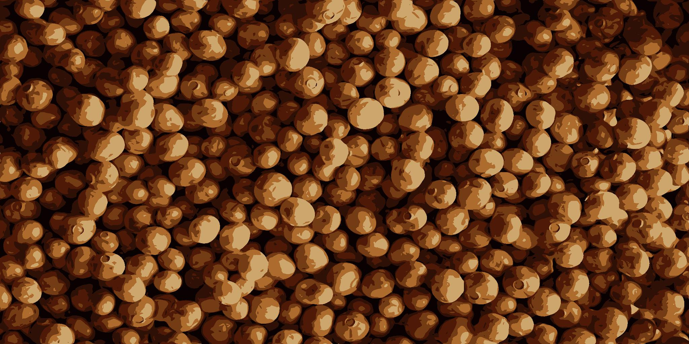

# Farbpalette anwenden

<table>
<tr style="border: 0;">
<td width="33.33%" style="border: 0;" valign="top">

{width="200px"}

<b>In:</b> Filters > Adjustments

</td>
<td width="100.00%" style="border: 0;" valign="top">

## Beschreibung

Wendet die Farben in einer geordneten Palette mithilfe einer ID-Map auf ein Bild an.

Die Farben werden verteilt, indem die Farbindizes auf der ID-Map mit den Farbindizes in der Palette übereinstimmen.

Beispielsweise wird die #2 in der Palette auf alle Pixel in der ID-Map mit einem ID-Wert von 2 angewendet.

Dieser Knoten kann in Kombination mit den folgenden Knoten verwendet werden: [Farbe quantisieren](../../../../../../compositing-graphs/nodes-reference-for-com/node-library/filters/adjustments/quantize-color/quantize-color.md), [Farbpalette erstellen](../../../../../../compositing-graphs/nodes-reference-for-com/node-library/filters/adjustments/create-color-palette-16/create-color-palette-16.md), [Farbpalette ändern](../../../../../../compositing-graphs/nodes-reference-for-com/node-library/filters/adjustments/modify-color-palette/modify-color-palette.md), [Farbpalette anzeigen](../../../../../../compositing-graphs/nodes-reference-for-com/node-library/filters/adjustments/view-color-palette/view-color-palette.md).

</td>
</tr>
</table>

## Eingaben

|  |  |
|:---|:---|
| <b>ID</b> <i>Graustufen</i> PRIMÄR | Die Eingabe-ID-Map, die zum Verteilen der Farben in der Eingabepalette verwendet wird.   Eine ID-Map ist ein Bild, bei dem Pixel, die Teil eines Ganzen sind (z. B. eine Form), alle denselben eindeutigen Identifikationswert aufweisen. In diesem Fall ist der Wert eine Ganzzahl.   Eine ID-Zuordnung kann mithilfe eines Knotens [Farbe quantisieren](../../../../../../compositing-graphs/nodes-reference-for-com/node-library/filters/adjustments/quantize-color/quantize-color.md) erstellt werden. |
| <b>Palette</b> <i>Farbe</i> | Eine geordnete Liste von RGB-Farben, die als Pixelzeile codiert sind. Die Palette kann maximal 256 Farben enthalten. Dies ist die Palette, die der Knoten den Indizes der ID-Map zuordnet.   Paletten können mit einem Knoten [Farbe quantisieren](../../../../../../compositing-graphs/nodes-reference-for-com/node-library/filters/adjustments/quantize-color/quantize-color.md) erzeugt und mit einem Knoten [Farbpalette ändern](../../../../../../compositing-graphs/nodes-reference-for-com/node-library/filters/adjustments/modify-color-palette/modify-color-palette.md) geändert werden. |

## Ausgaben

|  |  |
|:---|:---|
| <b>Ausgabe</b> <i>Farbe</i> | Das Ergebnis der Zuordnung der Farben in der Palette zu den Indizes der ID-Map. |

## Beispiele

{zoomable="yes"}

<table>
  <tr>
    <td>
      
       <i>Vorher</i>
    </td>
    <td>
      
       <i>Nach</i>
    </td>
  </tr>
</table>

{zoomable="yes"}

<table>
  <tr>
    <td>
      
       <i>Vorher</i>
    </td>
    <td>
      
       <i>Nach</i>
    </td>
  </tr>
</table>
