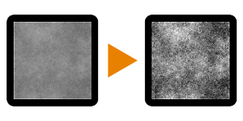

# Auto-Tonwertkorrektur

<table>
<tr style="border: 0;">
<td width="33.33%" style="border: 0;" valign="top">

{width="128px"}

<b>In:</b> Filters > Adjustments

</td>
<td width="100.00%" style="border: 0;" valign="top">

## Beschreibung

Passt die Eingangspegel automatisch an, sodass der gesamte Bereich von Schwarz bis Weiß verwendet wird. Das bedeutet, dass der dunkelste Wert im Bild vollständig schwarz und der hellste Wert vollständig weiß eingestellt wird, wodurch der Kontrast maximiert wird.

</td>
</tr>
</table>

## Beispiele

<table style="margin-top: 32px; margin-bottom: 32px">
    <tr style="border: 0">
        <td style="border: 0; background: transparent">
            
        </td>
    </tr>
</table>
