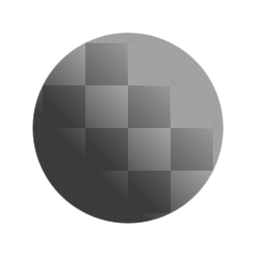

# Klammer

<table>
<tr style="border: 0;">
<td style="border: 0;" valign="top">

{width="128px"}

{width="128px"}

## Klemmen (Graustufen)

**In:** *Filter/Korrekturen*

**Einfach**

</td>
<td style="border: 0;" valign="top">

## Beschreibung

Klammert Eingabewerte an definierte Grenzen.

## Parameter

* **Min**: *0.0 -* 1.0\
  Untere Klemmbegrenzung.
* **Max**: *0.0 - 1.0* Oberes Klemmlimit.
* **Auf Alpha anwenden**: *Falsch/Wahr* (nur Farbversion)\
  Legen Sie fest, ob die Klammer auch auf das Alpha angewendet wird.

## Beispielbilder

</td>
</tr>
</table>
