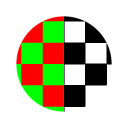

# Farbe zu maskieren

<table>
<tr style="border: 0;">
<td style="border: 0;" valign="top">

<table>
<tr style="border: 0;">
<td width="33.33%" style="border: 0;" valign="top">

{width="200px"}

<b>In:</b> Filters > Adjustments

</td>
<td width="100.00%" style="border: 0;" valign="top">

## Beschreibung

Extrahiert eine Graustufenmaske aus den ausgewählten Farben in einem Farbbild.

</td>
</tr>
</table>

<table>
<tr style="border: 0;">
<td style="border: 0;" valign="top">

### Eingaben

</td>
<td style="border: 0;" valign="top">

### Ausgaben

</td>
<td style="border: 0;" valign="top">

### Parameter

</td>
<td style="border: 0;" valign="top">

### Beispiele

</td>
</tr>
</table>

## Eingaben

|  |  |
| --- | --- |
| <b>Eingabefarbe</b> | Das Eingabefarbbild, aus dem eine Maske basierend auf ihren Farben extrahiert werden soll. |
| <b>Farbeingabe</b> Farbe *Verfügbar, wenn &quot;Farbeingabe verwenden&quot; auf &quot;Wahr&quot; festgelegt ist* | Das Eingabefarbbild, das zum Definieren der Referenzfarbe pro Pixel verwendet wird. |

## Ausgaben

|  |  |
| --- | --- |
| <b>Ausgabe</b> *Graustufen* | Die generierte Maske als Graustufen-Bitmap. |

## Parameter

|  |  |
| --- | --- |
| <b>Farbeingabe verwenden</b> Boolescher Wert | Verwenden Sie ein Eingabebild anstelle einer einheitlichen Farbe, um eine Referenzfarbe pro Pixel zu definieren.    Das Eingabebild wird von der <b>Farbeingabe</b> bereitgestellt. |
| <b>Color</b> Float3 *Verfügbar, wenn &quot;Farbeingabe verwenden&quot; auf &quot;Falsch&quot; festgelegt ist* | Die einheitliche Referenzfarbe, um die die Farbauswahl durchgeführt werden soll. |
| <b>Schwellenwert</b> Gleitkomma | Der Abstand zur Referenzfarbe, unter der die Farben ausgewählt sind. |
| <b>Auswahlüberblendung</b> Gleitend | Blenden Sie die Farbauswahl basierend auf dem Abstand zur Referenzfarbe aus. |
| <b>Entfernungsfarbraum</b> Ganze Zahl | Beim Equalize-Prozess werden Farben verglichen, um den Abstand zwischen ihnen zu bestimmen. Bestimmte Farbräume und Abstandsalgorithmen sind für bestimmte Anwendungsfälle besser geeignet.   In dieser Dropdown-Liste können Sie den Farbraum auswählen, der zum Vergleichen der Farben verwendet wird:<ul data-preserve-html="true"> <li data-preserve-html="true"><b><i>RGB (Daten):</i></b> Die Farbe ist in Rot-, Grün- und Blaukanäle unterteilt und direkt entlang dieser Achse verteilt, wobei die menschliche Wahrnehmung ignoriert wird. Dies ist für Bilder mit Rohdaten geeignet.</li> <li data-preserve-html="true"><i>Linearer sRGB (Farbe):</i> Die Farbe wird in die Kanäle Rot, Grün und Blau aufgeteilt und linear zur Pixellichtintensität verteilt. Dies eignet sich für Bilder, die auf Displays visualisiert werden können.</li> <li data-preserve-html="true"><b><i>Luminanz (Farbe):</i></b> Die Farbe wird in Farbton-, Chrominanz- und Luminanzwerte aufgeteilt, wobei nur der Luminanzwert im Vergleich verwendet wird. Dies eignet sich für Bilder, die auf Displays visualisiert werden können.</li> <li data-preserve-html="true"><i>Lab (Farbe):</i> Ein standardisierter wahrnehmbarer Farbraum, der Farben so verteilt, dass Farben, die sich &quot;ähnlich&quot; fühlen, sich tatsächlich im Würfel befinden. Dies eignet sich für Bilder, die auf Displays visualisiert werden können.</li> <li data-preserve-html="true"><i>Winkel (Normal):</i> Die Farbe wird in die X-, Y- und Z-Achsen eines Vektors aufgeteilt und mit einem Punktprodukt verglichen. Dies eignet sich für Bilder, die &quot;Tangent-Leerzeichen-Normale&quot; enthalten.</li> </ul> |
| <b>Abstandsgewichte</b> Gleitkomma3 | Der Lab-Farbdistanz-Algorithmus (DeltaE2000) führt bestimmte Gewichtungsfaktoren für jeden Helligkeits-, Chroma- und Farbtonwert ein.   Niedrigere Werte verringern den Einfluss der Faktoren im Farbdifferenzalgorithmus.   Da das Auge in der Regel größere Unterschiede in der Helligkeit (L) akzeptiert als in Chroma (C) oder Farbton (H), ist das Standardverhältnis für (L:C:H) (0,5:1:1). Ein Verhältnis von 0,5:1:1 ermöglicht einen doppelt so großen Helligkeitsunterschied wie bei Chroma oder Farbton. |

## Beispiele

<table>
<tr style="border: 0;">
<td style="border: 0;" valign="top">

</td>
<td style="border: 0;" valign="top">

</td>
</tr>
</table>

</td>
<td style="border: 0;" valign="top">

</td>
<td style="border: 0;" valign="top">

</td>
</tr>
</table>
