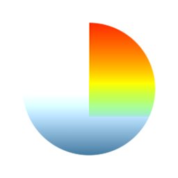

# HDR-Bereichsanzeige

<table>
<tr style="border: 0;">
<td style="border: 0;" valign="top">

{width="128px"}

{width="128px"}

## HDR-Bereichsanzeige (Graustufen)

**In:** *Filter/Korrekturen*

**Einfach**

</td>
<td style="border: 0;" valign="top">

## Beschreibung

Debugtool zum Überprüfen exakter Bereiche mit High Dynamic Range. Es gibt sowohl Farb- als auch Graustufenversionen.

## Parameter

* **Bereichsmin.**: *-2.0 - 0.0* Minimaler Bereich, um die Markierung zu starten.
* **Max. Bereich**: *1.0 - 3.0* Maximaler Bereich, bis zu dem hervorgehoben werden kann.

## Beispielbilder

| 

 |
| --- |
|  |

</td>
</tr>
</table>
