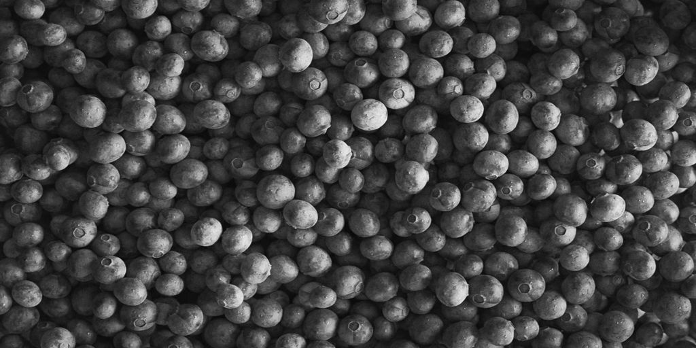

# Histogramm entzerren

<table>
<tr style="border: 0;">
<td width="33.33%" style="border: 0;" valign="top">

{width="200px"}

<b>In:</b> Filters > Adjustments

</td>
<td width="100.00%" style="border: 0;" valign="top">

## Beschreibung

Entzerrt das Histogramm für ein Graustufenbild und passt die Graustufenwerte effektiv an, um eine gleichmäßige Verteilung zu erreichen.

</td>
</tr>
</table>

## Eingaben

|  |  |
|:---|:---|
| <b>Eingabe</b> <i>Graustufen</i> PRIMÄR | Das Bild, für das das Histogramm ausgeglichen werden soll. |

## Ausgaben

|  |  |
|:---|:---|
| <b>Ausgabe</b> <i>Graustufen</i> | Das Ergebnisbild mit angewendeter Histogrammentzerrung. |

## Parameter

|  |  |
|:---|:---|
| <b>Histogrammauflösung</b> *Ganzzahl* | Die Breite des Histogramms. Ein höherer Wert ermöglicht eine feinere Wertverteilung.   Verfügbare Auflösungen sind in Pixeln:  256, 512, 1024, 2048, 4096 |
| <b>Glättung des Histogramms</b> *Fließkommazahl* | Das Histogramm kann geglättet werden, indem die Graustufenwerte im Bild neu verteilt werden, um die *Differenz* zwischen jedem Wert zu entzerren.   Dieser Parameter passt die Intensität der Glättung an. |

## Beispiele

<table>
  <tr>
    <td>
      
       <i>Vorher</i>
    </td>
    <td>
      
       <i>Nach</i>
    </td>
  </tr>
</table>

{zoomable="yes"}

<table>
  <tr>
    <td>
      
       <i>Vorher</i>
    </td>
    <td>
      
       <i>Nach</i>
    </td>
  </tr>
</table>

{zoomable="yes"}

<table>
  <tr>
    <td>
      
       <i>Vorher</i>
    </td>
    <td>
      
       <i>Nach</i>
    </td>
  </tr>
</table>

{zoomable="yes"}
