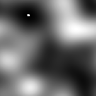

# Histogrammverschiebung

<table>
<tr style="border: 0;">
<td style="border: 0;" valign="top">

{width="128px"}

## Histogrammverschiebung

**In:** *Filter/Korrekturen*

**Einfach**

</td>
<td style="border: 0;" valign="top">

## Beschreibung

Verschiebt den gesamten Bildbereich vollständig und fließt ein, wenn die Bereichsgrenzen erreicht sind.

[Klicken Sie hier, um ein Substance Academy-Video über Histogram Shift anzuschauen.](https://youtu.be/p9wcmJBFyGA?t=492)

## Parameter

* **Position**: *0.0 - 1.0*\
  Gibt an, um wie viel der Input verschoben werden soll. 1.0 ist eine vollständige Drehung und ist gleich 0.0.

## Beispielbilder

</td>
</tr>
</table>
