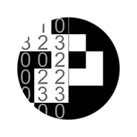
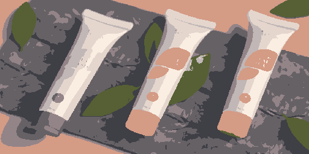

# ID zum Maskieren von Graustufen

<table>
<tr style="border: 0;">
<td width="33.33%" style="border: 0;" valign="top">

Symbol {width="200px"}

<b>In:</b> Filters > Adjustments

</td>
<td width="100.00%" style="border: 0;" valign="top">

## Beschreibung

Erstellt eine Maske aus einer ID-Map, wobei die Pixel mit den ausgewählten Pixelwerten weiß sind.

Eine ID-Map ist ein Bild, bei dem Pixel, die Teil eines Ganzen sind (z. B. eine Form), alle denselben eindeutigen Identifikationswert aufweisen. In diesem Fall ist der Wert eine Ganzzahl.

</td>
</tr>
</table>

## Eingaben

|  |  |
|:---|:---|
| <b>ID</b> <i>Graustufen</i> PRIMÄR | Die Eingabe-ID-Zuordnung, aus der eine Maske extrahiert werden soll. |

## Ausgaben

|  |  |
|:---|:---|
| <b>Ausgabe</b> <i>Graustufen</i> | Die Binärmaske, die aus der Eingabe-ID-Map extrahiert wurde. |

## Parameter

|  |  |
|:---|:---|
| <b>Auswahlmodus</b> *Integer* | Die Methode zum Auswählen der Pixelwerte in der ID-Map, die in der Maske weiß sein sollen:<ul data-preserve-html="true"> <li data-preserve-html="true"><b>Solo:</b> Wählen Sie einen einzelnen Pixelwert aus</li> <li data-preserve-html="true"><b>Bereich:</b> Wählen Sie einen Bereich von Pixelwerten aus.</li> </ul> |
| <b>ID Integer</b> *Integer* *Verfügbar, wenn &#39;Auswahlmodus&#39; auf &#39;Solo&#39; festgelegt ist* | Der Pixelwert in der ID-Map, der in der Ausgabemaske weiß sein sollte. |
| <b>ID-Bereich</b> *Ganzzahl2* *Verfügbar, wenn &quot;Auswahlmodus&quot; auf &quot;Bereich&quot; festgelegt ist* | Der Bereich der Pixelwerte in der ID-Map, von Anfang bis Ende, der in der Ausgabemaske weiß sein sollte. |

## Beispiele

<table>
  <tr>
    <td>
      
       <i>Vorher</i>
    </td>
    <td>
      
       <i>Nach</i>
    </td>
  </tr>
</table>

<table>
<tr style="border: 0;">
<td style="border: 0;" valign="top">

Zu maskierende {zoomable="yes"}

</td>
<td style="border: 0;" valign="top">

Zu maskierende {zoomable="yes"}

</td>
</tr>
</table>
