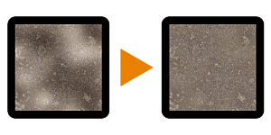

# Luminanzhochpass

<table>
<tr style="border: 0;">
<td style="border: 0;" valign="top">

{width="128px"}

## Luminanzhochpass

**In:** *Filter/Korrekturen*

**Einfach**

</td>
<td style="border: 0;" valign="top">

## Beschreibung

Bricht Beleuchtungsinformationen ab, indem ein [Hochpass](../../../../../../compositing-graphs/nodes-reference-for-com/node-library/filters/adjustments/highpass/highpass.md) für den Luminanzwert der Eingabe ausgeführt wird. Nützlich, um fotografierte Texturen mit Beleuchtungsinformationen zu korrigieren. Kann in [Substance 3D Designer](https://www.adobe.com/de/products/substance3d-designer.html) mit mehreren Durchläufen kombiniert werden, um unterschiedliche Lichtfrequenzen zu entfernen.

Erweist sich als etwas besser bei der Farberhaltung als [Beleuchtung Niederfrequenzen abbrechen](../../../../../../compositing-graphs/nodes-reference-for-com/node-library/filters/adjustments/lighting-cancel-low-fre/lighting-cancel-low-frequencies.md)

## Parameter

* **Radius**: *0.0 - 64.0* Radius des Hochpasseffekts. Ein kleinerer Radius annulliert eine kleinere Beleuchtung und passt sie an die Eingabebilder an.

## Beispielbilder

| 

 |
| --- |
|  |

</td>
</tr>
</table>
