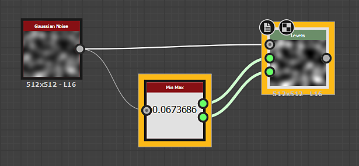

# Min. Max

<table>
<tr style="border: 0;">
<td width="33.33%" style="border: 0;" valign="top">

{width="200px"}

<b>In:</b> Filters > Adjustments

</td>
<td width="100.00%" style="border: 0;" valign="top">

## Beschreibung

Min Max findet die hellsten und dunkelsten Werte einer Graustufeneingabe und gibt sie als [Werte](../../../../../values-compositing-graphs/values-in-substance-compositing-graphs.md) zurück. Es ist als detailliertere, manuelle Alternative für [Auto-Stufen](../../../../../../compositing-graphs/nodes-reference-for-com/node-library/filters/adjustments/auto-levels/auto-levels.md) vorgesehen, bei der Sie die Werteingaben eines [Stufen](../../../../../../compositing-graphs/nodes-reference-for-com/atomic-nodes/levels/levels.md)-Knotens gelegt und die Werte von Min Max darin einstecken.

Um diesen Knoten mit einer Ebene zu verwenden, sollten Sie mindestens wissen, wie Sie die Dropdown-Liste [Leg-Parameter](../../../../../../compositing-graphs/manage-parameters/exposing-a-parameter/exposing-a-parameter.md) sowie die Registerkarte [Wert-Eingabe](../../../../../values-compositing-graphs/values-in-substance-compositing-graphs.md) verwenden.

</td>
</tr>
</table>

## Beispiele

<table style="margin-top: 32px; margin-bottom: 32px">
    <tr style="border: 0">
        <td style="border: 0; background: transparent">
            
        </td>
    </tr>
</table>
