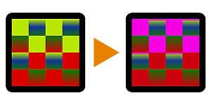

# Farbbereich ersetzen

<table>
<tr style="border: 0;">
<td style="border: 0;" valign="top">

{width="128px"}

## Farbbereich ersetzen

**In:** *Filter/Korrekturen*

**Einfach**

</td>
<td style="border: 0;" valign="top">

## Beschreibung

Ersetzt die Quellfarbe durch die Zielfarbe mit zusätzlichen Steuerelementen. Kann beispielsweise verwendet werden, um Teile einer Material ID-Karte neu zu färben (backen).

Eine erweiterte Version finden Sie unter [Farbabgleich.](../../../../../../compositing-graphs/nodes-reference-for-com/node-library/filters/adjustments/color-match/color-match.md)

## Parameter

* **Quellfarbe**: *(Farbwert)*Farbe, die ersetzt werden soll.
* **Zielfarbe**: *(Farbwert)*Farbe, durch die ersetzt werden soll.
* **Quellbereich**: *0.0 -* 1.0\
  Bereich oder Toleranz der ausgewählten Quelle. Kann erhöht werden, damit auch weitere benachbarte Farben farblich verschoben werden.
* **Schwellenwert**: *0.0 - 1.0* Abfall/Kontrast für den Bereich. Wählen Sie &quot;Niedrig&quot;, um nur die Quellfarbe zu ersetzen, und &quot;Hoch&quot;, um auch die Farben zu ersetzen, die in die Quelle übergehen.

## Beispielbilder

| 

 |
| --- |
|  |

</td>
</tr>
</table>
