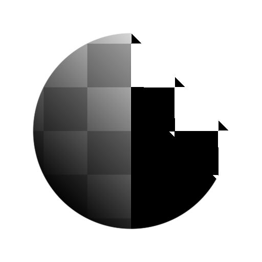

# Schwellenwert

<table>
<tr style="border: 0;">
<td style="border: 0;" valign="top">

{width="200px"}

## Schwellenwert

**In:** *Filter/Korrekturen*

**Einfach**

</td>
<td style="border: 0;" valign="top">

## Beschreibung

Gibt Weiß zurück, wenn die im Parameter **Modus** festgelegten *Vergleichskriterien* für den Eingabepixelwert im Verhältnis zum Wert **Schwellenwert** erfüllt sind.\
Ähnlich wie [Histogrammscan](../../../../../../compositing-graphs/nodes-reference-for-com/node-library/filters/adjustments/histogram-scan/histogram-scan.md), jedoch mit Kontrast immer auf maximaler Ebene. Dient als präzisere und schnellere Möglichkeit, ähnliche Ergebnisse wie bei der Histogrammsuche zu erhalten.

### Parameter

* **Schwellenwert**: *0.0 - 1.0*\
  Luminanzwert, mit dem der Eingangspixelwert verglichen wird.
* **Modus**:\
  Das Kriterium, nach dem der Eingabepixelwert mit dem **Schwellenwert**-Wert verglichen werden soll:
  * *Größer*
  * *Größer oder gleich*
  * *Niedriger*
  * *Niedriger oder gleich*

## Beispielbilder

</td>
</tr>
</table>
