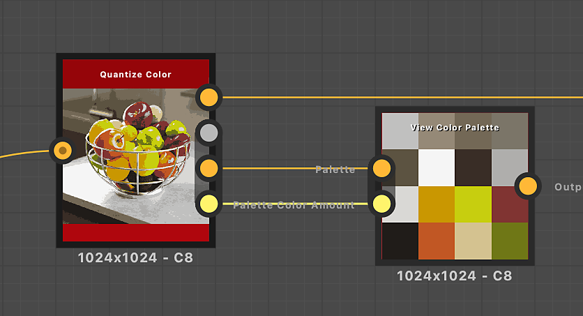

# Farbpalette anzeigen

<table>
<tr style="border: 0;">
<td width="33.33%" style="border: 0;" valign="top">

{width="200px"}

<b>In:</b> Filters > Adjustments

</td>
<td width="100.00%" style="border: 0;" valign="top">

## Beschreibung

Verpackt eine Farbpalette in ein Quadrat oder Rechteck, um sie leichter in der Diagramm- oder 2D-Ansicht darzustellen.\
Das Packing zielt darauf ab, so wenig freie Zeitnischen wie möglich zu lassen.

</td>
</tr>
</table>

Die Reihenfolge der Farben in der Palette bleibt erhalten, wobei die Farben ähnlich wie beim Textumbruch von links nach rechts und von oben nach unten fließen.

Dieser Knoten kann verwendet werden, um die Paletten zu visualisieren, die von den folgenden Knoten erzeugt werden: [Farbe quantisieren](../../../../../../compositing-graphs/nodes-reference-for-com/node-library/filters/adjustments/quantize-color/quantize-color.md), [Farbpalette erstellen](../../../../../../compositing-graphs/nodes-reference-for-com/node-library/filters/adjustments/create-color-palette-16/create-color-palette-16.md), [Farbpalette ändern](../../../../../../compositing-graphs/nodes-reference-for-com/node-library/filters/adjustments/modify-color-palette/modify-color-palette.md).

## Eingaben

|  |  |
|:---|:---|
| <b>Palette</b> <i>Farbe</i> PRIMÄR | Eine geordnete Liste von RGB-Farben, die als Pixelzeile codiert sind. Die Palette kann maximal 256 Farben enthalten.   Dies ist die Palette, die der Knoten verpackt und rendert. |
| <b>Farbmenge der Palette</b> <i>Integer</i> | Die Menge der in der Palette gespeicherten Farben.   Wenn diese Zahl nicht mit der tatsächlichen Farbmenge in der Bildeingabe der Palette übereinstimmt, ist die Visualisierung möglicherweise unvollständig oder weist mehr leere Steckplätze auf als unbedingt erforderlich. |

## Ausgaben

|  |  |
|:---|:---|
| <b>Ausgabe</b> <i>Farbe</i> | Die Visualisierung der verpackten Palette. |

## Beispiele

<table>
<tr style="border: 0;">
<td style="border: 0;" valign="top">

{zoomable="yes"}

</td>
<td style="border: 0;" valign="top">

{zoomable="yes"}

</td>
</tr>
</table>

<table>
<tr style="border: 0;">
<td style="border: 0;" valign="top">

{zoomable="yes"}

</td>
<td style="border: 0;" valign="top">

{zoomable="yes"}

</td>
</tr>
</table>
