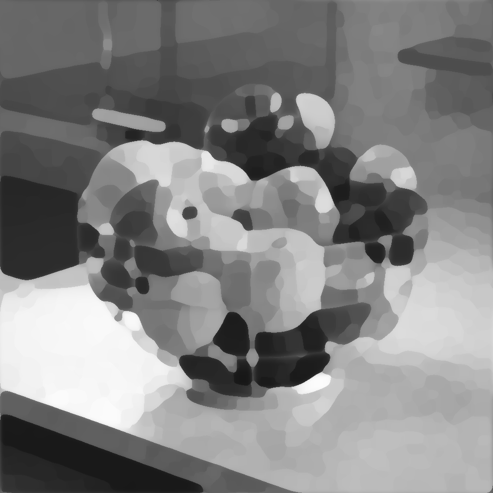

# MLV-Graustufen

<table>
<tr style="border: 0;">
<td width="33.33%" style="border: 0;" valign="top">

<b>In:</b> Filters > Blurs

</td>
<td width="100.00%" style="border: 0;" valign="top">

## Beschreibung

MLV steht für <b>&#39;Mittel der geringsten Abweichung&#39;</b>. Dieser Filter optimiert Kanten und glättet Bildrauschen.

Der Filter findet strukturierende Bereiche in einem Bild und verwendet sie sowohl zum Scharfzeichnen als auch zum Reduzieren. Dies kann in manchen Fällen zu Stufen entlang von Gradienten führen, die breiter als die Strukturierungsbereiche sind.

</td>
</tr>
</table>

>[!NOTE]
>
> Siehe auch [MLV-Farbe](../../../../../../compositing-graphs/nodes-reference-for-com/node-library/filters/blurs/mlv-color/mlv-color.md).

## Eingaben

|  |  |
|:---|:---|
| <b>Eingabe</b> <i>Graustufen</i> | Das Graustufenbild, das verarbeitet werden soll. |

## Ausgaben

|  |  |
|:---|:---|
| <b>Ausgabe</b> <i>Graustufen</i> | Das gefilterte Graustufenbild. |

## Parameter

|  |  |
|:---|:---|
| <b>Intensität</b> *Gleitend* | Die Stärke der Filterung, die auf das Bild angewendet wurde.  Höhere Werte führen zu einer stärkeren Glättung von Details und zum Rauschen in flachere Bereiche. |
| <b>Smoothness</b> *Gleitend* | Die Intensität der auf die Strukturierungsflächen aufgebrachten Glättung, die zu runderen Flächen führt und die bei höheren Filterungen auftreten kann, vermindert. |
| <b>Kriterium</b> *Integer* | Das Kriterium zur Auswahl der Werte, die die Strukturierungsbereiche im Bild definieren.  Mit anderen Worten, wie Pixel *gruppiert* werden sollten in Bereiche, die geglättet werden sollen.  *- Varianz:* Wählen Sie Werte mit der niedrigsten Streuung um den Mittelwert aus, was zu Clustern von Pixeln führt, die einander ähnlich sind  *- Variationskoeffizient:* Wählen Sie Werte aus, während Sie den Mittelwert berücksichtigen, was umgekehrt zu weniger Variationen in helleren Bereichen führt |
| <b>Gaußsch</b> *Boolescher Wert* | Verwenden Sie eine Gaußsche Verteilung zum Gruppieren von Pixeln in strukturierende Bereiche.  Wenn &quot;True&quot; festgelegt ist, führt dies zu glatteren Bereichen und einem reduzierten Abflachungseffekt. |
| <b>Iterationen</b> *Integer* | Gibt an, wie oft der Filter ausgeführt wird, wobei jede Iteration auf das Ergebnis der vorherigen angewendet wird.  Mehr Iterationen führen zu flacheren und schärferen Strukturierungsbereichen. |

## Beispiele

<table>
  <tr>
    <td>
      
       <i>Vorher</i>
    </td>
    <td>
      
       <i>Nach</i>
    </td>
  </tr>
</table>

<table>
  <tr>
    <td>
      
       <i>Vorher</i>
    </td>
    <td>
      
       <i>Nach</i>
    </td>
  </tr>
</table>

<table>
  <tr>
    <td>
      
       <i>Vorher</i>
    </td>
    <td>
      
       <i>Nach</i>
    </td>
  </tr>
</table>
