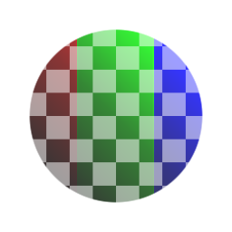

# RGBA-Zusammenführung

<table>
<tr style="border: 0;">
<td width="33.33%" style="border: 0;" valign="top">

{width="128px"}

<b>In:</b> Filters > Channels

</td>
<td width="100.00%" style="border: 0;" valign="top">

## Beschreibung

Packt einen separaten Graustufeneingang in jeden der vier Kanäle. Nicht zu verwechseln mit RGB-A Merge, da dieser Knoten Ihnen mehr Kontrolle über das Zusammenführen gibt!

Sehr nützlicher Knoten für Channel-Packing-Maps. Kann beispielsweise für die Packing-Smoothness, Metallic und AO in die jeweiligen R-, G- und B-Kanäle eingesetzt werden.

</td>
</tr>
</table>

## Eingaben

|  |  |
|:---|:---|
| <b>R</b> <i>Graustufen-Eingabe</i> |  |
| <b>G</b> <i>Graustufen-Eingabe</i> |  |
| <b>B</b> <i>Graustufen-Eingabe</i> |  |
| <b>A</b> <i>Graustufen-Eingabe</i> |  |
