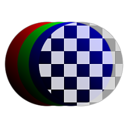

# RGBA-Teilung

<table>
<tr style="border: 0;">
<td width="33.33%" style="border: 0;" valign="top">

{width="128px"}

<b>In:</b> Filters > Channels

</td>
<td width="100.00%" style="border: 0;" valign="top">

## Beschreibung

Teilt ein Eingabebild in die entsprechenden Kanäle für Rot, Grün, Blau und Alpha auf. Sie &quot;entpackt&quot; ein Bild effektiv.

Hilfreich für die separate Analyse und Verwendung verpackter Kanäle. Wenn Sie eine Positionskarte oder eine Weltraum-Normalmap für Substance Painter-Effekte verwenden, können Sie beispielsweise die X-, Y- oder Z-Komponente herausfiltern.

</td>
</tr>
</table>
