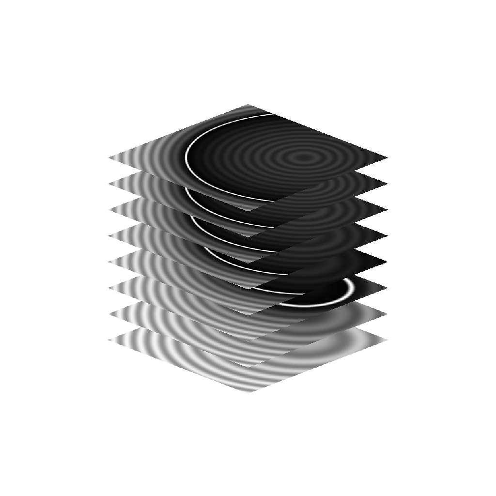

# 3D Texture SDF

<table>
<tr style="border: 0;">
<td width="41.60%" style="border: 0;" valign="top">

{width="200px"}

**In:** *Filter/Effekt*

**Einfach**

</td>
<td width="58.30%" style="border: 0;" valign="top">

## Beschreibung

Der Knoten **3D Texture SDF** generiert das *vorzeichenbehaftete Abstandsfeld* einer Form aus der *3D-Textur* der **Eingabe**, die die Slices des *Volumes* der Form darstellt.

</td>
</tr>
</table>

## Parameter

### Eingaben

* **Maskeneingabe** *Graustufen*\
  Die *3D-Textur*-Maske, die die Slices des *Volumes* einer Form darstellt.

### Parameter

* **Schwellenwert** *Gleitkomma*\
  Wenn das Formvolumen durch einen *verblassenden Verlauf* beschrieben wird, wird der Verlaufswert festgelegt, bei dem die *Oberfläche* der Form *erkannt* wird.
* **Ausgabe** *Ganzzahl*\
  Der Typ des Distanzfelds, das ausgegeben werden soll:
  * *Entfernungsfeld*: gibt ein Abstandsfeld aus, das die Abstände *außerhalb* der Form beschreibt.
  * *Vorzeichenbehaftetes Abstandsfeld*: gibt ein Abstandsfeld aus, das die Abstände *außerhalb* (positiv) und *innerhalb* (negativ) der Form beschreibt.

## Beispielbilder

<table>
<tr style="border: 0;">
<td style="border: 0;" valign="top">

{width="256px"}

</td>
<td style="border: 0;" valign="top">

{width="256px"}

</td>
<td style="border: 0;" valign="top">

{width="256px"}

</td>
</tr>
</table>
