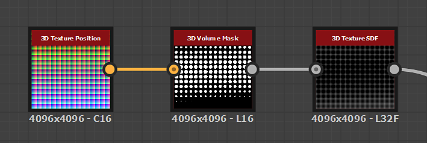

# 3D Textur SDF

<table>
<tr style="border: 0;">
<td width="33.33%" style="border: 0;" valign="top">

{width="200px"}

<b>In:</b> Filter > Effekt

</td>
<td width="100.00%" style="border: 0;" valign="top">

## Beschreibung

Der SDF **-Knoten der** 3D-Textur generiert das *vorzeichenbehaftete Abstandsfeld* einer Form aus der *3D-Textur* der **Eingabe**, die die Slices des *Volumes* der Form darstellt.

</td>
</tr>
</table>

## Eingaben

|  |  |
|:---|:---|
| <b>Maskeneingabe</b> <i>Graustufen</i> | Die <i>3D-Textur</i>, die die Slices des <i>Volumes</i> einer Form darstellt. |

## Parameter

|  |  |
|:---|:---|
| <b>Schwellenwert</b> <i>Gleitend</i> | Wenn das Formvolumen durch einen <i>verblassenden Verlauf</i> beschrieben wird, wird der Verlaufswert festgelegt, bei dem die <i>Oberfläche</i> der Form <i>erkannt</i> wird. |
| <b>Ausgabe</b> <i>Integer</i> | Der Typ des Distanzfelds, das ausgegeben werden soll:  - <i>Distanzfeld</i>: gibt ein Abstandsfeld aus, das die Abstände <i>außerhalb</i> der Form beschreibt. - <i>Vorzeichenbehaftetes Abstandsfeld</i>: gibt ein Abstandsfeld aus, das die Abstände <i>außerhalb</i> (positiv) und <i>innerhalb</i> (negativ) der Form beschreibt. |

## Beispiele

<table style="margin-top: 32px; margin-bottom: 32px">
    <tr style="border: 0">
        <td style="border: 0; background: transparent">
            
        </td>
        <td style="border: 0; background: transparent">
            
        </td>
        <td style="border: 0; background: transparent">
            
        </td>
    </tr>
</table>
