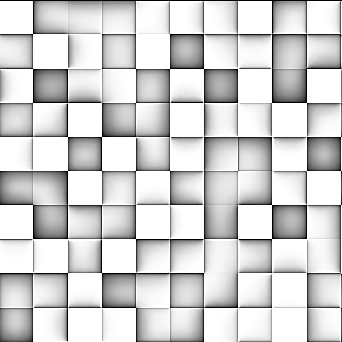

# Umgebungsluft (HBAO) (Filterknoten)

<table>
<tr style="border: 0;">
<td style="border: 0;" valign="top">

{width="128px"}

## Umgebungs-Verdeckung (HBAO)

**In:** *Filter/Effekte*

**Fortgeschrittene**

</td>
<td style="border: 0;" valign="top">

## Beschreibung

Verwendet eine Höhenkarte als Eingabe und generiert daraus eine Umgebungskarte für die Verdeckung. Es verwendet Horizon-Based Ambient Verdeckung, einen Algorithmus, der ursprünglich für die Echtzeit-AO-Generierung im Bildschirmbereich entwickelt wurde. Sehr nützlich für das Erstellen prozeduraler AO-Maps aus prozeduralen Heightmaps.

Eine alternative, komplexere, aber langsamere Version von AO finden Sie unter [Ambient Verdeckung (RTAO)](../../../../../../compositing-graphs/nodes-reference-for-com/node-library/filters/effects/ambient-occlusion-rtao/ambient-occlusion-rtao.md)

## Parameter

* **Welteinheiten verwenden**: *Falsch/Wahr* Schaltet die Verwendung von Welt- oder Bildschirmraumeinheiten um. Aktiviert zusätzliche Parameter, die eine präzisere Steuerung ermöglichen.
* **Height-Tiefe**: *0.0 - 1.0* Wird nur verwendet, wenn &quot;World Units&quot; auf &quot;False&quot; gesetzt ist. Steuert die globale Skalierung.
* **Oberflächengröße**: **0.0 - 1000.0** Wird nur verwendet, wenn &quot;World Units&quot; auf &quot;True&quot; festgelegt ist. Steuert die globale Skalierung.
* **Height-Skalierung (cm)**: *0.0 - 1000.0* Wird nur verwendet, wenn &quot;World Units&quot; auf &quot;True&quot; festgelegt ist. Steuert die globale Skalierung.
* **Radius**: *0.0 - 1.0* Steuert die Verteilung des AO.
* **Qualität**: *4 Samples, 8 Samples, 16 Samples*\
  Legt die Qualitätsstufe fest, indem die Anzahl der für die Berechnung verwendeten Stichproben bestimmt wird.
* **GPU-Optimierung**: *Falsch/Wahr* Aktiviert die interne GPU-Optimierung und beschleunigt die Verarbeitung.

## Beispielbilder

| 

 | 

 |
| --- | --- |
|  |  |

</td>
</tr>
</table>
