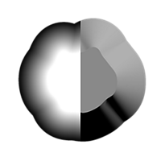
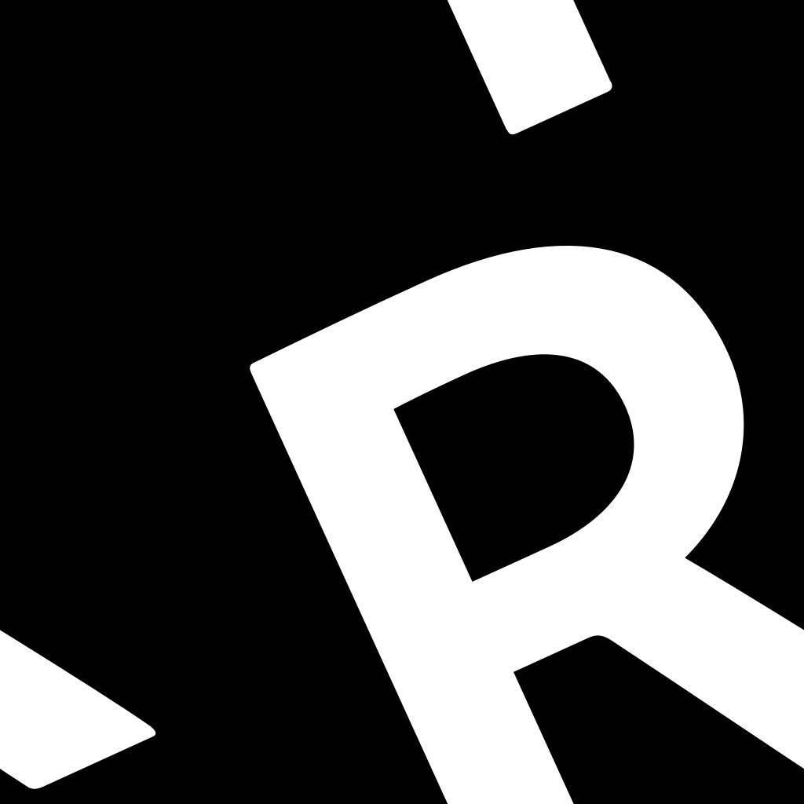

# Weiche Abschrägung

<table>
<tr style="border: 0;">
<td width="33.33%" style="border: 0;" valign="top">

{width="200px"}

<b>In:</b> Filters > Effects

</td>
<td width="100.00%" style="border: 0;" valign="top">

## Beschreibung

Zeichnet einen Verlauf oder eine Flächenfarbe von den Rändern einer Maske nach außen, nach innen oder in beiden Richtungen.

Überlappende Farbverläufe werden nach invertierten normalisierten Abständen sortiert, sodass der Abstand zum nächsten Rand gezeichnet wird.

Der Abstand des Verlaufs kann mithilfe eines Abstands-Map dynamisch entlang des Rands angepasst werden.

</td>
</tr>
</table>

>[!TIP]
>
> Der [Richtungsabstand](../../../../../../compositing-graphs/nodes-reference-for-com/node-library/filters/effects/directional-distance/directional-distance.md)-Knoten bietet ähnliche Funktionen, bei denen die Erweiterung in einer bestimmten Richtung ausgeführt wird.

<table>
<tr style="border: 0;">
<td style="border: 0;" valign="top">

</td>
<td style="border: 0;" valign="top">

### Ausgangsanschlüsse

</td>
<td style="border: 0;" valign="top">

### Parameter

</td>
</tr>
</table>

## Eingangsanschlüsse

|  |  |
| --- | --- |
| <b>Maskeneingabe</b> *Graustufen* PRIMÄR | Das Bild, aus dem die Maske entnommen werden soll.   Alle Werte über dem Wert &quot;Maskenschwellenwert&quot; sind in dieser Maske weiß. |
| <b>Quelleingabe</b> *Graustufen* | Eine optionale Eingabe, die nur verwendet wird, wenn der Parameter &quot;Ausgabemodus&quot; auf &quot;Dilation&quot; festgelegt ist.   In diesem Fall wird dieses Bild auf die weißen Bereiche der Maske gelegt und die Graustufenwerte an den Rändern werden erweitert. |
| <b>Abstands-Map</b> *Graustufen* | Eine optionale Eingabe, die verwendet wird, wenn der Wert des Parameters &quot;Abstands-Map-Multiplikator&quot; größer als 0 ist.   Er wird verwendet, um den Abschrägungs-/Dilatationsabstand entlang der Ränder der Maske einzustellen, wobei ein dunklerer Wert zu einem kürzeren Abstand führt. |

## Ausgangsanschlüsse

|  |  |
| --- | --- |
| <b>Ausgabe</b> *Graustufen* | Das Ergebnisbild, entsprechend dem ausgewählten &#39;Ausgabemodus&#39;. |
| <b>UV</b> *Farbe* | Eine UV-Karte, bei der die UVs entlang der Maskenränder erweitert werden.   Dieser kann mit einem [UV Mapper](../../../../../../compositing-graphs/nodes-reference-for-com/node-library/spline-paths-tools/spline-tools/uv-mapper-color/uv-mapper-color.md)-Knoten verbunden werden, um ein anderes Bild mithilfe dieser erweiterten UVs zuzuordnen. |

## Parameter

|  |  |
| --- | --- |
| <b>Ausgabemodus</b> *Integer* | Die Methode zum Erweitern der Maskenränder:<ul data-preserve-html="true"> <li data-preserve-html="true"><b>Abgeflachte Kante:</b> Zeichnen eines Verlaufs von 1 bis 0, wobei 0 bei der maximalen Entfernung erreicht wird</li> <li data-preserve-html="true"><b>Dilation:</b> zeichnet eine Volltonfarbe bis zur &quot;maximalen Entfernung&quot;. Diese Farbe ist weiß oder die Farbe &quot;Quelleingabe&quot; am Maskenrand, falls verbunden.</li> <li data-preserve-html="true"><b>Abstand:</b> der Rohabstand zum nächsten Maskenrand, im normalisierten Bildbereich, wobei 1 die Länge der kürzesten Seite des Bildes ist</li> </ul> |
| <b>Richtung</b> *Integer* *Verfügbar, wenn &quot;Ausgabemodus&quot; auf &quot;Abgeflachte Kante&quot; oder &quot;Dilation&quot; festgelegt ist* | Die Seite der Maskenbegrenzung, die erweitert werden soll:<ul data-preserve-html="true"> <li data-preserve-html="true"><b>Zeichnen Sie in:</b> in Richtung des Inneren der Maske</li> <li data-preserve-html="true"><b>Out:</b> Ziehen Sie nach außen auf die Maske</li> <li data-preserve-html="true"><b>In/Out:</b> Ziehen Sie sowohl nach innen als auch nach außen der Maske</li> </ul> |
| <b>Maximale Entfernung</b> *Gleitend* | Der Dilatationsabstand im normierten Bildraum, wobei 1 die Länge der kürzeren Seite des Eingangsbildes ist. |
| <b>Smoothness maskieren</b> *Gleitend* | Die Intensität der auf die Maske angewendeten Glättung.   Der Wert gibt den Radius der Weichzeichnung an und 1 Einheit entspricht 1/256 des Bildes. |
| <b>Maskenoffset</b> *Gleitend* | Verschiebt die Maskenränder nach innen oder außen. |
| <b>Maskenschwellenwert</b> *Gleitend* | Der Wert, der zum Erkennen der Ränder der Maske im Bild &quot;Maskeneingabe&quot; verwendet wird.   Werte über diesem Schwellenwert sind *innerhalb* der Maskenformen, während die folgenden Werte *außerhalb* sind. |
| <b>Skalierung</b> *Float2* | Passt den horizontalen (X) und vertikalen (Y) Abstand der Erweiterung an.   Diese Werte sind Multiplikatoren für den Parameterwert &quot;Maximale Entfernung&quot;. |
| <b>Abstands-Map-Multiplikator</b> *Integer* | Passt die Auswirkung des Abstands-Map auf die &quot;Maximale Entfernung&quot; an. |

## Beispiele

<table>
<tr style="border: 0;">
<td style="border: 0;" valign="top">

{width="1024px" zoomable="yes"}

</td>
<td style="border: 0;" valign="top">

{width="1024px" zoomable="yes"}

</td>
</tr>
</table>

<table>
<tr style="border: 0;">
<td style="border: 0;" valign="top">

<table>
  <tr>
    <td>
      
       <i>Vorher</i>
    </td>
    <td>
      
       <i>Nach</i>
    </td>
  </tr>
</table>

</td>
<td style="border: 0;" valign="top">

<table>
  <tr>
    <td>
      
       <i>Vorher</i>
    </td>
    <td>
      
       <i>Nach</i>
    </td>
  </tr>
</table>

</td>
</tr>
</table>

<table>
<tr style="border: 0;">
<td style="border: 0;" valign="top">

<table>
  <tr>
    <td>
      
       <i>Vorher</i>
    </td>
    <td>
      
       <i>Nach</i>
    </td>
  </tr>
</table>

</td>
<td style="border: 0;" valign="top">

<table>
  <tr>
    <td>
      
       <i>Vorher</i>
    </td>
    <td>
      
       <i>Nach</i>
    </td>
  </tr>
</table>

</td>
</tr>
</table>

<table>
  <tr>
    <td>
      
       <i>Vorher</i>
    </td>
    <td>
      
       <i>Nach</i>
    </td>
  </tr>
</table>
