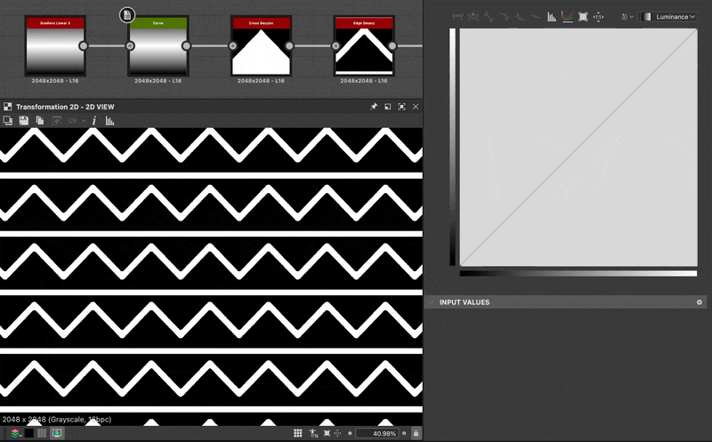

# Querschnitt

<table>
<tr style="border: 0;">
<td width="33.33%" style="border: 0;" valign="top">

{width="200px"}

<b>In:</b> Filters > Effects

</td>
<td width="100.00%" style="border: 0;" valign="top">

## Beschreibung

Zeichnet ein Querschnittsprofil einer Eingabe. Kann angepasst werden, um vertikale oder horizontale Slice, und verfügt über Steuerelemente für Zeichenstil und Diagramm Offset und Skalierung.

</td>
</tr>
</table>

Dieser Knoten ist besonders zum Debuggen und Analysieren von Höhenkarten nützlich. Dadurch erhalten Sie eine pixelgenaue Profilansicht, ohne komplexe Knoten oder eine lange, weniger präzise Einrichtung in der 3D-Ansicht zu benötigen.

Du kannst auch 2D-Formen und Silhouetten erstellen, die sich sonst kaum realisieren lassen. In Kombination mit einem [Kurvenknoten](../../../../../../compositing-graphs/nodes-reference-for-com/atomic-nodes/curve/curve.md)kann das auf einen linearen Verlauf angewendete Kurvenprofil direkt angezeigt werden.

## Parameter

<b>Querschnittkoordinate</b> *Gleitend*\
Legen Sie fest, mit welcher Koordinate das Slice aufgenommen werden soll. Kann eine X- oder Y-Koordinate sein, abhängig von der Abschnittsachse.

<b>Abschnittsachse</b> *Integer*\
Stellen Sie ein, ob das Slice vertikal oder horizontal ist.

<b>Helfer anzeigen</b> *Boolescher Wert*\
Aktiviert eine Überlagerung, in der die Position des Abschnitts über dem Eingabebild angezeigt wird.

Hilfseinstellungen

<b>Helferskala</b> *Gleitend*\
Die Größe der Überlagerung, ausgedrückt als Vielfaches, wobei 1,0 das gesamte Bild ist.

<b> Helferposition </b> *Float2*\
Die Position (X, Y) der Überlagerung im Ausgabebild, wobei (0.0, 0.0) oben links und (1.0, 1.0) unten rechts ist.

<b>Height-Skalierung</b> *Gleitend*

Verkleinert den gesamten Graphen. Nützlich für die Anzeige von HDR-Bildern.

<b>Height-Offset</b> *Gleitend*\
Verschiebt den gesamten Graphen nach oben oder unten. Nützlich für die Anzeige von HDR-Bildern.

<b>Zeichenstil</b> *Integer*\
Wechseln Sie zwischen Volltonfüllung und Linienzeichnung.

<b>Verlauf umkehren</b> *Boolescher Wert* Wenn der Zeichenstil auf *Verlauf* oder *Verlauf gespiegelt* festgelegt ist, können Sie diesen Verlauf umkehren, ohne den Hintergrund zu beeinflussen.\
*Hinweis:* Nur verfügbar, wenn &quot;Zeichenstil&quot; auf &quot;Verlauf&quot; oder &quot;Verlauf gespiegelt&quot; festgelegt ist.

<b>Glatt/Polygon</b> *Boolescher Wert*\
Schaltet die Form zwischen perfektem ebenem Profil oder gezackten Polygonen um.\
*Hinweis:* Nur verfügbar, wenn &quot;Zeichenstil&quot; auf &quot;Durchgezogen&quot;, &quot;Verlauf&quot; oder &quot;Farbverlauf gespiegelt&quot; festgelegt ist.

<b>Segmentbetrag</b>: *Integer*\
Legt die Anzahl der Segmente fest, die im Polygon- oder Linienstil gezeichnet werden.\
*Hinweis:* Nur verfügbar, wenn &quot;Glatt/Polygon&quot; auf &quot;Polygon&quot; oder &quot;Zeichenformat&quot; auf &quot;Linie&quot; festgelegt ist.

<b>Line-Thickness</b> *Gleitend*\
Legt die Thickness der Zeile fest.\
*Hinweis:* Nur verfügbar, wenn &quot;Zeichenformat&quot; auf &quot;Linie&quot; festgelegt ist.

<b>Linienstil</b> *Integer*\
Ermöglicht die Auswahl der Farbe und des Verfalls der Linie.\
*Hinweis:* Nur verfügbar, wenn &quot;Zeichenformat&quot; auf &quot;Linie&quot; festgelegt ist.

<b>Line-Smoothness</b> *Gleitend*\
Legt den Verlaufsunterschied der Linie fest.\
*Hinweis:* Nur verfügbar, wenn &quot;Zeichenformat&quot; auf &quot;Linie&quot; festgelegt ist.

<b>Farbe</b> *Gleitend*\
Graustufenfarbe der Linie oder Form.\
*Hinweis:* Nur verfügbar, wenn &quot;Zeichenstil&quot; auf &quot;Durchgezogen&quot; oder &quot;Linie&quot; und &quot;Linienstil&quot; auf &quot;Glatt&quot; oder &quot;Durchgezogen&quot; festgelegt ist.

<b>Hintergrundfarbe</b> *Gleitende* Graustufenfarbe des Hintergrunds.\
*Hinweis:* Nicht verfügbar, wenn &quot;Zeichenstil&quot; auf &quot;Linie&quot; und &quot;Linienstil&quot; auf &quot;Segmentkennung&quot; oder &quot;Verlauf entlang Linie&quot; festgelegt ist.

## Beispiele

