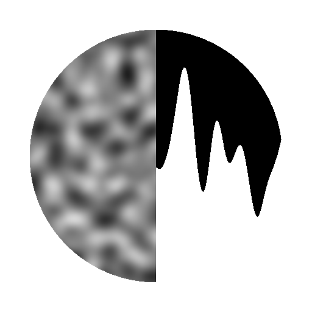

# Querschnitt

<table>
<tr style="border: 0;">
<td width="33.33%" style="border: 0;" valign="top">

{width="200px"}

<b>In:</b> Filters > Effects

</td>
<td width="100.00%" style="border: 0;" valign="top">

## Beschreibung

Zeichnet ein Querschnittsprofil einer Eingabe. Kann angepasst werden, um vertikale oder horizontale Slice, und verfügt über Steuerelemente für Zeichenstil und Diagramm Offset und Skalierung.

</td>
</tr>
</table>

Dieser Knoten ist besonders zum Debuggen und Analysieren von Höhenkarten nützlich. Damit erhalten Sie eine pixelgenaue Profilansicht, ohne dass komplexe Knoten oder eine lange, weniger präzise Einrichtung in der 3D-Ansicht erforderlich sind.

Du kannst auch 2D-Formen und Silhouetten erstellen, die sich sonst kaum realisieren lassen. In Kombination mit einem [Kurvenknoten](../../../../../../compositing-graphs/nodes-reference-for-com/atomic-nodes/curve/curve.md)kann das auf einen linearen Verlauf angewendete Kurvenprofil direkt angezeigt werden.

## Parameter

|  |  |
|:---|:---|
| <b>Querschnittkoordinate</b> *Fließkommazahl* | Legen Sie fest, mit welcher Koordinate das Slice aufgenommen werden soll. Kann eine X- oder Y-Koordinate sein, abhängig von der Abschnittsachse. |
| <b>Abschnittsachse</b> *Integer* | Stellen Sie ein, ob das Slice vertikal oder horizontal ist. |
| <b>Helfer anzeigen</b> *Boolesche Wert* | Aktiviert eine Überlagerung, in der die Position des Abschnitts über dem Eingabebild angezeigt wird. |
| <b>Helfer-Einstellungen</b> |  |
| <b>Helfer-Skalierung</b> *Fließkommazahl* | Die Größe der Überlagerung, ausgedrückt als Vielfaches, wobei 1,0 das gesamte Bild ist. |
| <b>Position des Helfers</b> *Float2* | Die Position (X, Y) der Überlagerung im Ausgabebild, wobei (0.0, 0.0) oben links und (1.0, 1.0) unten rechts ist. |
| <b>Height-Skalierung</b> *Gleitend* | Verkleinert den gesamten Graphen. Nützlich für die Anzeige von HDR-Bildern. |
| <b>Height-Offset</b> *Gleitend* | Verschiebt den gesamten Graphen nach oben oder unten. Nützlich für die Anzeige von HDR-Bildern. |
| <b>Zeichenstil</b> *Integer* | Wechseln Sie zwischen Volltonfüllung und Linienzeichnung. |
| <b>Verlauf umkehren</b> *Boolescher Wert* | Wenn der Zeichenstil auf *Farbverlauf* oder *Farbverlauf gespiegelt* festgelegt ist, können Sie diesen Farbverlauf umkehren, ohne den Hintergrund zu beeinflussen.  *Hinweis:* Nur verfügbar, wenn &quot;Zeichenstil&quot; auf &quot;Farbverlauf&quot; oder &quot;Farbverlauf gespiegelt&quot; festgelegt ist. |
| <b>Glatt/Polygon</b> *Boolescher Wert* | Schaltet die Form zwischen einem perfekten glatten Profil oder einem gezackten Polygon um.  *Hinweis:* Nur verfügbar, wenn &quot;Zeichenstil&quot; auf &quot;Durchgezogen&quot;, &quot;Verlauf&quot; oder &quot;Farbverlauf gespiegelt&quot; festgelegt ist. |
| <b>Segmentbetrag</b> *Integer* | Legt die Anzahl der Segmente fest, die beim Zeichnen im Polygonstil oder im Linienstil verwendet werden.  *Hinweis:* Nur verfügbar, wenn &quot;Glatt/Polygon&quot; auf &quot;Polygon&quot; oder &quot;Zeichenstil&quot; auf &quot;Linie&quot; festgelegt ist. |
| <b>Line-Thickness</b> *Gleitend* | Legt die Thickness der Zeile fest.  *Hinweis:* Nur verfügbar, wenn &quot;Zeichenstil&quot; auf &quot;Linie&quot; festgelegt ist. |
| <b>Linienstil</b> *Integer* | Erlaubt es Ihnen, die Farbe und den Abfall der Linie auszuwählen.  *Hinweis:* Nur verfügbar, wenn &quot;Zeichenstil&quot; auf &quot;Linie&quot; festgelegt ist. |
| <b>Line-Smoothness</b> *Fließkommazahl* | Legt den Verlaufsabfall der Linie fest.  *Hinweis:* Nur verfügbar, wenn &quot;Zeichenstil&quot; auf &quot;Linie&quot; festgelegt ist. |
| <b>Farbe</b> *Gleitend* | Graustufenfarbe der Linie oder Form.  *Hinweis:* Nur verfügbar, wenn &quot;Zeichenstil&quot; auf &quot;Durchgezogen&quot; oder &quot;Linie&quot; und &quot;Linienstil&quot; auf &quot;Glatt&quot; oder &quot;Durchgezogen&quot; festgelegt sind. |
| <b>Hintergrundfarbe</b> *Fließkommazahl* | Graustufenfarbe des Hintergrunds.  *Hinweis:* Nicht verfügbar, wenn &quot;Zeichenstil&quot; auf &quot;Linie&quot; und &quot;Linienstil&quot; auf &quot;Segmentkennung&quot; oder &quot;Verlauf entlang Linie&quot; festgelegt ist. |

## Beispiele

