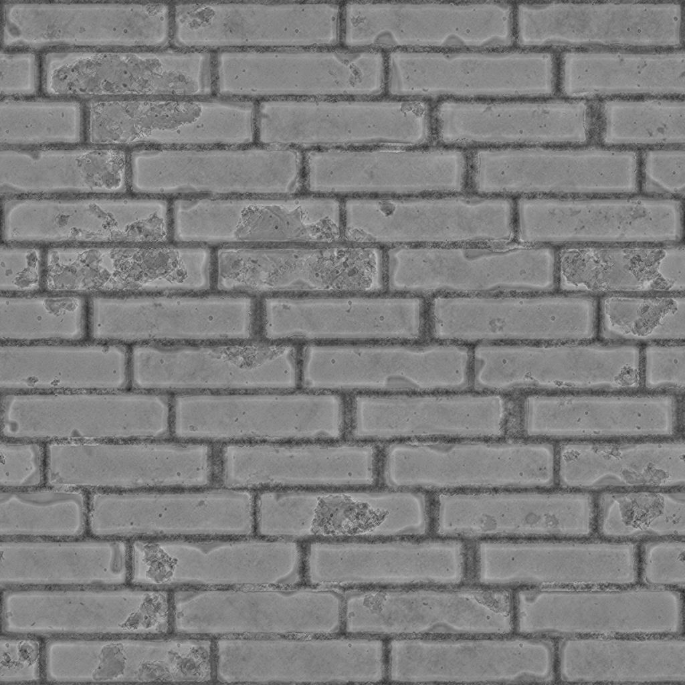
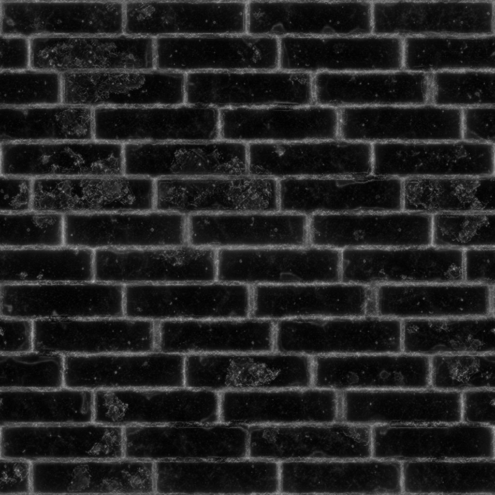

# Kurvenglättung

<table>
<tr style="border: 0;">
<td width="33.33%" style="border: 0;" valign="top">

{width="200px"}

<b>In:</b> Filters > Effects

</td>
<td width="100.00%" style="border: 0;" valign="top">

## Beschreibung

Berechnet die Krümmung einer Fläche, die durch einen Normalen-Map beschrieben wird.

Eine Krümmungs-Map stellt die konkaven und konvexen Flächen einer Fläche dar.\
Flache Bereiche sind zu 50 % grau. Konvexe Bereiche sind heller, konkave Bereiche sind dunkler.

</td>
</tr>
</table>

Die konkaven und konvexen Bereiche werden ebenfalls in ihre eigenen Ausgänge aufgeteilt, um die Auswahl bzw. Maskierung von Bereichen basierend auf diesen Eigenschaften zu vereinfachen.

>[!TIP]
>
> Sehen Sie sich [Krümmung](../../../../../../compositing-graphs/nodes-reference-for-com/node-library/filters/effects/curvature-filter-node/curvature-filter-node.md) nach, um eine schärfere Version zu erhalten, oder [Krümmung Sobel](../../../../../../compositing-graphs/nodes-reference-for-com/node-library/filters/effects/curvature-sobel/curvature-sobel.md), wenn Sie weitere Optionen benötigen.

## Eingaben

|  |  |
|:---|:---|
| <b>Normal</b> <i>Farbe</i> <b>PRIMÄR</b> | Die Normalen-Map, die die Fläche beschreibt, für die die Krümmung berechnet werden soll. |

## Ausgaben

|  |  |
|:---|:---|
| <b>Krümmung</b> <i>Graustufen</i> | Die Krümmungs-Map wurde von der Eingabe-Normalen-Map berechnet.   Flache Bereiche sind zu 50 % grau. Konvexe Bereiche sind heller, konkave Bereiche sind dunkler. |
| <b>Konvexität</b> <i>Graustufen</i> | Die Konvexitätskarte wurde aus der Eingabe-Normalen-Map berechnet.   Je konvexer ein Bereich ist, desto heller ist er auf der Karte.  Flache oder konkave Bereiche sind schwarz. |
| <b>Konkavität</b> <i>Graustufen</i> | Die Konkavitäts-Map wurde aus der Eingabe-Normalmap berechnet.   Je konkaver ein Gebiet ist, desto heller ist es auf der Karte.  Flache oder konvexe Bereiche sind schwarz. |

## Parameter

|  |  |
|:---|:---|
| <b>Normales Format</b> *Integer* | Das Format der Eingabe-Normalmap. Kehrt den grünen Kanal effektiv um.<ul data-preserve-html="true"> <li data-preserve-html="true"><b>DirectX:</b> Die Y-Achse zeigt nach oben</li> <li data-preserve-html="true"><b style="">OpenGL:</b> Die Y-Achse zeigt nach unten</li> </ul> |

## Beispiele

<table>
  <tr>
    <td>
      
       <i>Vorher</i>
    </td>
    <td>
      
       <i>Nach</i>
    </td>
  </tr>
</table>

<table>
<tr style="border: 0;">
<td style="border: 0;" valign="top">

{zoomable="yes"}

</td>
<td style="border: 0;" valign="top">

{zoomable="yes"}

</td>
</tr>
</table>

<table>
  <tr>
    <td>
      
       <i>Vorher</i>
    </td>
    <td>
      
       <i>Nach</i>
    </td>
  </tr>
</table>

<table>
<tr style="border: 0;">
<td style="border: 0;" valign="top">

{zoomable="yes"}

</td>
<td style="border: 0;" valign="top">

{zoomable="yes"}

</td>
</tr>
</table>
