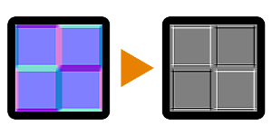

# Krümmungssobel

<table>
<tr style="border: 0;">
<td style="border: 0;" valign="top">

{width="128px"}

## Krümmungssobel

**In:** *Filter/Effekte*

**Einfach**

</td>
<td style="border: 0;" valign="top">

## Beschreibung

Führt eine einfache, harte Konversion der Einmalpasskrümmung zur Eingabe von [Normalmap](../../../../../../compositing-graphs/nodes-reference-for-com/atomic-nodes/normal/normal.md) durch. Die resultierende Karte enthält weiße Farbtöne für konvexe Bereiche und schwarze Farbtöne für konkave Bereiche. Der Kurvenzeichner erzeugt immer dickere Linien und scharfe Übergänge.

Dieser Knoten ist nützlich, um bestimmte Kanten schnell hervorzuheben oder abzudunkeln. Sie unterscheidet sich leicht von [Krümmung](../../../../../../compositing-graphs/nodes-reference-for-com/node-library/filters/effects/curvature-filter-node/curvature-filter-node.md), da sie qualitativ bessere Ergebnisse liefert, aber immer noch scharf und hart ist.

## Parameter

* **Intensität**: *0.0 - 1.0* Intensität des Effekts, passt den Kontrast an.
* **Normaler Typ**: *DirectX, OpenGL*

## Beispielbilder

| 

 |
| --- |
|  |

</td>
</tr>
</table>
