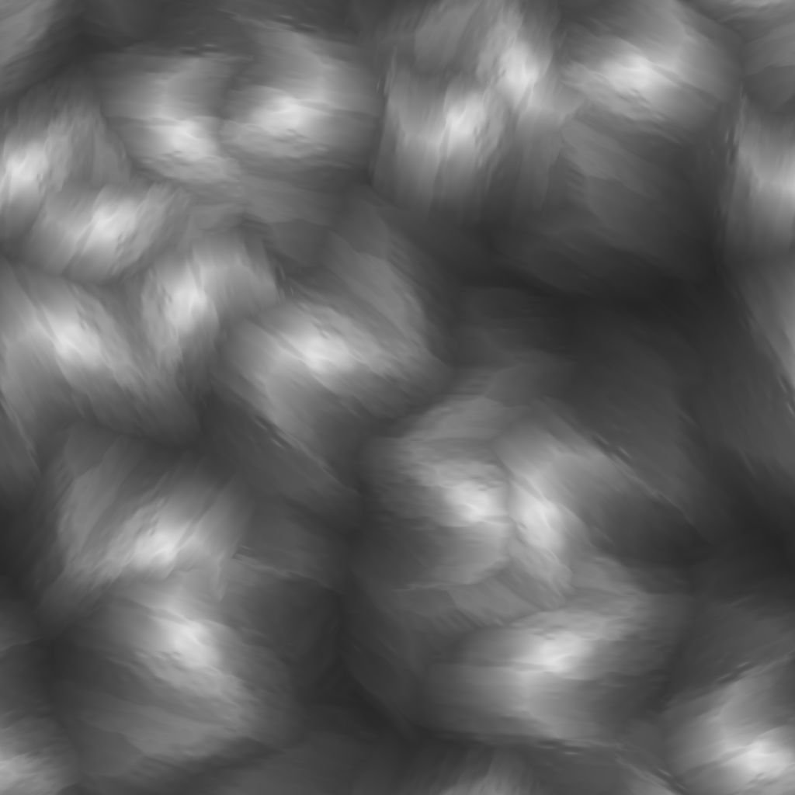

# Diffusions-Graustufen

<table>
<tr style="border: 0;">
<td width="41.60%" style="border: 0;" valign="top">

{width="200px"}

**In:** *Filter/Effekte*

**Fortgeschrittene**

</td>
<td width="58.30%" style="border: 0;" valign="top">

## Beschreibung

Wenden Sie einen Diffusionsprozess auf die Werte in der Bildeingabe **Quelle** entsprechend der bereitgestellten Bildeingabe **Maske** an, um glatte Abstufungen zwischen den Werten zu erstellen.

Nur Werte aus Pixeln, die der Maske entsprechen, werden gestreut. andere Pixel nicht am Ergebnis beteiligt sind.

</td>
</tr>
</table>

## Parameter

* **Iterationen**: *0.0 - 64.0* Die Anzahl der auszuführenden Diffusionsiterationen (höher ist besser, aber langsamer). Nützliche Werte liegen im Bereich [8, 48].\
  Bitte beachten Sie, dass niedrige Werte in Ordnung oder sogar besser sind, wenn Sie nicht nach mathematischer Korrektheit suchen.\
  **Entfernung**: **0.0 - 1.0** Passt den maximalen Abstand der Diffusion an.
* **Dithering aktivieren**: *Wahr/Falsch* Steuert die Sampling-Methode für jeden Durchgang. Beim Dithering ist die Konvergenz in weniger Durchgängen möglich, es entsteht jedoch Rauschen.\
  Ohne sie ist jeder Durchgang schneller, aber es sind mehr Durchgänge erforderlich, um ein reibungsloses Ergebnis ohne Banding-Artefakte zu erzielen.

## Eingaben

* **Quelle** *Graustufen*\
  Das zu streuende Bild.
* **Maske** *Graustufen*\
  Diffusionsmaske: Weiße Pixel werden in *Quelle* aufgenommen und in schwarzen Pixeln verteilt. Das Bild sollte schwarzweiß sein. Wenn die Maske Farbverläufe enthält, ist der Cutoff-Wert 0,5.
* **Intensität** *Graustufen*\
  Legt lokal fest, wie stark der Diffusionsprozess angewendet wird. Diese Zuordnung sollte *kontrastiert* sein, um einen spürbaren Effekt zu erzielen.

## Beispielbilder

<table>
<tr style="border: 0;">
<td style="border: 0;" valign="top">

{width="256px"}

</td>
<td style="border: 0;" valign="top">

{width="256px"}

</td>
<td style="border: 0;" valign="top">

{width="256px"}

</td>
</tr>
</table>

<table>
<tr style="border: 0;">
<td style="border: 0;" valign="top">

{width="256px"}

</td>
<td style="border: 0;" valign="top">

{width="256px"}

</td>
<td style="border: 0;" valign="top">

{width="512px"}

</td>
</tr>
</table>
