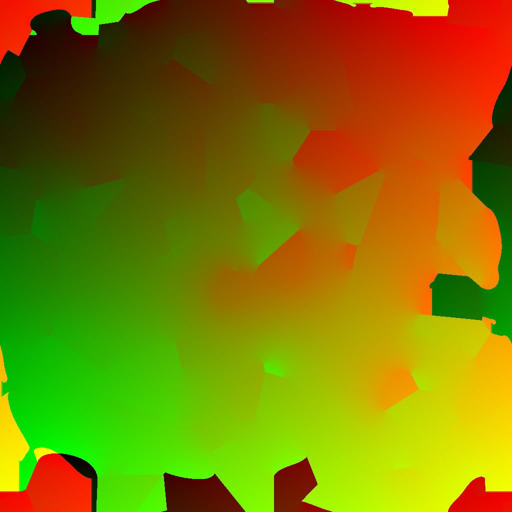

# Diffusions-UV

<table>
<tr style="border: 0;">
<td width="41.60%" style="border: 0;" valign="top">

{width="200px"}

**In:** *Filter/Effekte*

**Fortgeschrittene**

</td>
<td width="58.30%" style="border: 0;" valign="top">

## Beschreibung

Wenden Sie einen Diffusionsprozess auf die UV-Koordinaten in der Bildeingabe **Quelle** gemäß der bereitgestellten Bildeingabe **Maske** an, wobei die Koordinaten zwischen den Werten aus **Quelle** interpoliert werden.

Nur UVs von Pixeln, die der Maske entsprechen, werden gestreut. andere Pixel nicht am Ergebnis beteiligt sind.

Bitte beachten Sie, dass die Kachelung in einer besonderen Art und Weise erfolgt: Wenn die Aufteilung *aktiviert ist* (was standardmäßig der Fall ist), können benachbarte Koordinaten über die 0/1-Grenze gemittelt werden.

Wenn beispielsweise der U-Koordinatenwert auf einem Pixel 0,1 und auf einem anderen Pixel 0,8 beträgt, wird der gemittelte Wert 0,95 und nicht 0,45 sein, da *eine Unterteilung der Koordinaten angenommen wird*. Dies ist unabhängig von der tatsächlichen Pixelposition: Koordinatenwerte werden im ganzen Bild gleich behandelt.

Dies kann zu unerwünschten Ergebnissen führen, wenn dieser Filter für *Texturverformung* verwendet wird. Stellen Sie in diesem Fall sicher, dass Ihre Maske nicht mehr als *eine halbe Texturlänge auseinander* als &quot;Steuerkurven/Punkte&quot; definiert.

</td>
</tr>
</table>

## Parameter

* **Iterationen**: *0.0 - 64.0* Die Anzahl der auszuführenden Diffusionsiterationen (höher ist besser, aber langsamer). Nützliche Werte liegen im Bereich [8, 48].\
  Bitte beachten Sie, dass niedrige Werte in Ordnung oder sogar besser sind, wenn Sie nicht nach mathematischer Korrektheit suchen.

## Eingaben

* **Quelle** *Farbe*\
  Die zu diffundierenden UVs. Beachten Sie, dass die Unterteilung in Untertitel in diesem Filter besonders behandelt wird (siehe *Beschreibung*).
* **Maske** *Graustufen* Die Diffusionsmaske: Weiße Pixel werden in *Quelle* aufgenommen und in schwarzen Pixeln verteilt. Das Bild sollte schwarzweiß sein. Wenn die Maske Farbverläufe enthält, ist der Cutoff-Wert 0,5.

## Beispielbilder

<table>
<tr style="border: 0;">
<td style="border: 0;" valign="top">

{width="256px"}

</td>
<td style="border: 0;" valign="top">

{width="256px"}

</td>
</tr>
</table>

<table>
<tr style="border: 0;">
<td style="border: 0;" valign="top">

{width="256px"}

</td>
<td style="border: 0;" valign="top">

{width="256px"}

</td>
</tr>
</table>
