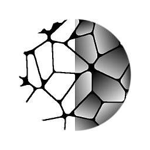

# Flood Fill zu Verlauf

<table>
<tr style="border: 0;">
<td width="33.33%" style="border: 0;" valign="top">

{width="128px"}

<b>In:</b> Filters > Effects

</td>
<td width="100.00%" style="border: 0;" valign="top">

## Beschreibung

Transformieren eine [Flood Fill](../../../../../../compositing-graphs/nodes-reference-for-com/node-library/filters/effects/flood-fill/flood-fill.md)-Base in (zufällig orientierte) Verläufe. Sehr nützlich zum Erstellen einer Höhenkarte, bei der Kacheln zufällig geneigt und geneigt sind.

</td>
</tr>
</table>

## Eingaben

|  |  |
|:---|:---|
| <b>Flood Fill</b> <i>Farbeingabe</i> | Flood Fill-Basisdaten. |
| <b>Winkeleingabe</b> <i>Graustufen-Eingabe</i> | Optionale Karte zur Bestimmung des Winkels pro Zelle mit einer externen Karte. |
| <b>Steigung-Eingabe</b> <i>Graustufen-Eingabe</i> | Optionale Map, um die Steigung-Stärke des Verlaufs pro Zelle zu bestimmen. |

## Parameter

|  |  |
|:---|:---|
| <b>Winkel</b> <i>0.0 - 1.0</i> | Legt für alle Musterelemente einen einheitlichen globalen Winkel bzw. eine einheitliche globale Richtung fest. |
| <b>Winkelabweichung</b> <i>0.0 - 1.0</i> | Der Winkel für jede Kachel wird einzeln zufällig angepasst. Dies ist der nützlichste und mächtigste Parameter! |
| <b>Multiplizieren mit der Größe des Begrenzungsrahmens</b> <i>0.0 - 1.0</i> | Skaliert den gesamten linearen Effekt anhand der Größe des individuellen Begrenzungsrahmens der Kachel. Das bedeutet, dass kleinere Kacheln am Ende dunkler sind als größere. |
| <b>Winkel-Bildeingabemultiplikator</b> <i>0.0 - 1.0</i> | Festlegen des Einflusses der optionalen Winkel-Eingabe-Map auf die generierten Verlaufsrichtungen |
| <b>Steigung-Bildeingabemultiplikator</b> <i>0.0 - 1.0</i> | Legen Sie den Einfluss der optionalen Steigung-Eingabemap auf die generierte Steigung des Verlaufs fest. |
| <b>Multiplizieren mit der Intensität der Steigung</b> <i>0.0 - 1.0</i> |  |
| <b>Einfache Steigung </b> <i>(Graustufenwert)</i> | Ermöglicht die Festlegung eines Volltonwerts für flache Steigungen. |

## Beispiele

<table style="margin-top: 32px; margin-bottom: 32px">
    <tr style="border: 0">
        <td style="border: 0; background: transparent">
            
        </td>
        <td style="border: 0; background: transparent">
            
        </td>
    </tr>
</table>
