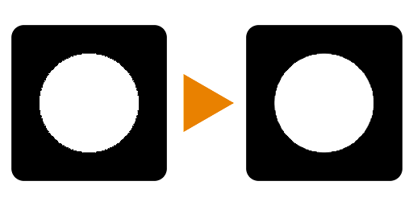

# FXAA

<table>
<tr style="border: 0;">
<td width="33.33%" style="border: 0;" valign="top">

<b>In:</b> Filters > Effects

</td>
<td width="100.00%" style="border: 0;" valign="top">

## Beschreibung

Wendet einen Anti-Aliasing-Filter basierend auf dem FXAA-Algorithmus an. So reparieren Sie gezackte, verpixelte Kanten an Formen. Dies ist besonders nützlich für eine [Datenträgerform](../../../../../../compositing-graphs/nodes-reference-for-com/node-library/texture-generators/patterns/shape/shape.md) mit verpixelten Kanten, da sie eine einfache 1-Knoten-Lösung für Anti-Alias-Kanten bietet.

</td>
</tr>
</table>

## Beispiele

<table style="margin-top: 32px; margin-bottom: 32px">
    <tr style="border: 0">
        <td style="border: 0; background: transparent">
            
        </td>
    </tr>
</table>
