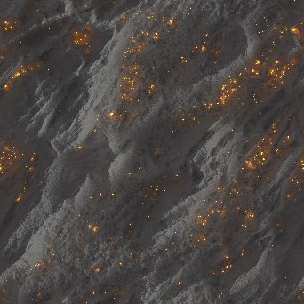

# RT-Bestrahlung

<table>
<tr style="border: 0;">
<td width="41.60%" style="border: 0;" valign="top">

{width="128px"}

**In:** *Filter/Effekte*

**Komplex**

</td>
<td width="58.30%" style="border: 0;" valign="top">

## Beschreibung

Generiert eine Raytraced-Bestrahlung auf einem Height-Map-Eingang, der aus einer Umgebungskarte und einer Emissionskarte generiert wird. Kann verwendet werden, um Beleuchtung in eine Textur innerhalb eines Diagramms zu &quot;backen&quot;. Wird für gefälschte globale Beleuchtung und Leuchten verwendet.Dieser Knoten sollte aufgrund der Berechnungszeit nicht in Kombination mit der CPU-Engine (SSE) verwendet werden. Gibt zwei Zuordnungen zurück: eine Bestrahlungsstärke-Ausgabe, bei der die Bestrahlungsstärke auf die Materialeingänge angewendet wird, eine Roh-Bestrahlungsstärke-Karte, die nur die berechneten Bestrahlungsstärken enthält.

</td>
</tr>
</table>

## Parameter

### Eingaben

* **Height:** *Graustufeneingabe* Height ist die einzige erforderliche Eingabe aus dem Materialschlitz. Ohne sie funktioniert der Knoten nicht gut.
* **Ausstrahlend:** *Farbeingabe* Ausstrahlend sollte in einem Format vorliegen, in dem reines Schwarz kein Licht ausstrahlt, jeder andere Farbwert Licht ausstrahlt. Alpha wird ignoriert. Eine Verbindung mit diesem Steckplatz oder dem Umgebungssteckplatz ist erforderlich, um ein Ergebnis zu sehen.
* **Umgebung**: *Farbeingabe*\
  HDR-Lichtumgebung zur Berechnung der Bestrahlung mit. Eine Verbindung zu diesem Slot oder dem Emissive Slot ist erforderlich, um ein Ergebnis zu sehen.

### Parameter

* **Height-Skalierung**: *0.0 - 1.0*\
  Skalierung zum Interpretieren des Heights bei. Wirkt sich auf den gesamten Szenenlook aus.
* **Qualität**: *32 Strahlen, 64 Strahlen, 128 Strahlen*\
  Bestimmt die Ergebnisqualität, beeinflusst aber auch die Leistung. Weniger Strahlen bedeuten mehr Rauschen.
* **Rückschläge berechnen**: *False/True*\
  Rechnerzugriffe ein-/ausschalten. Beeinflusst Qualität und Geschwindigkeit.
* **Umgebungsrotation**: *0.0 - 1.0*\
  Drehen Sie die Umgebung.
* **Umgebungsbelastung (EV)**: *-4.0 - 4.0*\
  Der für die Umgebung zu verwendende Belichtungswert wirkt sich auf die Gesamthelligkeit des Effekts aus.
* **Emissionsintensität**: *0.0 - 20.0*\
  Multiplikator für den Emissionseintrag, beeinflusst die Stärke der Bestrahlung von emittierenden Stoffen.
* **Ausstrahlender Farbraum**: *sRGB, linear*\
  Farbraum, der zum Interpretieren der ENISsive-Eingabe verwendet wird.
* **IBL Shadows in Raw Irradiance Alpha**: *False/True*\
  Legen Sie fest, ob der
* **Verzerrung durch Emissions-LOD**: *-1.0 - 1.0* Die Qualität der emittierenden Strahlung abstimmen. Ein niedrigerer Wert bedeutet mehr Rauschen.

## Beispielbilder

| 

 | 

 | 

 |
| --- | --- | --- |
|  |  |  |
